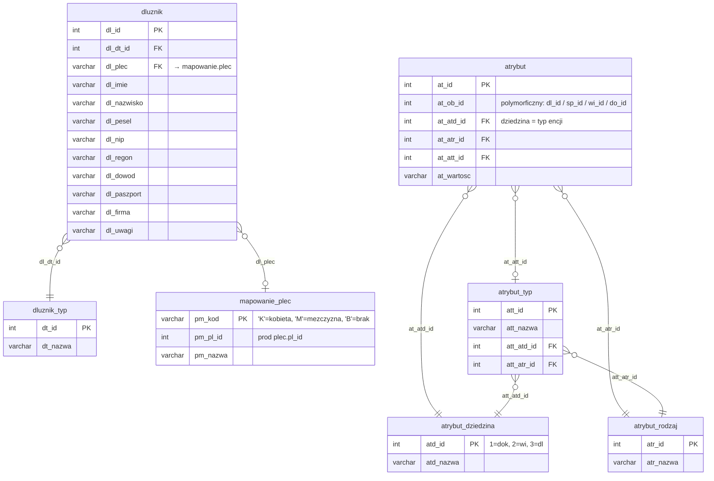

# Iteracja 2 — Dłużnicy i atrybuty

```mermaid
erDiagram
    dluznik_typ {
        int     dt_id    PK
        varchar dt_nazwa
    }

    mapowanie_plec {
        varchar pm_kod    PK  "'K'=kobieta, 'M'=mezczyzna, 'B'=brak"
        int     pm_pl_id      "prod plec.pl_id"
        varchar pm_nazwa
    }

    dluznik {
        int     dl_id         PK
        int     dl_dt_id      FK
        varchar dl_plec       FK  "→ mapowanie.plec"
        varchar dl_imie
        varchar dl_nazwisko
        varchar dl_pesel
        varchar dl_nip
        varchar dl_regon
        varchar dl_dowod
        varchar dl_paszport
        varchar dl_firma
        varchar dl_uwagi
    }

    atrybut_dziedzina {
        int     atd_id    PK   "1=dok, 2=wi, 3=dl"
        varchar atd_nazwa
    }

    atrybut_rodzaj {
        int     atr_id    PK
        varchar atr_nazwa
    }

    atrybut_typ {
        int     att_id     PK
        varchar att_nazwa
        int     att_atd_id FK
        int     att_atr_id FK
    }

    atrybut {
        int     at_id     PK
        int     at_ob_id       "polymorficzny: dl_id / sp_id / wi_id / do_id"
        int     at_atd_id FK   "dziedzina = typ encji"
        int     at_atr_id FK
        int     at_att_id FK
        varchar at_wartosc
    }

    dluznik     }o--||  dluznik_typ       : "dl_dt_id"
    dluznik     }o--o|  mapowanie_plec    : "dl_plec"
    atrybut     }o--||  atrybut_dziedzina : "at_atd_id"
    atrybut     }o--||  atrybut_rodzaj    : "at_atr_id"
    atrybut     }o--o|  atrybut_typ       : "at_att_id"
    atrybut_typ }o--||  atrybut_dziedzina : "att_atd_id"
    atrybut_typ }o--||  atrybut_rodzaj    : "att_atr_id"
```
