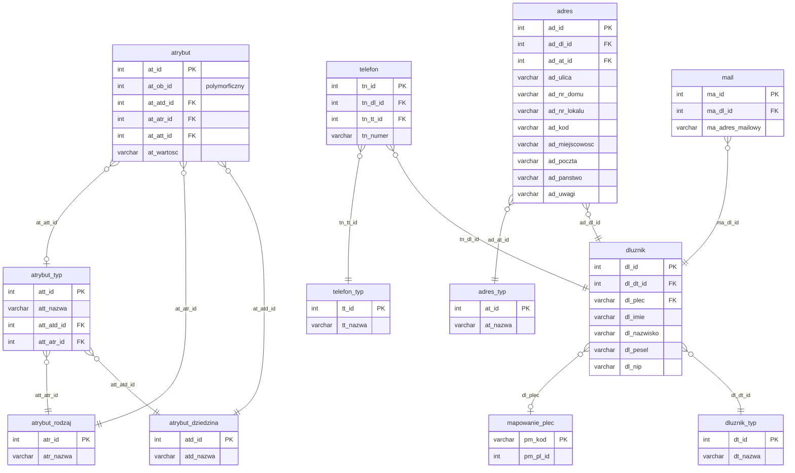

# Iteracja 3 — Dane kontaktowe (kumulatywnie: iter 2 + adres / mail / telefon)

```mermaid
erDiagram
    dluznik_typ {
        int     dt_id    PK
        varchar dt_nazwa
    }

    mapowanie_plec {
        varchar pm_kod   PK
        int     pm_pl_id
    }

    dluznik {
        int     dl_id    PK
        int     dl_dt_id FK
        varchar dl_plec  FK
        varchar dl_imie
        varchar dl_nazwisko
        varchar dl_pesel
        varchar dl_nip
    }

    atrybut_dziedzina {
        int     atd_id    PK
        varchar atd_nazwa
    }

    atrybut_rodzaj {
        int     atr_id    PK
        varchar atr_nazwa
    }

    atrybut_typ {
        int     att_id     PK
        varchar att_nazwa
        int     att_atd_id FK
        int     att_atr_id FK
    }

    atrybut {
        int     at_id     PK
        int     at_ob_id       "polymorficzny"
        int     at_atd_id FK
        int     at_atr_id FK
        int     at_att_id FK
        varchar at_wartosc
    }

    adres_typ {
        int     at_id    PK
        varchar at_nazwa
    }

    telefon_typ {
        int     tt_id    PK
        varchar tt_nazwa
    }

    adres {
        int     ad_id          PK
        int     ad_dl_id       FK
        int     ad_at_id       FK
        varchar ad_ulica
        varchar ad_nr_domu
        varchar ad_nr_lokalu
        varchar ad_kod
        varchar ad_miejscowosc
        varchar ad_poczta
        varchar ad_panstwo
        varchar ad_uwagi
    }

    mail {
        int     ma_id            PK
        int     ma_dl_id         FK
        varchar ma_adres_mailowy
    }

    telefon {
        int     tn_id    PK
        int     tn_dl_id FK
        int     tn_tt_id FK
        varchar tn_numer
    }

    dluznik     }o--||  dluznik_typ       : "dl_dt_id"
    dluznik     }o--o|  mapowanie_plec    : "dl_plec"
    atrybut     }o--||  atrybut_dziedzina : "at_atd_id"
    atrybut     }o--||  atrybut_rodzaj    : "at_atr_id"
    atrybut     }o--o|  atrybut_typ       : "at_att_id"
    atrybut_typ }o--||  atrybut_dziedzina : "att_atd_id"
    atrybut_typ }o--||  atrybut_rodzaj    : "att_atr_id"
    adres       }o--||  dluznik           : "ad_dl_id"
    adres       }o--||  adres_typ         : "ad_at_id"
    mail        }o--||  dluznik           : "ma_dl_id"
    telefon     }o--||  dluznik           : "tn_dl_id"
    telefon     }o--||  telefon_typ       : "tn_tt_id"
```
