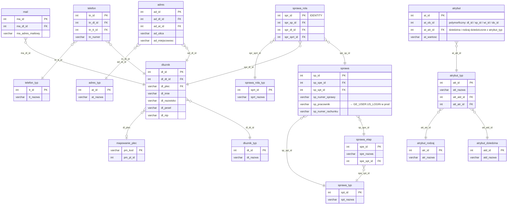

# Iteracja 4 — Sprawy i role (kumulatywnie: iteracja 3 + sprawa / sprawa_rola)

```mermaid
erDiagram
    dluznik_typ {
        int     dt_id    PK
        varchar dt_nazwa
    }

    mapowanie_plec {
        varchar pm_kod   PK
        int     pm_pl_id
    }

    dluznik {
        int     dl_id    PK
        int     dl_dt_id FK
        varchar dl_plec  FK
        varchar dl_imie
        varchar dl_nazwisko
        varchar dl_pesel
        varchar dl_nip
    }

    adres_typ {
        int     at_id    PK
        varchar at_nazwa
    }

    telefon_typ {
        int     tt_id    PK
        varchar tt_nazwa
    }

    adres {
        int     ad_id    PK
        int     ad_dl_id FK
        int     ad_at_id FK
        varchar ad_ulica
        varchar ad_miejscowosc
    }

    mail {
        int     ma_id            PK
        int     ma_dl_id         FK
        varchar ma_adres_mailowy
    }

    telefon {
        int     tn_id    PK
        int     tn_dl_id FK
        int     tn_tt_id FK
        varchar tn_numer
    }

    atrybut_dziedzina {
        int     atd_id    PK
        varchar atd_nazwa
    }

    atrybut_rodzaj {
        int     atr_id    PK
        varchar atr_nazwa
    }

    atrybut_typ {
        int     att_id     PK
        varchar att_nazwa
        int     att_atd_id FK
        int     att_atr_id FK
    }

    atrybut {
        int     at_id     PK
        int     at_ob_id       "polymorficzny: dl_id / sp_id / wi_id / do_id"
        int     at_att_id FK   "dziedzina i rodzaj dziedziczone z atrybut_typ"
        varchar at_wartosc
    }

    sprawa_typ {
        int     spt_id    PK
        varchar spt_nazwa
    }

    sprawa_etap {
        int     spe_id     PK
        varchar spe_nazwa
        int     spe_spt_id FK
    }

    sprawa_rola_typ {
        int     sprt_id    PK
        varchar sprt_nazwa
    }

    sprawa {
        int     sp_id             PK
        int     sp_spe_id         FK
        int     sp_spt_id         FK
        varchar sp_numer_sprawy
        varchar sp_pracownik          "→ GE_USER.US_LOGIN w prod"
        varchar sp_numer_rachunku
    }

    sprawa_rola {
        int     spr_id      PK   "IDENTITY"
        int     spr_sp_id   FK
        int     spr_dl_id   FK
        int     spr_sprt_id FK
    }

    dluznik      }o--||  dluznik_typ       : "dl_dt_id"
    dluznik      }o--o|  mapowanie_plec    : "dl_plec"
    adres        }o--||  dluznik           : "ad_dl_id"
    adres        }o--||  adres_typ         : "ad_at_id"
    mail         }o--||  dluznik           : "ma_dl_id"
    telefon      }o--||  dluznik           : "tn_dl_id"
    telefon      }o--||  telefon_typ       : "tn_tt_id"
    atrybut      }o--||  atrybut_typ       : "at_att_id"
    atrybut_typ  }o--||  atrybut_dziedzina : "att_atd_id"
    atrybut_typ  }o--||  atrybut_rodzaj    : "att_atr_id"
    sprawa       }o--||  sprawa_etap       : "sp_spe_id"
    sprawa       }o--||  sprawa_typ        : "sp_spt_id"
    sprawa_etap  }o--||  sprawa_typ        : "spe_spt_id"
    sprawa_rola  }o--||  sprawa            : "spr_sp_id"
    sprawa_rola  }o--||  dluznik           : "spr_dl_id"
    sprawa_rola  }o--||  sprawa_rola_typ   : "spr_sprt_id"
```
