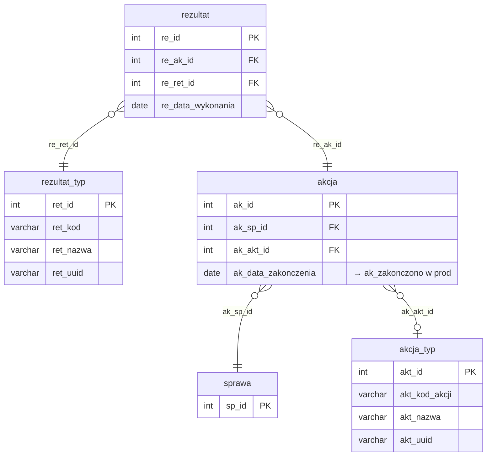

# Akcje i rezultaty

Iteracja 5 obejmuje akcje prowadzone w ramach spraw oraz ich rezultaty — kontakt telefoniczny, wizyta, wysłane pismo, itp. Dane z tej iteracji można załadować dopiero po Iteracji 4, ponieważ każda akcja musi być powiązana z istniejącą sprawą. Zobacz też: [walidacje](../przygotowanie-danych/walidacje.md), [kolejność ładowania](../przygotowanie-danych/kolejnosc-zasilania-tabel.md).

  Iteracja: 5
  Zależności: Iteracja 4
  Walidacje: <a href="../przygotowanie-danych/walidacje.md#biz_08">BIZ_08</a>
  Zakres: akcje prowadzone w sprawach oraz ich rezultaty

## Diagram ER

Diagram pokazuje tabele iteracji 5 (`akcja`, `rezultat`) wraz ze słownikami typów akcji i rezultatów z iteracji 1 oraz powiązaniem do sprawy z iteracji 4. Pełna struktura sprawy — [Sprawy i role § Diagram ER](sprawy.md#diagram-er). Słowniki `akcja_typ`/`rezultat_typ` — [Tabele słownikowe](slowniki.md).

## Tabele

### dbo.akcja

<code>dbo.akcja</code> — przekształcenie akcje wykonane w ramach spraw

  Tabela prod: <code>dm_data_web.akcja</code>
  Kształt mapowania: przekształcenie
  Obowiązkowa: nie
  Multi-row: tak (1 sprawa → N akcji)

Akcje wykonane w ramach spraw — operacyjna jednostka pracy na sprawie (telefon, wizyta, list, monit). Każda akcja wskazuje sprawę, w ramach której była prowadzona, oraz opcjonalnie typ akcji ze słownika `akcja_typ`. Kolumna `ak_data_zakonczenia` (NULL = akcja niezakończona) mapowana jest na prod `ak_zakonczono`.

<ul class="param-list">
  <li>
    ak_id
    INT
    Klucz główny akcji w stagingu
  </li>
  <li>
    ak_sp_id
    INT
    FK do sprawy
  </li>
  <li>
    ak_akt_id
    INT
    FK do słownika typów akcji - opcjonalny
  </li>
  <li>
    ak_data_zakonczenia
    DATE
    Data zakończenia akcji - mapowana na ak_zakonczono w prod
  </li>
  <li>
    mod_date
    DATETIME
    Kolumna techniczna - obsługiwana triggerami insert; nie wypełniać
  </li>
</ul>

### dbo.rezultat

<code>dbo.rezultat</code> — przekształcenie rezultaty akcji

  Tabela prod: <code>dm_data_web.rezultat</code>
  Kształt mapowania: przekształcenie
  Obowiązkowa: tak (BIZ_08: każda akcja musi mieć ≥1 rezultat)
  Multi-row: tak (1 akcja → N rezultatów, ale typowo 1:1)

Rezultaty akcji — wynik wykonania akcji (kontakt osiągnięty, brak odbioru, odmowa płatności, zobowiązanie do zapłaty itp.). Tabela materializuje wymóg BIZ_08: akcja bez rezultatu jest nieprawidłowa. Każdy rezultat wskazuje akcję, której dotyczy, oraz typ rezultatu ze słownika `rezultat_typ`.

<ul class="param-list">
  <li>
    re_id
    INT
    Klucz główny rezultatu akcji w stagingu
  </li>
  <li>
    re_ak_id
    INT
    FK do akcji
  </li>
  <li>
    re_ret_id
    INT
    FK do słownika typów rezultatów
  </li>
  <li>
    re_data_wykonania
    DATE
    Data wykonania rezultatu
  </li>
  <li>
    mod_date
    DATETIME
    Kolumna techniczna - obsługiwana triggerami insert; nie wypełniać
  </li>
</ul>

## Powiązania {#powiazania}

- Poprzednia iteracja: [Sprawy i role](sprawy.md)
- Następna iteracja: [Wierzytelności](wierzytelnosci.md)
- Słowniki bazowe iteracja 1: [akcja_typ](slowniki.md#dboakcja_typ), [rezultat_typ](slowniki.md#dborezultat_typ)
- Walidacje referencyjne (akcja): [REF_14 (sprawa), REF_32 (typ akcji)](../przygotowanie-danych/walidacje.md)
- Walidacje referencyjne (rezultat): [REF_33 (akcja), REF_34 (typ rezultatu)](../przygotowanie-danych/walidacje.md)
- Walidacje biznesowe: [BIZ_08 (akcja musi mieć ≥1 rezultat, BLOKUJĄCE)](../przygotowanie-danych/walidacje.md#biz_08)
