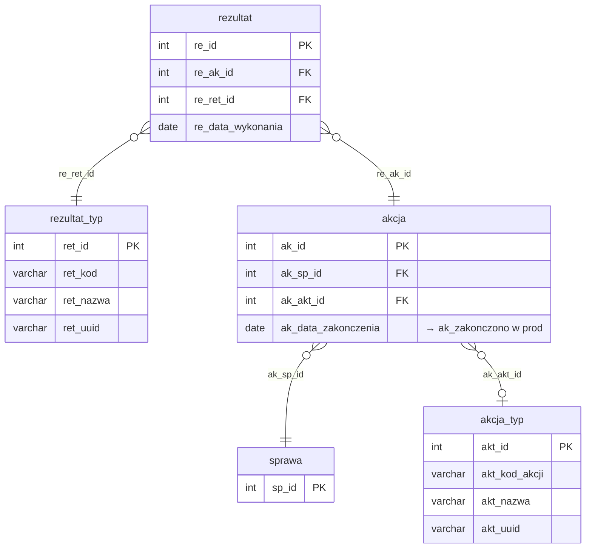

# Akcje i rezultaty

Iteracja 5 ładuje akcje windykacyjne wraz z ich rezultatami — dwie tabele stagingowe (`dbo.akcja`, `dbo.rezultat`) zasilają trzy tabele produkcyjne: `akcja`, `rezultat` oraz link table `akcja_typ_rezultat_typ` (derywowana z par stagingowych). Wszystkie przejścia są klasy **C**, zależne od słowników z iteracji 1 (`akcja_typ`, `rezultat_typ`) oraz od `mapowanie.dodane_sprawy` zbudowanego w iteracji 4. Iteracja 5 stanowi niezależną gałąź modelu danych — nie jest warunkiem koniecznym dla iteracji 6-9 (wierzytelności, dokumenty, finanse, harmonogram).

Iteracja 5 wprowadza nowy paradygmat rozwiązywania FK — zamiast VARCHAR `ext_id` kolumnowego mostu staging→prod, prod `akcja` przechowuje staging PK bezpośrednio w kolumnie `ak_migracja_id` (INT, indeksowana). Dzięki temu sekcja `rezultat` rozwiązuje FK przez JOIN `prod.akcja.ak_migracja_id = staging.re_ak_id` (INT=INT, bez CAST) — indeks `IX_akcja_ak_migracja_id` rebuildowany jest tuż przed INSERT-em do rezultat. Pozostałe FK do słowników iteracji 1 rozwiązywane są przez pre-zbudowane tabele tymczasowe (`#akt_map`, `#ret_map`) z `CAST(akt_uuid AS VARCHAR(50))` wykonanym raz, a nie per-wiersz. Idempotencja: `akcja` range-based (`WHERE stg.ak_id > @max_mig_id`), `rezultat` NOT EXISTS na composite (`re_ak_id`, `re_ret_id`) — scoping przez JOIN do staging `rezultat` zamiast `@max_mig_id` (po retry akcja high-water mark byłby już na max, co permanentnie pomijałoby rezultat). `akcja_typ_rezultat_typ` — DISTINCT pary wydobyte ze stagingu z WHERE NOT EXISTS po snapshot composite. Ze względu na wydajność, NCI na prod `akcja`+`rezultat` są disablowane przed sekcjami 4-5 i rebuildowane globalnie po zakończeniu pipeline; sekcje 1-2 dodatkowo re-MERGE słowniki `akcja_typ`/`rezultat_typ` (safety przebieg — wyniki iteracji 1 są idempotentne). Szczegóły per prod-tabela w sekcjach `### dbo.<tabela>`; walidacje referencyjne i biznesowe w sekcji [Powiązania](#powiazania) poniżej.

  Iteracja: 5
  Zależności: Iteracja 1 (akcja_typ, rezultat_typ) + Iteracja 4 (mapowanie.dodane_sprawy)

## Diagram ER

Diagram pokazuje tabele iteracji 5 (`akcja`, `rezultat`) wraz z ich słownikami z iteracji 1 oraz minimalnym stubem `sprawa` z iteracji 4 jako punktem zaczepienia FK `ak_sp_id`. Pełna struktura sprawy (`sprawa_typ`, `sprawa_etap`, `sprawa_rola`) — [Sprawy § Diagram ER](sprawy.md#diagram-er). Słowniki `akcja_typ`/`rezultat_typ` — [Tabele słownikowe](slowniki.md). Prod-only link table `akcja_typ_rezultat_typ` opisana w sekcji `<code>dbo.akcja_typ_rezultat_typ</code>` poniżej — derywowana z JOIN staging `rezultat` × `akcja` × `akcja_typ` × `rezultat_typ`.

## Tabele

<code>dbo.akcja</code> — C akcje windykacyjne wykonane w ramach spraw

  Tabela prod: <code>dm_data_web.akcja</code>
  Klasa: C — pełna transformacja (paradygmat `ak_migracja_id`)
  Obowiązkowa: nie
  Multi-row: tak (1 sprawa → N akcji)

Akcje windykacyjne wykonane w ramach spraw — operacyjna jednostka pracy na sprawie (telefon, wizyta, list, monit). Staging PK `ak_id` jest typu INT; prod używa IDENTITY i przechowuje pochodzenie staging PK w kolumnie `ak_migracja_id` (INT, nie VARCHAR `ext_id`). Ten paradygmat pozwala sekcji `rezultat` rozwiązać FK `re_ak_id → ak_id` bez CAST — prod `ak_migracja_id` jest indeksowany (`IX_akcja_ak_migracja_id`) i zapewnia szybki INT=INT JOIN. Kolumna `ak_data_zakonczenia` (NULL = akcja niezakończona) mapowana jest na prod `ak_zakonczono`.

<ul class="param-list">
  <li>
    ak_id
    INT
    Klucz główny akcji w stagingu
  </li>
  <li>
    ak_sp_id
    INT
    FK do sprawy - rozwiązywany przez mapowanie.dodane_sprawy
  </li>
  <li>
    ak_akt_id
    INT
    FK do słownika typów akcji - opcjonalny
  </li>
  <li>
    ak_data_zakonczenia
    DATE
    Data zakończenia akcji - mapowana na ak_zakonczono w prod
  </li>
  <li>
    mod_date
    DATETIME
    Kolumna techniczna - obsługiwana triggerami insert; nie wypełniać
  </li>
</ul>

### dbo.akcja
Prod `akcja` generuje własny IDENTITY `ak_id` — staging PK trafia do kolumny `ak_migracja_id` (INT). Idempotencja realizowana jest range-based: `WHERE stg.ak_id > @max_mig_id` (gdzie `@max_mig_id = MAX(ak_migracja_id)` w prod, domyślnie `-2147483648` dla stagingu pustego). FK `ak_sp_id` rozwiązywany przez INNER JOIN na `mapowanie.dodane_sprawy` (staging `sp_id` → prod `sp_id`; tabela budowana przez iteracja 4). FK `ak_akt_id` rozwiązywany przez pre-zbudowaną tabelę tymczasową `#akt_map` (staging `akt_id` → prod `akt_id` przez `akt_uuid`, `CAST(akt_uuid AS VARCHAR(50))` wykonany raz podczas budowy mapy). Przy INSERT stosowana jest jedna przemianowana kolumna: staging `ak_data_zakonczenia` trafia do prod `ak_zakonczono` (NULL = akcja niezakończona). Kolumny hardkodowane: `ak_kolejnosc = 0` i `ak_interwal = 0` (brak odpowiedników w stagingu — prod wymaga wartości domyślnych). Performance: przed INSERT-em NCIs na prod `akcja` + `rezultat` są DISABLE (proc `usp_manage_prod_ncis 'akcja,rezultat', 'DISABLE'`), a sam INSERT wykorzystuje hint `WITH (TABLOCK)` — w połączeniu z disabled NCIs daje minimalnie-logowany bulk insert. Indeks `IX_akcja_ak_migracja_id` rebuildowany jest natychmiast po INSERT do `akcja` (przed sekcją `rezultat`), pozostałe NCIs rebuildowane globalnie po zakończeniu pipeline. Pominięte przy INSERT: IDENTITY `ak_id`. Kolumny `aud_data`/`aud_login` wypełniane są explicite (odpowiednio `COALESCE(stg.mod_date, @aud_now)` i `@aud_login`), z pominięciem UDF-a obliczającego defaulty.

<code>dbo.rezultat</code> — C rezultaty akcji windykacyjnych (rozszerza prod: `rezultat` + `akcja_typ_rezultat_typ`)

  Tabele prod: <code>dm_data_web.rezultat</code>, <code>dm_data_web.akcja_typ_rezultat_typ</code>
  Klasa: C — pełna transformacja (link table derywowany)
  Obowiązkowa: tak (BIZ_08: każda akcja musi mieć ≥1 rezultat)
  Multi-row: tak (1 akcja → N rezultatów, ale typowo 1:1)

Rezultaty akcji windykacyjnych — wynik wykonania akcji (kontakt osiągnięty, brak odbioru, odmowa płatności, zobowiązanie do zapłaty itp.). Staging PK `re_id` istnieje, ale nie trafia do prod — prod używa IDENTITY `re_id`, a **nie posiada** kolumny `re_ext_id` (w przeciwieństwie do tabel iteracja 3, gdzie ext_id jest kotwicą idempotencji). Tabela jest materializacją wymogu BIZ_08 (akcja bez rezultatu jest nieprawidłowa) i walidowana jest przez REF_33 (FK do akcji) i REF_34 (FK do typu rezultatu). Dodatkowo iteracja 5 wykorzystuje staging `rezultat` × `akcja` jako źródło derywacji link-table `akcja_typ_rezultat_typ` (distinct pary `akt_id` × `ret_id`).

<ul class="param-list">
  <li>
    re_id
    INT
    Klucz główny rezultatu akcji w stagingu
  </li>
  <li>
    re_ak_id
    INT
    FK do akcji - rozwiązywany przez prod.akcja.ak_migracja_id
  </li>
  <li>
    re_ret_id
    INT
    FK do słownika typów rezultatów
  </li>
  <li>
    re_data_wykonania
    DATE
    Data wykonania rezultatu
  </li>
  <li>
    mod_date
    DATETIME
    Kolumna techniczna - obsługiwana triggerami insert; nie wypełniać
  </li>
</ul>

### dbo.rezultat
Prod `rezultat` generuje własny IDENTITY `re_id` — staging PK nie trafia do prod (brak kolumny `re_ext_id` w prod `rezultat`). FK `re_ak_id` rozwiązywany przez INNER JOIN na `prod.akcja.ak_migracja_id = stg.re_ak_id` (INT=INT, bez CAST — wykorzystuje indeks `IX_akcja_ak_migracja_id` rebuildowany w poprzednim kroku). FK `re_ret_id` rozwiązywany przez pre-zbudowaną tabelę tymczasową `#ret_map` (staging `ret_id` → prod `ret_id` przez `ret_uuid`, `CAST(ret_uuid AS VARCHAR(50))` wykonany raz). Idempotencja nie może być range-based — na retry po udanym INSERT do `akcja` wartość `@max_mig_id` byłaby już na maksimum, co permanentnie pomijałoby wiersze rezultat — dlatego scoping realizowany jest przez JOIN do staging `dbo.rezultat` (naturalny zakres bieżących danych stagingu) plus `NOT EXISTS` na composite key (`re_ak_id`, `re_ret_id`) w prod. Kolumna `re_data_wykonania` kopiowana jest 1:1. Brak kolumn hardkodowanych. INSERT korzysta z hint `WITH (TABLOCK)` i disabled NCIs (patrz sekcja `### dbo.akcja` powyżej) — minimalnie-logowany bulk insert. Pominięte przy INSERT: IDENTITY `re_id` w prod, staging `re_id` (nie używany — prod nie ma odpowiednika ext_id). Kolumny `aud_data`/`aud_login` wypełniane są explicite (odpowiednio `COALESCE(stg.mod_date, @aud_now)` i `@aud_login`), z pominięciem UDF-a.

### dbo.akcja_typ_rezultat_typ
Link table typu N:M — pary `(akt_id, ret_id)` dopuszczalne w modelu produkcyjnym. W iteracji 5 derywowana ze stagingu: `FROM dbo.rezultat JOIN dbo.akcja ON ak_id = re_ak_id JOIN dbo.akcja_typ ON akt_id = ak_akt_id JOIN dbo.rezultat_typ ON ret_id = re_ret_id` — następnie JOIN-y do prod `akcja_typ`/`rezultat_typ` po `akt_uuid`/`ret_uuid` rozwiązują prod IDs. `SELECT DISTINCT` deduplikuje (ta sama para `akt_id` × `ret_id` może wystąpić wielokrotnie w stagingu przy różnych sprawach). Idempotencja: snapshot istniejących par prod trafia do indeksowanej `#existing_akrt` (UNIQUE INDEX na composite), a `LEFT JOIN ... WHERE ex.aktret_akt_id IS NULL` pomija pary już obecne. Brak kolumn hardkodowanych. Tabela ładowana jest **przed** sekcjami `### dbo.akcja` i `### dbo.rezultat` (SECTION 3 w SQL), ponieważ jej zawartość zależy wyłącznie od stagingu — nie od prod-owych FK rozwiązywanych w sekcjach 4-5.

## Powiązania {#powiazania}

- Poprzednia iteracja: [Sprawy i role](sprawy.md)
- Następna iteracja: [Wierzytelności](wierzytelnosci.md)
- Klasyfikacja mapowania: [Mapowanie staging → prod](mapowanie-tabel.md)
- Słowniki bazowe iteracja 1: [akcja_typ](slowniki.md#dboakcja_typ), [rezultat_typ](slowniki.md#dborezultat_typ)
- Walidacje referencyjne (akcja): [REF_14 (sprawa), REF_32 (typ akcji)](../przygotowanie-danych/walidacje.md)
- Walidacje referencyjne (rezultat): [REF_33 (akcja), REF_34 (typ rezultatu)](../przygotowanie-danych/walidacje.md)
- Walidacje biznesowe: [BIZ_08 (akcja musi mieć ≥1 rezultat, BLOKUJĄCE)](../przygotowanie-danych/walidacje.md)
