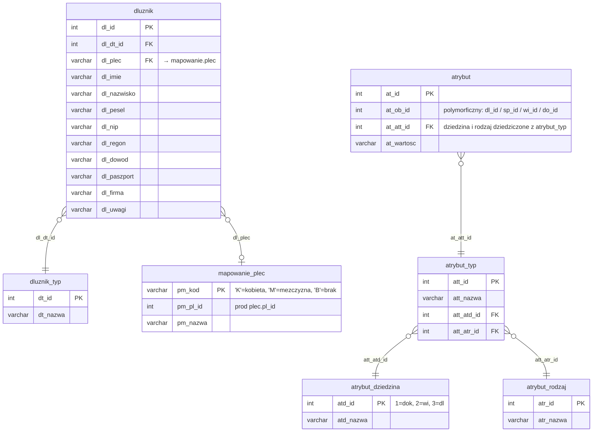

# Dłużnicy i atrybuty dłużników

Iteracja 2 ładuje dane master dłużników oraz ich atrybuty na bazie słowników z iteracji 1. Obejmuje cztery tabele stagingowe migrujące do produkcji: `dbo.dluznik` (rekord główny dłużnika), `dbo.atrybut` z filtrem `att_atd_id = 3` (atrybuty domeny dłużnik), oraz parę `dbo.wlasciwosc` + `dbo.wlasciwosc_dluznik` z filtrem `wdzi_id = 4` (właściwości domeny dłużnik). Dodatkowo konsumowana jest tabela pomocnicza `mapowanie.plec`, która mapuje jednoliterowe kody płci ze stagingu na FK prod `plec.pl_id`. Ta iteracja jest warunkiem koniecznym dla iteracji 3 (kontakty — adres, mail, telefon) oraz iteracja 4 (sprawy i role dłużników).

Pod względem mechaniki iteracja 2 stosuje wspólny wzorzec: produkcja generuje własny klucz IDENTITY, staging PK trafia do kolumny `*_ext_id` (VARCHAR) w tabeli prod, a FK rozwiązywane są przez JOIN na `ext_id` tabel prod lub przez tabele mapujące (`mapowanie.dodani_dluznicy`). Polimorficzne tabele `atrybut` i `wlasciwosc` rozgałęziają się na dedykowane tabele dziedzinowe (`atrybut_wartosc` + `atrybut_dluznik`, `wlasciwosc` + `wlasciwosc_dluznik`). Iteracja 2 jest pierwszą iteracją używającą współdzielonych procedur `usp_migrate_atrybut_wartosc` oraz `usp_migrate_wlasciwosc_domain` — ten sam mechanizm powtarzają iteracja 3 (właściwości kontaktów), iteracja 4 (atrybuty spraw), iteracja 6 (atrybuty wierzytelności) i iteracja 7 (atrybuty dokumentów). Wszystkie cztery migrujące tabele iteracji 2 są klasy **C** — wymagają pełnych transformacji (renamy kolumn, JOIN-y na ext_id, hardkodowane stałe); szczegóły per tabela opisane są w sekcji `### dbo.<tabela>` każdego bloku. Tabela `mapowanie.plec` jest pomocnicza — nie migruje do prod, służy wyłącznie jako słownik JOIN podczas ładowania `dluznik`, dlatego nie nosi badge'a klasy. Walidacje referencyjne, formatu i biznesowe zebrane są w sekcji [Powiązania](#powiazania) poniżej.

  Iteracja: 2
  Zależności: Iteracja 1 (tabele słownikowe)

## Diagram ER

W diagramie węzeł `mapowanie_plec` używa podkreślenia zamiast kropki — składnia mermaid `erDiagram` nie dopuszcza kropek w nazwach encji.

## Tabele

<code>dbo.dluznik</code> — C rekord główny dłużnika (osoba fizyczna lub podmiot gospodarczy)

  Tabela prod: <code>dm_data_web.dluznik</code>
  Klasa: C — pełna transformacja
  Obowiązkowa: tak
  Multi-row: tak

Główny rekord dłużnika — obejmuje zarówno osoby fizyczne (`dl_dt_id` ∈ {1,2}), jak i podmioty gospodarcze (`dl_dt_id` ∈ {3,4}). Staging PK `dl_id` jest typu INT, prod używa IDENTITY i przechowuje pochodzenie w `dl_ext_id` (VARCHAR). Ta tabela zawiera najwięcej transformacji w iteracji 2: pięć zmian nazw kolumn, CAST typu, mapowanie słownikowe płci i rozwiązanie FK.

<ul class="param-list">
  <li>
    dl_id
    INT
    Klucz główny dłużnika w stagingu
  </li>
  <li>
    dl_plec
    VARCHAR(1)
    Kod płci dłużnika - wartość tekstowa mapowana na prod przez mapowanie.plec
  </li>
  <li>
    dl_imie
    VARCHAR
    Imię dłużnika - wymagane dla wartości dl_dt_id równych (1,2)
  </li>
  <li>
    dl_nazwisko
    VARCHAR
    Nazwisko dłużnika - wymagane dla wartości dl_dt_id równych (1,2)
  </li>
  <li>
    dl_dowod
    VARCHAR
    Numer dowodu osobistego dłużnika
  </li>
  <li>
    dl_paszport
    VARCHAR
    Numer paszportu dłużnika
  </li>
  <li>
    dl_dluznik
    VARCHAR
    Wewnętrzny numer ewidencyjny dłużnika
  </li>
  <li>
    dl_pesel
    VARCHAR
    Numer PESEL dłużnika - wymagany dla wartości dl_dt_id równych (1,2)
  </li>
  <li>
    dl_dt_id
    INT
    FK do słownika typów dłużnika - determinuje wymagane pola: (1,2) osoba fizyczna, (3,4) podmiot gospodarczy
  </li>
  <li>
    dl_uwagi
    VARCHAR
    Uwagi dotyczące dłużnika
  </li>
  <li>
    dl_firma
    VARCHAR
    Nazwa firmy dłużnika - wymagana dla wartości dl_dt_id równych (3,4)
  </li>
  <li>
    dl_import_info
    INT
    Identyfikator paczki importu, z której pochodzi rekord
  </li>
  <li>
    dl_nip
    VARCHAR
    Numer NIP dłużnika - wymagany dla wartości dl_dt_id równych (3,4)
  </li>
  <li>
    dl_regon
    VARCHAR
    Numer REGON dłużnika
  </li>
  <li>
    mod_date
    DATETIME
    Kolumna techniczna - obsługiwana triggerami insert; nie wypełniać
  </li>
</ul>

### dbo.dluznik
Prod `dluznik` generuje własny IDENTITY `dl_id` — staging PK trafia do kolumny `dl_ext_id` (VARCHAR) jako odwzorowanie migracyjne. Przy INSERT przemianowane są cztery kolumny: `dl_dowod → dl_numer_dowodu`, `dl_paszport → dl_numer_paszportu`, `dl_dluznik → dl_numer`, `dl_uwagi → dl_opis`. Kolumna `dl_import_info` rzutowana jest z INT na VARCHAR(50). Płeć rozwiązywana jest przez LEFT JOIN `mapowanie.plec` na `pm_kod = dl_plec`; wynikowe `pm_pl_id` trafia do prod `dl_pl_id` (INT, FK do prod `plec`). FK `dl_dt_id` rozwiązywany jest przez JOIN na `staging.dluznik_typ.dt_ext_id → prod.dluznik_typ.dt_id`. Po zakończeniu MERGE odwzorowanie staging→prod PK zapisywane jest do tabeli `mapowanie.dodani_dluznicy` — ta tabela jest źródłem FK dla iteracji 3, iteracja 4 i dalej. Pominięte przy INSERT: `aud_data`/`aud_login` (systemowe) oraz IDENTITY `dl_id`.

<code>dbo.atrybut</code> (att_atd_id=3) — C atrybuty dodatkowe dziedziny dłużnik, rozbicie na dwie tabele prod

  Tabela prod: <code>dm_data_web.atrybut_wartosc</code> + <code>dm_data_web.atrybut_dluznik</code>
  Klasa: C — fan-out + shared proc
  Obowiązkowa: nie
  Multi-row: tak

Polimorficzna tabela wartości atrybutów — w iteracji 2 ładowane są tylko rekordy z filtrem `att_atd_id = 3` (dziedzina dłużnik). Każdy wiersz stagingowy jest rozbijany na dwie tabele prod: `atrybut_wartosc` (wartość wraz z typem atrybutu) oraz `atrybut_dluznik` (tabela łącząca wartość z konkretnym dłużnikiem). Filtr na `at_att_id` przez JOIN z `staging.atrybut_typ` ograniczonym do `att_atd_id = 3`. MERGE wykonywany wspólną procedurą `usp_migrate_atrybut_wartosc`.

<ul class="param-list">
  <li>
    at_id
    INT
    Klucz główny atrybutu
  </li>
  <li>
    at_ob_id
    INT
    Identyfikator encji docelowej - FK do tabeli określonej przez atrybut_typ.att_atd_id
  </li>
  <li>
    at_wartosc
    VARCHAR
    Wartość atrybutu
  </li>
  <li>
    at_att_id
    INT
    FK do słownika typów atrybutu - dziedzina i rodzaj dziedziczone z atrybut_typ
  </li>
  <li>
    mod_date
    DATETIME
    Kolumna techniczna - obsługiwana triggerami insert; nie wypełniać
  </li>
</ul>

### dbo.atrybut
Shared proc `usp_migrate_atrybut_wartosc` wykonuje dwufazowe ładowanie. Faza 1 — MERGE do `prod.atrybut_wartosc` (IDENTITY `atw_id`): staging `at_id` trafia do `atw_ext_id` VARCHAR(100), wartość `at_wartosc` kopiowana jest do `atw_wartosc`, FK `atw_att_id` rozwiązywany przez JOIN na `staging.atrybut_typ.att_ext_id → prod.atrybut_typ.att_id`. Mapping staging `at_id` → prod `atw_id` trafia do tabeli tymczasowej `#atw_mapping`. Faza 2 — INSERT do `prod.atrybut_dluznik` (tabela łącząca, PK composite `atdl_atw_id + atdl_dl_id`): FK `atdl_atw_id` pobierany z `#atw_mapping`, FK `atdl_dl_id` rozwiązywany przez `mapowanie.dodani_dluznicy` (staging `at_ob_id` traktowany jako staging `dl_id`). Filtr iteracja 2 wymusza `att_atd_id = 3` na etapie JOIN-a z `atrybut_typ`. Pominięte przy INSERT: `aud_data`/`aud_login` (systemowe), IDENTITY w prod. Ten sam wzorzec powtarzają iteracja 4 (`att_atd_id = 4`, sprawa), iteracja 6 (`=2`, wierzytelność) i iteracja 7 (`=1`, dokument).

<code>dbo.wlasciwosc</code> (wdzi_id=4) — C wartości właściwości dziedziny dłużnik

  Tabela prod: <code>dm_data_web.wlasciwosc</code>
  Klasa: C — shared proc (tryb MAPPING)
  Obowiązkowa: nie
  Multi-row: tak

Nagłówkowa tabela właściwości przypisanych do dłużnika — w iteracji 2 ładowane są tylko rekordy, w których skonfigurowana dziedzina w `wlasciwosc_typ_podtyp_dziedzina` wskazuje na `wdzi_id = 4` (dluznik). Ten sam nagłówek `wlasciwosc` występuje w iteracji 3 z trzema innymi dziedzinami (adres/email/telefon), dlatego migracja wykonywana jest współdzieloną procedurą `usp_migrate_wlasciwosc_domain`, parametryzowaną trybem i filtrami.

<ul class="param-list">
  <li>
    wl_id
    INT
    Klucz główny właściwości w stagingu
  </li>
  <li>
    wl_wtpd_id
    INT
    FK do konfiguracji typ/podtyp/dziedzina (wlasciwosc_typ_podtyp_dziedzina.wtpd_id) - determinuje dziedzinę (dluznik/adres/mail/telefon)
  </li>
  <li>
    wl_aktywny_od
    DATETIME
    Data początku obowiązywania właściwości
  </li>
  <li>
    wl_aktywny_do
    DATETIME
    Data końca obowiązywania właściwości - NULL oznacza obowiązywanie bezterminowe
  </li>
  <li>
    mod_date
    DATETIME
    Kolumna techniczna - obsługiwana triggerami insert; nie wypełniać
  </li>
</ul>

### dbo.wlasciwosc
Shared proc `usp_migrate_wlasciwosc_domain` uruchamiany w trybie MAPPING z filtrem `wdzi_id = 4`. MERGE do `prod.wlasciwosc` (IDENTITY `wl_id`): staging `wl_id` rejestrowany jako `wl_ext_id` (VARCHAR), FK `wl_wtpd_id` rozwiązywany przez JOIN na `staging.wlasciwosc_typ_podtyp_dziedzina.wtpd_ext_id → prod.wlasciwosc_typ_podtyp_dziedzina.wtpd_id`. Kolumny hardkodowane: `wl_zpi_id = 2` (stała `@ZPI_IMPORT`) oraz `wl_tworzacy_us_id = @system_admin_user_id`. Kolumny `wl_aktywny_od` i `wl_aktywny_do` kopiowane 1:1. Mapping staging→prod PK materializowany jest w tabeli tymczasowej proca i wykorzystywany przy INSERT do `wlasciwosc_dluznik` (tryb MAPPING). Pominięte przy INSERT: `aud_data`/`aud_login` (systemowe), IDENTITY w prod.

<code>dbo.wlasciwosc_dluznik</code> — C tabela łącząca właściwość z dłużnikiem

  Tabela prod: <code>dm_data_web.wlasciwosc_dluznik</code>
  Klasa: C — junction, shared proc
  Obowiązkowa: nie
  Multi-row: tak

Tabela łącząca (junction) — każdy wiersz wiąże rekord `wlasciwosc` z konkretnym dłużnikiem. Ładowana razem z rodzicem `wlasciwosc` w tym samym kroku iteracja 2. W iteracji 3 występują siostrzane tabele junction dla pozostałych dziedzin (`wlasciwosc_adres`, `wlasciwosc_email`, `wlasciwosc_telefon`). Brak osobnego `ext_id` w stagingu — idempotencja zapewniona przez composite key na prod.

<ul class="param-list">
  <li>
    wd_id
    INT
    Klucz główny wiersza łączącego
  </li>
  <li>
    wd_wl_id
    INT
    FK do wlasciwosc (wl_id) - konkretna właściwość przypisana dłużnikowi
  </li>
  <li>
    wd_dl_id
    INT
    FK do dluznik (dl_id) - dłużnik, któremu przypisano właściwość
  </li>
  <li>
    mod_date
    DATETIME
    Kolumna techniczna - obsługiwana triggerami insert; nie wypełniać
  </li>
</ul>

### dbo.wlasciwosc_dluznik
MERGE po composite key (`wd_wl_id`, `wd_dl_id`); brak kolumn hardkodowanych. Dzieli wspólny shared proc `usp_migrate_wlasciwosc_domain` z rodzicem `wlasciwosc` (tryb MAPPING, filtr `wdzi_id=4`). FK `wd_dl_id` rozwiązywane przez `mapowanie.dodani_dluznicy` (staging `dl_id` → prod `dl_id`). Pominięte: `aud_data`/`aud_login` (systemowe), prod PK (IDENTITY). Brak osobnego `ext_id` w stagingu — idempotencja po composite key (`wd_wl_id`, `wd_dl_id`).

<code>mapowanie.plec</code> — mapowanie kodu płci na FK do prod plec

  Tabela prod: <code>dm_data_web.plec</code> (tylko referencja dla rozwiązania FK)
  Klasa: — pomocnicza (nie migruje do prod)
  Obowiązkowa: tak (dla dłużników z niepustym `dl_plec`)
  Multi-row: tak

Tabela pomocnicza — nie podlega migracji do prod. Zawiera słownik mapowania jednoliterowych kodów płci (`'K'`, `'M'`, `'B'`) występujących w kolumnie `dbo.dluznik.dl_plec` na identyfikatory produkcyjnej tabeli `plec` (`pm_pl_id`). Jest konsumowana wyłącznie przez krok `dluznik` — LEFT JOIN `mapowanie.plec ON pm_kod = stg.dl_plec` dostarcza wartość `pm_pl_id` wstawianą do prod `dluznik.dl_pl_id`. Wiersz musi być wypełniony przed uruchomieniem iteracja 2; brak odpowiedniego mapowania skutkuje `NULL` w prod `dl_pl_id` dla dłużników z niepustym `dl_plec`.

<ul class="param-list">
  <li>
    pm_kod
    VARCHAR
    Jednoliterowy kod płci
  </li>
  <li>
    pm_pl_id
    INT
    FK do tabeli plec
  </li>
  <li>
    pm_nazwa
    VARCHAR
    Opis przekazanego kodu
  </li>
</ul>

## Powiązania {#powiazania}

- Poprzednia iteracja: [Tabele słownikowe](slowniki.md)
- Następna iteracja: [Dane kontaktowe (adres, mail, telefon)](kontakty.md)
- Klasyfikacja mapowania: [Mapowanie staging → prod](mapowanie-tabel.md)
- Walidacje referencyjne (dluznik): [REF_26, REF_30](../przygotowanie-danych/walidacje.md)
- Walidacje referencyjne (atrybut): [REF_15, REF_16, REF_17, REF_18, REF_19, REF_28](../przygotowanie-danych/walidacje.md)
- Walidacje formatu (dluznik): [FMT_01 (PESEL), FMT_02 (NIP), FMT_03 (REGON)](../przygotowanie-danych/walidacje.md)
- Walidacje biznesowe (dluznik): [BIZ_13 (brak identyfikatora)](../przygotowanie-danych/walidacje.md)
