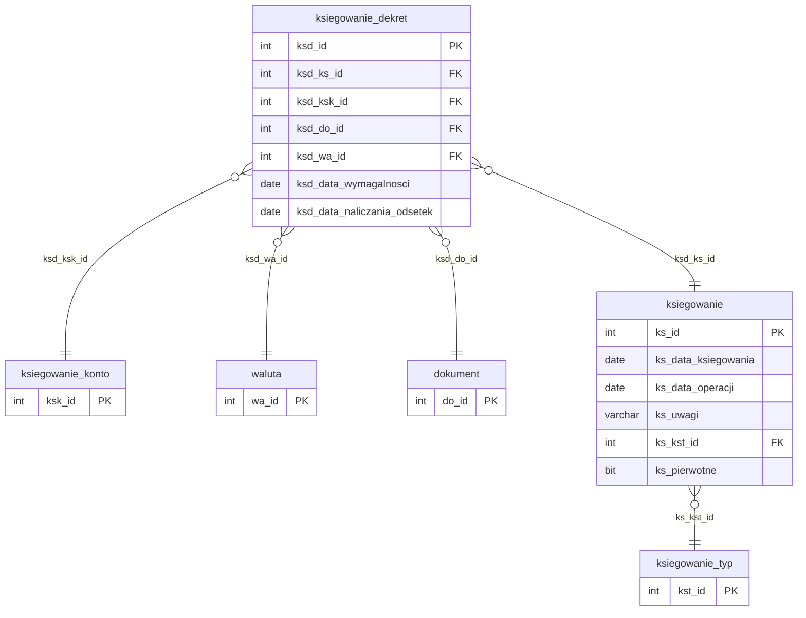

# Dane finansowe

Iteracja 8 obejmuje księgowania i dekrety — kwoty obciążające/uznanie wierzytelności, rozbite na pozycje rodzajowe (kapitał, odsetki, koszty) zgodnie z zasadą podwójnego zapisu. Dane z tej iteracji można załadować dopiero po Iteracji 7, ponieważ każde księgowanie referuje dokument lub wierzytelność z wcześniejszych iteracji. Zobacz też: [walidacje](../przygotowanie-danych/walidacje.md), [kolejność ładowania](../przygotowanie-danych/kolejnosc-zasilania-tabel.md).

  Iteracja: 8
  Zależności: Iteracja 7
  Walidacje: <a href="../przygotowanie-danych/walidacje.md#biz_05">BIZ_05</a>, <a href="../przygotowanie-danych/walidacje.md#biz_06">BIZ_06</a>, <a href="../przygotowanie-danych/walidacje.md#biz_17">BIZ_17</a>, <a href="../przygotowanie-danych/walidacje.md#biz_18">BIZ_18</a>
  Zakres: księgowania i dekrety

## Diagram ER

Diagram pokazuje dwie encje finansowe iteracji 8 (`ksiegowanie`, `ksiegowanie_dekret`) oraz minimalne stuby `ksiegowanie_typ`, `ksiegowanie_konto`, `waluta` (iteracja 1) i `dokument` (iteracja 7) jako punkty zaczepienia FK. Słownik typów księgowań — [Słowniki § dbo.ksiegowanie_typ](slowniki.md#dboksiegowanie_typ); słownik kont księgowych — [Słowniki § dbo.ksiegowanie_konto](slowniki.md#dboksiegowanie_konto); słownik walut — [Słowniki § dbo.waluta](slowniki.md); dokumenty — [Role wierzytelności i dokumenty § dbo.dokument](role-wierzytelnosci-i-dokumenty.md#dbodokument). Staging `dbo.operacja` nie ma bezpośredniego odpowiednika w modelu prod — jego kwoty są rozbijane na pozycje rodzajowe (kapitał, odsetki, opłaty, prowizje) i zasilają równocześnie `ksiegowanie` oraz `ksiegowanie_dekret`, dlatego nie pojawia się jako osobna encja na diagramie. Kolumny staging niewykorzystywane przez iterację 8 (`ksd_ksksub_id`, większość kolumn opisowych `operacja`) są wymienione w param-list, ale pominięte na diagramie.

## Tabele

### dbo.ksiegowanie

<code>dbo.ksiegowanie</code> — przekształcenie nagłówki księgowań finansowych

  Tabela prod: <code>dm_data_web.ksiegowanie</code>
  Kształt mapowania: przekształcenie
  Obowiązkowa: nie
  Multi-row: tak (1 wierzytelność → N księgowań)

Nagłówek księgowania finansowego — data operacji, data zaksięgowania, typ księgowania i powiązanie z wierzytelnością (pośrednio, przez dekrety). Księgowanie grupuje dekrety dwustronne (Winien/Ma) dla jednej operacji gospodarczej.

<ul class="param-list">
  <li>
    ks_id
    INT
    Klucz główny księgowania.
  </li>
  <li>
    ks_data_ksiegowania
    DATE
    Data zaksięgowania operacji w systemie źródłowym.
  </li>
  <li>
    ks_data_operacji
    DATE
    Data operacji finansowej (data zdarzenia gospodarczego).
  </li>
  <li>
    ks_uwagi
    VARCHAR
    Uwagi księgowego dotyczące księgowania.
  </li>
  <li>
    ks_kst_id
    INT
    FK do słownika typów księgowań.
  </li>
  <li>
    ks_pierwotne
    BIT
    Flaga: księgowanie pierwotne (1) vs. korygujące (0).
  </li>
  <li>
    mod_date
    DATETIME
    Kolumna techniczna — obsługiwana triggerami insert; nie wypełniać.
  </li>
</ul>

### dbo.ksiegowanie_dekret

<code>dbo.ksiegowanie_dekret</code> — przekształcenie dekrety księgowań — pozycje szczegółowe per dokument

  Tabela prod: <code>dm_data_web.ksiegowanie_dekret</code>
  Kształt mapowania: przekształcenie
  Obowiązkowa: nie
  Multi-row: tak (1 księgowanie → N dekretów — linie Winien/Ma)

Dekret księgowania — pozycja szczegółowa nagłówka, przypisana do dokumentu lub (w przypadku dekretów wynikających z operacji finansowych) do nagłówka bez dokumentu. Staging `ksd_kwota` koduje stronę dekretu znakiem: wartości dodatnie oznaczają stronę Winien, ujemne — Ma. Dekrety zgrupowane jednym `ksd_ks_id` muszą bilansować się do zera zgodnie z zasadą podwójnego zapisu.

<ul class="param-list">
  <li>
    ksd_id
    INT
    Klucz główny dekretu w stagingu.
  </li>
  <li>
    ksd_ks_id
    INT
    FK do księgowania (nagłówka).
  </li>
  <li>
    ksd_do_id
    INT
    FK do dokumentu (opcjonalny — dekret może nie być powiązany z dokumentem).
  </li>
  <li>
    ksd_kwota
    DECIMAL(18,4)
    Kwota dekretu z zakodowaną stroną: dodatnia → Winien, ujemna → Ma.
  </li>
  <li>
    ksd_data_naliczania_odsetek
    DATE
    Data, od której naliczane są odsetki dla dekretu.
  </li>
  <li>
    ksd_ksk_id
    INT
    FK do słownika kont księgowych.
  </li>
  <li>
    ksd_uwagi
    VARCHAR
    Opcjonalne pole opisowe dekretu.
  </li>
  <li>
    ksd_sp_id
    INT
    FK do sprawy (pomocnicze — służy do wyznaczenia repertorium dekretu).
  </li>
  <li>
    ksd_kurs_bazowy
    DECIMAL
    Kurs wymiany z waluty dekretu na walutę bazową (PLN).
  </li>
  <li>
    ksd_kwota_wn_wyceny
    DECIMAL(18,4)
    Kwota Winien w walucie wyceny (pole zarezerwowane — obecnie nie wypełniane).
  </li>
  <li>
    ksd_kwota_ma_wyceny
    DECIMAL(18,4)
    Kwota Ma w walucie wyceny (pole zarezerwowane — obecnie nie wypełniane).
  </li>
  <li>
    ksd_wa_id_wyceny
    INT
    FK do słownika walut (waluta wyceny) — pole zarezerwowane, obecnie nie wypełniane.
  </li>
  <li>
    ksd_kwota_wn_bazowa
    DECIMAL(18,4)
    Kwota Winien w walucie bazowej (PLN).
  </li>
  <li>
    ksd_kwota_ma_bazowa
    DECIMAL(18,4)
    Kwota Ma w walucie bazowej (PLN).
  </li>
  <li>
    ksd_wa_id
    INT
    FK do słownika walut (waluta dekretu).
  </li>
  <li>
    ksd_data_wymagalnosci
    DATE
    Data wymagalności dekretu (dziedziczona z powiązanego dokumentu).
  </li>
  <li>
    ksd_ksksub_id
    INT
    FK do subkonta konta księgowego (pole schema-only w iteracji 8, REF_35).
  </li>
  <li>
    mod_date
    DATETIME
    Kolumna techniczna — obsługiwana triggerami insert; nie wypełniać.
  </li>
</ul>

### dbo.operacja

<code>dbo.operacja</code> — rozbicie operacje finansowe rozbijane na nagłówek + dekrety rodzajowe

  Tabele prod: <code>dm_data_web.ksiegowanie</code>, <code>dm_data_web.ksiegowanie_dekret</code>
  Kształt mapowania: rozbicie
  Obowiązkowa: nie
  Multi-row: tak (1 operacja → 1 nagłówek + 1–5 dekretów)

Operacja finansowa z systemu źródłowego — wpłaty, umorzenia, korekty, koszty i alokacje. Staging `operacja` nie odpowiada pojedynczej tabeli prod — jej kwoty są rozbijane na pozycje rodzajowe (kapitał, odsetki karne, odsetki umowne, opłaty, prowizje) w momencie ładowania i zasilają jednocześnie nagłówek `ksiegowanie` oraz od jednego do pięciu dekretów `ksiegowanie_dekret`. Strona dekretu (Winien/Ma) wynika z `oper_rejestr_kod` — `wplata` i `umorzenie` trafiają na stronę Winien, pozostałe (korekta, koszt, nadpłata, alokacja) na stronę Ma.

<ul class="param-list">
  <li>
    oper_id
    INT
    Klucz główny operacji.
  </li>
  <li>
    oper_wi_id
    INT
    FK do wierzytelności (powiązanie wierzytelność ↔ księgowanie jest pośrednie, przez dekret).
  </li>
  <li>
    oper_waluta
    VARCHAR
    Kod waluty operacji (SWIFT).
  </li>
  <li>
    oper_rejestr_kod
    VARCHAR
    Kod rejestru finansowego — determinuje stronę dekretu: wplata/umorzenie → Winien, pozostałe → Ma.
  </li>
  <li>
    oper_typ_dekretu
    INT
    Typ dekretu operacji.
  </li>
  <li>
    oper_opis_dekretu
    VARCHAR
    Opcjonalny opis dekretu.
  </li>
  <li>
    oper_dokument_typ_prod_id
    INT
    Identyfikator typu dokumentu w systemie źródłowym (pole informacyjne).
  </li>
  <li>
    oper_dokument_podtyp_prod_id
    INT
    Identyfikator podtypu dokumentu w systemie źródłowym (pole informacyjne).
  </li>
  <li>
    oper_dokument_typ_prod_opis
    VARCHAR
    Opis typu dokumentu w systemie źródłowym (pole informacyjne).
  </li>
  <li>
    oper_dokument_podtyp_prod_opis
    VARCHAR
    Opis podtypu dokumentu w systemie źródłowym (pole informacyjne).
  </li>
  <li>
    oper_dokument_prod_id
    INT
    Identyfikator dokumentu w systemie źródłowym (pole informacyjne).
  </li>
  <li>
    oper_opis_slowny
    VARCHAR
    Słowny opis operacji (pole informacyjne).
  </li>
  <li>
    oper_opis
    VARCHAR
    Opis techniczny operacji (pole informacyjne).
  </li>
  <li>
    oper_strona
    VARCHAR
    Strona dekretu w systemie źródłowym (wartość poglądowa — strona prod wyznaczana z oper_rejestr_kod).
  </li>
  <li>
    oper_kwota
    DECIMAL(18,4)
    Kwota operacji w walucie oryginalnej — suma składników rodzajowych.
  </li>
  <li>
    oper_kwota_dekretu
    DECIMAL(18,4)
    Kwota dekretu (pole informacyjne).
  </li>
  <li>
    oper_kwota_kapitalu
    DECIMAL(18,4)
    Kwota kapitału — generuje dekret rodzajowy KAP, gdy &gt; 0.
  </li>
  <li>
    oper_kwota_odsetek
    DECIMAL(18,4)
    Kwota odsetek umownych — generuje dekret rodzajowy ODU, gdy &gt; 0.
  </li>
  <li>
    oper_kowta_odsetek_karnych
    DECIMAL(18,4)
    Kwota odsetek karnych (typo 'kowta' potwierdzony w schemacie źródłowym) — generuje dekret rodzajowy ODK, gdy &gt; 0.
  </li>
  <li>
    oper_kwota_oplaty
    DECIMAL(18,4)
    Kwota opłaty — generuje dekret rodzajowy OPL, gdy &gt; 0.
  </li>
  <li>
    oper_kwota_prowizji
    DECIMAL(18,4)
    Kwota prowizji — generuje dekret rodzajowy PRW, gdy &gt; 0.
  </li>
  <li>
    oper_kwota_w_pln
    DECIMAL(18,4)
    Kwota operacji przeliczona na PLN (pole informacyjne).
  </li>
  <li>
    oper_kwota_dekretu_w_pln
    DECIMAL(18,4)
    Kwota dekretu w PLN (pole informacyjne).
  </li>
  <li>
    oper_kwota_kapitalu_w_pln
    DECIMAL(18,4)
    Kwota kapitału w PLN — kwota bazowa dekretu rodzajowego KAP.
  </li>
  <li>
    oper_kwota_odsetek_w_pln
    DECIMAL(18,4)
    Kwota odsetek umownych w PLN — kwota bazowa dekretu rodzajowego ODU.
  </li>
  <li>
    oper_kowta_odsetek_karnych_w_pln
    DECIMAL(18,4)
    Kwota odsetek karnych w PLN (typo 'kowta' potwierdzony) — kwota bazowa dekretu rodzajowego ODK.
  </li>
  <li>
    oper_kwota_oplaty_w_pln
    DECIMAL(18,4)
    Kwota opłaty w PLN — kwota bazowa dekretu rodzajowego OPL.
  </li>
  <li>
    oper_kwota_prowizji_w_pln
    DECIMAL(18,4)
    Kwota prowizji w PLN — kwota bazowa dekretu rodzajowego PRW.
  </li>
  <li>
    oper_data_waluty
    DATE
    Data waluty operacji (pole informacyjne).
  </li>
  <li>
    oper_data_danych
    DATE
    Data danych źródłowych (pole informacyjne).
  </li>
  <li>
    oper_data_dekretu
    DATE
    Data dekretu — data zaksięgowania nagłówka (z fallbackiem na oper_data_ksiegowania, gdy NULL).
  </li>
  <li>
    oper_data_ksiegowania
    DATE
    Data zaksięgowania operacji — data operacji gospodarczej dla nagłówka.
  </li>
  <li>
    oper_beneficjent_nazwa
    VARCHAR
    Nazwa beneficjenta (pole informacyjne).
  </li>
  <li>
    oper_remitter_nazwa
    VARCHAR
    Nazwa zleceniodawcy (pole informacyjne).
  </li>
  <li>
    oper_konto
    VARCHAR
    Numer konta bankowego operacji (pole informacyjne).
  </li>
  <li>
    oper_do_id
    INT
    FK do dokumentu powiązanego z operacją (walidowany przez REF_23; dekrety operacji w prod mają ksd_do_id = NULL).
  </li>
  <li>
    mod_date
    DATETIME
    Kolumna techniczna — obsługiwana triggerami insert; nie wypełniać.
  </li>
</ul>

## Powiązania {#powiazania}

- Poprzednia iteracja: [Role wierzytelności i dokumenty](role-wierzytelnosci-i-dokumenty.md)
- Następna iteracja: [Harmonogram spłat](harmonogram.md)
- Słowniki bazowe iteracja 1: [ksiegowanie_typ](slowniki.md#dboksiegowanie_typ), [ksiegowanie_konto](slowniki.md#dboksiegowanie_konto), [waluta](slowniki.md)
- Dokumenty (iteracja 7): [Role wierzytelności i dokumenty § dbo.dokument](role-wierzytelnosci-i-dokumenty.md#dbodokument)
- Walidacje referencyjne (ksiegowanie_dekret): [REF_20 (dekret → księgowanie)](../przygotowanie-danych/walidacje.md), [REF_21 (ksk_id → ksiegowanie_konto)](../przygotowanie-danych/walidacje.md), [REF_22 (ksd_do_id → dokument)](../przygotowanie-danych/walidacje.md), [REF_35 (ksd_ksksub_id → ksiegowanie_konto_subkonto)](../przygotowanie-danych/walidacje.md)
- Walidacje referencyjne (ksiegowanie): [REF_29 (ks_kst_id → ksiegowanie_typ)](../przygotowanie-danych/walidacje.md)
- Walidacje referencyjne (operacja): [REF_23 (oper_do_id → dokument)](../przygotowanie-danych/walidacje.md), [REF_27 (oper_waluta → waluta)](../przygotowanie-danych/walidacje.md)
- Walidacje techniczne: [TECH_09 (ksd_ks_id wymagane, BLOKUJĄCE)](../przygotowanie-danych/walidacje.md), [TECH_10 (oper_waluta dla kwoty &gt; 0, OSTRZEŻENIE)](../przygotowanie-danych/walidacje.md)
- Walidacje biznesowe: [BIZ_05 (księgowanie bez dekretu, BLOKUJĄCE)](../przygotowanie-danych/walidacje.md#biz_05), [BIZ_06 (suma dekretów ≠ 0, BLOKUJĄCE)](../przygotowanie-danych/walidacje.md#biz_06), [BIZ_17 (ks_data_ksiegowania z przyszłości, INFORMACJA)](../przygotowanie-danych/walidacje.md#biz_17), [BIZ_18 (ks_data_operacji z przyszłości, INFORMACJA)](../przygotowanie-danych/walidacje.md#biz_18)
