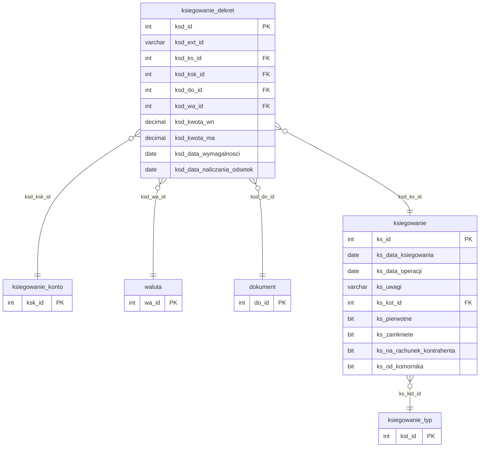

# Dane finansowe

Iteracja 8 ładuje warstwę finansową — trzy tabele stagingowe (`dbo.ksiegowanie`, `dbo.ksiegowanie_dekret`, `dbo.operacja`) zasilają dwie tabele produkcyjne (`ksiegowanie`, `ksiegowanie_dekret`). Układ nie jest 1:1: staging `ksiegowanie` → prod `ksiegowanie` 1:1, staging `ksiegowanie_dekret` → prod `ksiegowanie_dekret` 1:1, a staging `operacja` rozgałęzia się 1:2 — z każdego wiersza źródłowego generowane są syntetyczny nagłówek księgowania oraz od jednego do pięciu syntetycznych dekretów. Wszystkie przejścia są klasy **C**, zależne od słowników z iteracji 1 (`ksiegowanie_typ`, `ksiegowanie_konto`, `ksiegowanie_konto_subkonto`, `waluta`), mapowania spraw z iteracji 4 (`mapowanie.dodane_sprawy`) oraz mapowania dokumentów z iteracji 7 (`mapowanie.dodane_dokumenty`). Iteracja 8 domyka domenę finansową — nie produkuje własnego `mapowania.*` dla kolejnych iteracji; poza iteracja 8 pozostaje już tylko harmonogram spłat (iteracja 9).

`Ksiegowanie` ładowane jest z bezpośrednim zachowaniem prod PK — `SET IDENTITY_INSERT dm_data_web.ksiegowanie ON` + NOT EXISTS po `ks_id`; idempotencja oparta o PK, bez użycia ext_id. `Ksiegowanie_dekret` przechodzi range-based w pętli batchy po 500 000 rekordów z wyłączeniem/odbudową NCI na tabeli docelowej; idempotencja po `ksd_ext_id = CAST(ksd_id AS VARCHAR)` z fallbackiem `-2147483648`, FK `ksd_do_id` rozwiązywany LEFT JOIN-em przez `mapowanie.dodane_dokumenty` (dekrety bez dokumentu zachowują NULL), a `ksd_rb_id` przez tymczasowy lookup `#ksd_rb_lookup` (JOIN `mapowanie.dodane_sprawy` → prod `sprawa.sp_rb_id`). `Operacja` jest najbardziej złożona — per wiersz źródłowy SQL generuje syntetyczny nagłówek `ksiegowanie` z ext_id w formacie `OPER_<oper_id>_*` oraz do pięciu syntetycznych `ksiegowanie_dekret`, rozbijając kwotę przez `CROSS APPLY (VALUES ...)` na pozycje kapitału, odsetek umownych, odsetek karnych, opłat i prowizji z hardkodowanym `ksk_id` (2/5/6/10) oraz stroną `WN`/`MA` zależnie od typu operacji (wpłata/umorzenie vs. pozostałe). Zbiór wartości hardkodowanych wynika z kontraktu migracji: `ks_zamkniete = 1`, `ks_pierwotne = 1`, `ks_na_rachunek_kontrahenta = 0`, `ks_od_komornika = 0`, a dla dekretów `ksd_data_wymagalnosci = '9999-12-31'` (sentinel) oraz `ksd_kurs_bazowy = 1.0` (placeholder). Sekcja 3C obsługująca wpłaty i korekty pozostaje udokumentowana jako **TODO** — SQL zawiera placeholder bez finalnej implementacji. Szczegóły per prod-tabela w sekcjach `### dbo.<tabela>`; walidacje referencyjne, techniczne i biznesowe (REF_20–23, REF_27, REF_29, REF_35, TECH_09/10, BIZ_05/06/14/17/18) w sekcji [Powiązania](#powiazania) poniżej.

  Iteracja: 8
  Zależności: Iteracja 1 (ksiegowanie_typ, ksiegowanie_konto, ksiegowanie_konto_subkonto, waluta) + Iteracja 4 (mapowanie.dodane_sprawy) + Iteracja 7 (mapowanie.dodane_dokumenty)

## Diagram ER

Diagram pokazuje dwie tabele prod iteracja 8 (`ksiegowanie`, `ksiegowanie_dekret`) oraz minimalne stuby `ksiegowanie_typ`, `ksiegowanie_konto`, `waluta` (iteracja 1) oraz `dokument` (iteracja 7) jako punkty zaczepienia FK. Słownik typów księgowań — [Słowniki § dbo.ksiegowanie_typ](slowniki.md#dboksiegowanie_typ); słownik kont księgowych — [Słowniki § dbo.ksiegowanie_konto](slowniki.md#dboksiegowanie_konto); słownik walut — [Słowniki § dbo.waluta](slowniki.md); dokumenty — [Role wierzytelności i dokumenty § dbo.dokument](role-wierzytelnosci-i-dokumenty.md#dbodokument). Staging `dbo.operacja` nie jest odwzorowywana bezpośrednio na żadną tabelę prod — generuje syntetyczne wiersze w `ksiegowanie` i `ksiegowanie_dekret` (opisane w sekcji `<code>dbo.operacja</code>` poniżej), stąd nie pojawia się jako osobna encja na diagramie. Kolumny staging niewykorzystywane przez iteracja 8 (`ksd_ksksub_id`, większość kolumn opisowych `operacja`) są wymienione w param-list, ale pominięte w diagramie zgodnie z zasadą "tylko aktywne FK".

## Tabele

<code>dbo.ksiegowanie</code> — C nagłówki księgowań finansowych z bezpośrednim zachowaniem PK

  Tabele prod: <code>dm_data_web.ksiegowanie</code>
  Klasa: C — pełna transformacja (IDENTITY_INSERT, hardkody flag)
  Obowiązkowa: nie
  Multi-row: tak (1 wierzytelność → N księgowań)

Nagłówek księgowania finansowego — data operacji, typ księgowania, powiązanie z wierzytelnością pośrednio przez dekrety. Staging PK `ks_id` jest przenoszony 1:1 do prod jako `ks_id` dzięki `SET IDENTITY_INSERT dm_data_web.ksiegowanie ON` — staging PK = prod PK, nie jest potrzebna kolumna ext_id ani tabela mapująca. Ta decyzja upraszcza sekcję 2 iteracja 8 (staging `ksiegowanie_dekret.ksd_ks_id` może być skopiowany bez resolve'u) oraz jest wyjątkiem w całej migracji — pozostałe range-based tabele produkcyjne (dokument, wierzytelnosc) używają własnego IDENTITY z ext_id. Uwaga: ścieżka `operacja` (opisana w sekcji `<code>dbo.operacja</code>` poniżej) dokłada do tej samej tabeli prod dodatkowe wiersze przez IDENTITY auto-generate — z własną semantyką hardkodów i schematem ext_id na poziomie dekretów (`OPER_<oper_id>_*`).

<ul class="param-list">
  <li>
    ks_id
    INT
    Klucz główny księgowania - przenoszony 1:1 do prod ks_id przez IDENTITY_INSERT ON
  </li>
  <li>
    ks_data_ksiegowania
    DATE
    Data zaksięgowania operacji w systemie źródłowym
  </li>
  <li>
    ks_data_operacji
    DATE
    Data operacji finansowej (data zdarzenia gospodarczego)
  </li>
  <li>
    ks_uwagi
    VARCHAR
    Uwagi księgowego dotyczące księgowania
  </li>
  <li>
    ks_kst_id
    INT
    FK do słownika typów księgowań - bezpośrednio (kst_id zachowany po iteracji 1)
  </li>
  <li>
    ks_pierwotne
    BIT
    Flaga: księgowanie pierwotne (1) vs. korygujące (0) - dla staging wiersz zawsze traktowany jako pierwotne (hardkod 1)
  </li>
  <li>
    mod_date
    DATETIME
    Kolumna techniczna - obsługiwana triggerami insert; nie wypełniać
  </li>
</ul>

### dbo.ksiegowanie
Prod `ksiegowanie` normalnie generuje własny IDENTITY `ks_id`, ale dla ścieżki staging `ksiegowanie` identity jest ominięty przez `SET IDENTITY_INSERT dm_data_web.ksiegowanie ON` na czas Sekcja 1 — staging PK `ks_id` trafia bezpośrednio do prod `ks_id`. Idempotencja oparta o PK: snapshot istniejących prod `ks_id` do indeksowanej `#existing_ks`, a INSERT pomija wiersze już obecne (LEFT JOIN z filtrem `WHERE ex.ks_id IS NULL`). Po zakończeniu Sekcja 1 identity jest ponownie włączany (`SET IDENTITY_INSERT ... OFF`), aby Sekcja 3 mogła generować syntetyczne nagłówki przez standardową ścieżkę IDENTITY. INSERT używa hinta `WITH (TABLOCK)`. FK `ks_kst_id` kopiowany bezpośrednio ze stagingu (tożsamość `kst_id` zachowana po MERGE z iteracji 1). Kolumny hardkodowane dla tej ścieżki: `ks_zamkniete = 1` (księgowania wejściowe traktowane jako zamknięte z momentem migracji), `ks_pierwotne = 1` (wiersze staging to dokumenty pierwotne migracji, nie korekty), `ks_na_rachunek_kontrahenta = 0`, `ks_od_komornika = 0` (brak kolumny źródłowej — detekcja komornicza planowana jako TODO). Przed Sekcja 1 non-clustered indexy na prod `ksiegowanie` i `ksiegowanie_dekret` są disablowane (`EXEC usp_manage_prod_ncis 'ksiegowanie,ksiegowanie_dekret', 'DISABLE'`) i odbudowywane po zakończeniu Sekcja 3 (`'REBUILD'`) — wspólny NCI-cycle dla obu tabel iteracja 8. Kolumny `aud_data`/`aud_login` wypełniane są explicite (`COALESCE(stg.mod_date, @aud_now)` i `@aud_login`), z pominięciem UDF-a obliczającego defaulty.

<code>dbo.ksiegowanie_dekret</code> — C dekrety księgowań - pozycje szczegółowe per dokument

  Tabele prod: <code>dm_data_web.ksiegowanie_dekret</code>
  Klasa: C — pełna transformacja (range-based, batched 500k, NCI cycle)
  Obowiązkowa: nie
  Multi-row: tak (1 księgowanie → N dekretów — linie Winien/Ma)

Dekret księgowania — pozycja szczegółowa nagłówka, przypisana do dokumentu lub (w ścieżce `operacja`) do syntetycznego nagłówka bez dokumentu. Staging `ksd_kwota` koduje stronę dekretu znakiem: wartości dodatnie trafiają do prod `ksd_kwota_wn`, ujemne do `ksd_kwota_ma` (z `ABS`). Staging PK `ksd_id` trafia do prod jako `ksd_ext_id` (VARCHAR, `CAST(stg.ksd_id AS VARCHAR(255))`) — prod używa własnego IDENTITY `ksd_id`, a `ksd_ext_id` służy tylko do idempotencji i nie jest indeksem biznesowym. Staging `ksd_ks_id` jest kopiowany wprost do prod `ksd_ks_id` — bezpieczne, bo Sekcja 1 zachowała PK prod `ksiegowanie` (staging `ks_id` = prod `ks_id`). FK `ksd_do_id` jest rozwiązywane LEFT JOIN-em przez `mapowanie.dodane_dokumenty` (iteracja 7) — dekrety bez powiązanego dokumentu zachowują NULL.

<ul class="param-list">
  <li>
    ksd_id
    INT
    Klucz główny dekretu w stagingu - trafia do prod jako ksd_ext_id (CAST na VARCHAR)
  </li>
  <li>
    ksd_ks_id
    INT
    FK do księgowania - kopiowany wprost (prod ks_id = staging ks_id po Sekcji 1)
  </li>
  <li>
    ksd_do_id
    INT
    FK do dokumentu - rozwiązywany LEFT JOIN przez mapowanie.dodane_dokumenty (może być NULL)
  </li>
  <li>
    ksd_kwota
    DECIMAL(18,4)
    Kwota dekretu z zakodowaną stroną: dodatnia → WN, ujemna → MA (rozbijana na prod ksd_kwota_wn / ksd_kwota_ma)
  </li>
  <li>
    ksd_data_naliczania_odsetek
    DATE
    Data od której naliczane są odsetki dla dekretu
  </li>
  <li>
    ksd_ksk_id
    INT
    FK do słownika kont księgowych - bezpośrednio (ksk_id zachowany po iteracji 1)
  </li>
  <li>
    ksd_uwagi
    VARCHAR
    Uwagi dotyczące dekretu - nie mapowane do prod
  </li>
  <li>
    ksd_sp_id
    INT
    FK do sprawy - nie trafia bezpośrednio do prod; służy do wyliczenia ksd_rb_id przez #ksd_rb_lookup
  </li>
  <li>
    ksd_kurs_bazowy
    DECIMAL
    Kurs wymiany do waluty bazowej - kopiowany wprost ze stagingu
  </li>
  <li>
    ksd_kwota_wn_wyceny
    DECIMAL(18,4)
    Kwota Winien w walucie wyceny - nie populowane ze stagingu (TODO - wstawiane jako NULL)
  </li>
  <li>
    ksd_kwota_ma_wyceny
    DECIMAL(18,4)
    Kwota Ma w walucie wyceny - nie populowane ze stagingu (TODO - wstawiane jako NULL)
  </li>
  <li>
    ksd_wa_id_wyceny
    INT
    FK do słownika walut (waluta wyceny) - nie populowane ze stagingu (TODO)
  </li>
  <li>
    ksd_kwota_wn_bazowa
    DECIMAL(18,4)
    Kwota Winien w walucie bazowej (PLN) - kopiowane wprost
  </li>
  <li>
    ksd_kwota_ma_bazowa
    DECIMAL(18,4)
    Kwota Ma w walucie bazowej (PLN) - kopiowane wprost
  </li>
  <li>
    ksd_wa_id
    INT
    FK do słownika walut (waluta dekretu) - kopiowany wprost
  </li>
  <li>
    ksd_data_wymagalnosci
    DATE
    Data wymagalności dekretu - hardkodowana sentinelem 9999-12-31 (docelowo ma być dziedziczona z dokumentu)
  </li>
  <li>
    ksd_ksksub_id
    INT
    FK do subkonta konta księgowego - nie populowane przez iteracja 8 (pole schema-only, REF_35)
  </li>
  <li>
    mod_date
    DATETIME
    Kolumna techniczna - obsługiwana triggerami insert; nie wypełniać
  </li>
</ul>

### dbo.ksiegowanie_dekret
Prod `ksiegowanie_dekret` generuje własny IDENTITY `ksd_id` — staging PK trafia do kolumny `ksd_ext_id` (VARCHAR, `CAST(stg.ksd_id AS VARCHAR(255))`). Idempotencja po `ksd_ext_id`: snapshot istniejących `ksd_ext_id` (z filtrem `IS NOT NULL`) do `#existing_ksd`, a INSERT pomija ext_id już obecne. INSERT jest range-based, batched — `@ksd_batch_size = 500000`, pętla `WHILE` po `ksd_id BETWEEN @batch_start AND @batch_end` aż do `@ksd_max_id` — minimalizuje rozmiar transakcji przy dużej liczbie dekretów. Pre-materializacja stagingu do tabeli tymczasowej `#ksd_staging` (z pre-zcastowanym ext_id jako VARCHAR, unique index po `ksd_id`, indeksami po `ksd_ext_id_str` i `ksd_sp_id`) eliminuje powtarzalne CAST-y i JOIN-y per batch. Przed Sekcja 1 non-clustered indexy na prod `ksiegowanie_dekret` są disablowane razem z `ksiegowanie` (`EXEC usp_manage_prod_ncis 'ksiegowanie,ksiegowanie_dekret', 'DISABLE'`) i odbudowywane po zakończeniu Sekcja 3. Wszystkie INSERT-y używają hinta `WITH (TABLOCK)`. FK `ksd_ks_id` kopiowany wprost ze stagingu (bezpieczne, bo Sekcja 1 preserved prod `ks_id`). FK `ksd_do_id` rozwiązywany LEFT JOIN-em przez `mapowanie.dodane_dokumenty` — dekrety bez dokumentu otrzymują NULL. FK `ksd_rb_id` (nie widoczny w stagingu) pre-obliczany przez tymczasowy lookup `#ksd_rb_lookup`: JOIN `mapowanie.dodane_sprawy` (staging `sp_id` → prod `sp_id`) z prod `sprawa.sp_rb_id`; LEFT JOIN podczas INSERT-u po `ksd_sp_id`. FK `ksd_ksk_id` i `ksd_wa_id` kopiowane wprost ze stagingu (ID słownikowe zachowują tożsamość po iteracji 1). Strona dekretu wyliczana z `ksd_kwota`: `CASE WHEN ksd_kwota > 0 THEN ksd_kwota ELSE 0 END` → `ksd_kwota_wn`, `CASE WHEN ksd_kwota < 0 THEN ABS(ksd_kwota) ELSE 0 END` → `ksd_kwota_ma`. Kolumny `ksd_kwota_wn_bazowa`, `ksd_kwota_ma_bazowa`, `ksd_kurs_bazowy` kopiowane wprost ze stagingu. Kolumna `ksd_data_wymagalnosci` ustawiana jest na hardkodowany sentinel `@SENTINEL_DATE = '9999-12-31'` (zgodnie z komentarzem SQL: fallback dla dekretów bez dokumentu — obecnie stosowany bezwarunkowo; docelowo ma być dziedziczony z linked `dokument`). Kolumny `ksd_kwota_wn_wyceny`, `ksd_kwota_ma_wyceny`, `ksd_wa_id_wyceny` oznaczone są w SQL jako TODO i wstawiane jako NULL do czasu uzupełnienia stagingu. Kolumna `ksd_ksksub_id` nie jest populowana (walidacja REF_35 jest zadeklarowana, ale iteracja 8 nie wstawia wartości — pole pozostaje pod zarządzaniem dev teamu). Pominięte przy INSERT: IDENTITY `ksd_id`. Kolumny `aud_data`/`aud_login` wypełniane są explicite, z pominięciem UDF-a.

<code>dbo.operacja</code> — C operacje finansowe: 1 wiersz → syntetyczny nagłówek + do 5 dekretów

  Tabele prod: <code>dm_data_web.ksiegowanie</code>, <code>dm_data_web.ksiegowanie_dekret</code>
  Klasa: C — pełna transformacja (1:2 fan-out, CROSS APPLY VALUES, IDENTITY auto-gen)
  Obowiązkowa: nie
  Multi-row: tak (1 operacja → 1 nagłówek + 1–5 dekretów)

Operacja finansowa z systemu źródłowego — surowe dane o wpłatach, korektach, umorzeniach, kosztach i alokacjach, które muszą zostać przetransformowane na parę prod: syntetyczny nagłówek `ksiegowanie` + od jednego do pięciu dekretów `ksiegowanie_dekret` odpowiadających składnikom kwoty (kapitał, odsetki karne, odsetki umowne, opłaty, prowizje). Staging `operacja` nie posiada 1:1 odwzorowania w prod — jest to jedyna tabele iteracji 8 o paradygmacie "fan-out synthetic generation". Strona dekretu (WN/MA) jest wyliczana z `oper_rejestr_kod` — `wplata` i `umorzenie` trafiają do `kwota_wn`, pozostałe (`korekta`, `koszt`, `nadplata`, `alokacja`) do `kwota_ma`. Kwota jest rozbijana na pięć pozycji przez `CROSS APPLY (VALUES (...))` z hardkodowanym mapowaniem typ → `ksk_id`: KAP→2 (kapitał), ODK→5 (odsetki karne), ODU→6 (odsetki umowne), OPL→10 (opłaty), PRW→10 (prowizje). Wiersze z zerową kwotą na danej pozycji są odfiltrowywane (`WHERE v.kwota > 0`), stąd liczba generowanych dekretów wynosi 1–5 per operacja. Mapping staging `oper_id` → prod `ks_id` (auto-generated IDENTITY) zapisywany jest do tabeli tymczasowej `#oper_ks_mapping` wykorzystywanej w Krok 3B. **Sekcja 3C SQL (wpłata/korekta)** jest placeholderem bez implementacji — docelowo ma INSERT-ować do prod `wplata` lub `korekta` w zależności od `oper_rejestr_kod`/`oper_typ_dekretu`, ale wymaga uzgodnienia z dev teamem.

<ul class="param-list">
  <li>
    oper_id
    INT
    Klucz główny operacji - używany w schemacie ext_id 'OPER_&lt;oper_id&gt;_&lt;typ&gt;' dla dekretów prod
  </li>
  <li>
    oper_wi_id
    INT
    FK do wierzytelności - nie odwzorowywany w iteracji 8 (powiązanie wierzytelność ↔ księgowanie jest pośrednie przez dekret)
  </li>
  <li>
    oper_waluta
    VARCHAR
    Kod waluty operacji (SWIFT) - rozwiązywany LEFT JOIN-em przez prod waluta.wa_nazwa_skrocona z COLLATE SQL_Polish_CP1250_CI_AS
  </li>
  <li>
    oper_rejestr_kod
    VARCHAR
    Kod rejestru finansowego - determinuje stronę dekretu: wplata/umorzenie → WN, pozostałe → MA
  </li>
  <li>
    oper_typ_dekretu
    INT
    Typ dekretu operacji - mapowany 1:1 na prod ks_od_komornika (0→0, 1→1)
  </li>
  <li>
    oper_opis_dekretu
    VARCHAR
    Opis dekretu - nie odwzorowywany w iteracji 8
  </li>
  <li>
    oper_dokument_typ_prod_id
    INT
    Identyfikator typu dokumentu w systemie źródłowym - nie odwzorowywany w iteracji 8
  </li>
  <li>
    oper_dokument_podtyp_prod_id
    INT
    Identyfikator podtypu dokumentu w systemie źródłowym - nie odwzorowywany w iteracji 8
  </li>
  <li>
    oper_dokument_typ_prod_opis
    VARCHAR
    Opis typu dokumentu w systemie źródłowym - nie odwzorowywany w iteracji 8
  </li>
  <li>
    oper_dokument_podtyp_prod_opis
    VARCHAR
    Opis podtypu dokumentu w systemie źródłowym - nie odwzorowywany w iteracji 8
  </li>
  <li>
    oper_dokument_prod_id
    INT
    Identyfikator dokumentu w systemie źródłowym - nie odwzorowywany w iteracji 8
  </li>
  <li>
    oper_opis_slowny
    VARCHAR
    Słowny opis operacji - nie odwzorowywany w iteracji 8
  </li>
  <li>
    oper_opis
    VARCHAR
    Opis techniczny operacji - nie odwzorowywany w iteracji 8
  </li>
  <li>
    oper_strona
    VARCHAR
    Strona dekretu w systemie źródłowym - nie odwzorowywana bezpośrednio (strona wyliczana z oper_rejestr_kod)
  </li>
  <li>
    oper_kwota
    DECIMAL(18,4)
    Kwota operacji w walucie oryginalnej - nie rozbijana bezpośrednio (rozbicie na dekrety z oper_kwota_* components)
  </li>
  <li>
    oper_kwota_dekretu
    DECIMAL(18,4)
    Kwota dekretu - nie odwzorowywana bezpośrednio
  </li>
  <li>
    oper_kwota_kapitalu
    DECIMAL(18,4)
    Kwota kapitału - trafia do dekretu typu KAP (ksk_id=2) gdy &gt; 0
  </li>
  <li>
    oper_kwota_odsetek
    DECIMAL(18,4)
    Kwota odsetek umownych - trafia do dekretu typu ODU (ksk_id=6) gdy &gt; 0
  </li>
  <li>
    oper_kowta_odsetek_karnych
    DECIMAL(18,4)
    Kwota odsetek karnych (typo 'kowta' potwierdzony w schemacie źródłowym) - trafia do dekretu typu ODK (ksk_id=5) gdy &gt; 0
  </li>
  <li>
    oper_kwota_oplaty
    DECIMAL(18,4)
    Kwota opłaty - trafia do dekretu typu OPL (ksk_id=10) gdy &gt; 0
  </li>
  <li>
    oper_kwota_prowizji
    DECIMAL(18,4)
    Kwota prowizji - trafia do dekretu typu PRW (ksk_id=10) gdy &gt; 0
  </li>
  <li>
    oper_kwota_w_pln
    DECIMAL(18,4)
    Kwota operacji przeliczona na PLN - nie odwzorowywana bezpośrednio
  </li>
  <li>
    oper_kwota_dekretu_w_pln
    DECIMAL(18,4)
    Kwota dekretu przeliczona na PLN - nie odwzorowywana bezpośrednio
  </li>
  <li>
    oper_kwota_kapitalu_w_pln
    DECIMAL(18,4)
    Kwota kapitału w PLN - trafia do dekretu typu KAP jako ksd_kwota_wn_bazowa / ksd_kwota_ma_bazowa
  </li>
  <li>
    oper_kwota_odsetek_w_pln
    DECIMAL(18,4)
    Kwota odsetek umownych w PLN - trafia do dekretu typu ODU jako kwota bazowa
  </li>
  <li>
    oper_kowta_odsetek_karnych_w_pln
    DECIMAL(18,4)
    Kwota odsetek karnych w PLN (typo 'kowta' potwierdzony) - trafia do dekretu typu ODK jako kwota bazowa
  </li>
  <li>
    oper_kwota_oplaty_w_pln
    DECIMAL(18,4)
    Kwota opłaty w PLN - trafia do dekretu typu OPL jako kwota bazowa
  </li>
  <li>
    oper_kwota_prowizji_w_pln
    DECIMAL(18,4)
    Kwota prowizji w PLN - trafia do dekretu typu PRW jako kwota bazowa
  </li>
  <li>
    oper_data_waluty
    DATE
    Data waluty operacji - nie odwzorowywana bezpośrednio
  </li>
  <li>
    oper_data_danych
    DATE
    Data danych źródłowych - nie odwzorowywana bezpośrednio
  </li>
  <li>
    oper_data_dekretu
    DATE
    Data dekretu - trafia do prod ks_data_ksiegowania (z fallbackiem na oper_data_ksiegowania gdy NULL)
  </li>
  <li>
    oper_data_ksiegowania
    DATE
    Data zaksięgowania operacji - trafia do prod ks_data_operacji i jest fallbackiem dla ks_data_ksiegowania
  </li>
  <li>
    oper_beneficjent_nazwa
    VARCHAR
    Nazwa beneficjenta - nie odwzorowywana w iteracji 8
  </li>
  <li>
    oper_remitter_nazwa
    VARCHAR
    Nazwa zleceniodawcy - nie odwzorowywana w iteracji 8
  </li>
  <li>
    oper_konto
    VARCHAR
    Numer konta bankowego operacji - nie odwzorowywany w iteracji 8
  </li>
  <li>
    oper_do_id
    INT
    FK do dokumentu powiązanego z operacją - nie odwzorowywany przez iteracja 8 w ksiegowanie_dekret (dekrety operacji mają ksd_do_id = NULL; REF_23 walidacyjne)
  </li>
  <li>
    mod_date
    DATETIME
    Kolumna techniczna - obsługiwana triggerami insert; nie wypełniać
  </li>
</ul>

### dbo.ksiegowanie
Krok 3A generuje syntetyczne nagłówki `ksiegowanie` — jeden per wiersz `operacja` bez dekretów `OPER_%` w prod. Idempotencja: snapshot istniejących `oper_id` wyciągniętych z prod `ksiegowanie_dekret.ksd_ext_id` (pattern `OPER_<id>_*` rozbijany przez `SUBSTRING + CHARINDEX`) trafia do `#existing_oper_ksd`; INSERT pomija operacje już posiadające dekrety. Mechanizm używa `MERGE ... ON 1 = 0 WHEN NOT MATCHED THEN INSERT OUTPUT src.oper_id, inserted.ks_id INTO #oper_ks_mapping` — idiom pozwalający przechwycić jednocześnie staging `oper_id` i auto-generated prod `ks_id` (standard `INSERT ... OUTPUT` w SQL Server nie może referować kolumn źródła). Dla re-runów, gdzie `#oper_ks_mapping` nie zostało odtworzone z bieżącego MERGE (bo operacja była w `#existing_oper_ksd`), wykonywany jest backfill: INNER JOIN istniejących ext_id `_KAP` z prod `ksiegowanie_dekret` (oraz fallback na dowolny sufiks `_*` z `MIN(ksd_ks_id)` gdy `_KAP` nie istnieje dla danej operacji — np. kwota kapitału była zero). Kolumny mapowane wprost: `ks_data_ksiegowania = ISNULL(oper_data_dekretu, oper_data_ksiegowania)`, `ks_data_operacji = oper_data_ksiegowania`. Kolumny hardkodowane dla ścieżki `operacja`: `ks_uwagi = NULL`, `ks_kst_id = 2` (staging `operacja` nie ma kolumny typu księgowania — hardkod wplata), `ks_zamkniete = 1`, `ks_pierwotne = 0` (operacje to allokacje/korekty płatności, nie dokumenty pierwotne — odmiennie od staging `ksiegowanie`), `ks_na_rachunek_kontrahenta = 0`, `ks_od_komornika = CASE WHEN oper_typ_dekretu = 1 THEN 1 ELSE 0 END`. Prod `ks_id` generowany jest przez IDENTITY (bez `IDENTITY_INSERT`). INSERT używa `WITH (TABLOCK)`. Kolumny `aud_data`/`aud_login` wypełniane są explicite.

### dbo.ksiegowanie_dekret
Krok 3B generuje syntetyczne dekrety — od jednego do pięciu per operacja, po jednym dla każdej niezerowej pozycji kwoty. Pre-materializacja do `#oper_ksd_rows` (filtr: suma pięciu kwot > 0; pre-computed flag `is_wn` — `oper_rejestr_kod IN ('wplata','umorzenie') → 1`) oraz `CROSS APPLY (VALUES (...))` rozbijają operację na pięć potencjalnych rekordów: KAP (`@KSK_KAPITAL = 2`), ODK (`@KSK_ODSETKI_KARNE = 5`), ODU (`@KSK_ODSETKI_UMOWNE = 6`), OPL (`@KSK_OPLATY = 10`), PRW (`@KSK_OPLATY = 10`, ksksub_id=22 zaplanowany ale obecnie nie populowany). Filtr `WHERE v.kwota > 0` eliminuje pozycje zerowe. Idempotencja: snapshot istniejących ext_id `LIKE 'OPER_%'` do `#existing_oper_ksd_typ`, INSERT pomija ext_id już obecne. Schemat ext_id: `OPER_<oper_id>_<typ>`, gdzie typ ∈ {KAP, ODK, ODU, OPL, PRW}. `ksd_ks_id` pobierany z `#oper_ks_mapping` (mapping staging `oper_id` → prod `ks_id` z Krok 3A). Rozbicie WN/MA: `CASE WHEN is_wn = 1 THEN kwota ELSE 0 END` → `ksd_kwota_wn`, `CASE WHEN is_wn = 0 THEN kwota ELSE 0 END` → `ksd_kwota_ma` (analogicznie dla `kwota_bazowa` → `ksd_kwota_wn_bazowa`/`ksd_kwota_ma_bazowa`). FK `ksd_wa_id` pre-joined raz z prod `waluta.wa_nazwa_skrocona` (z COLLATE `SQL_Polish_CP1250_CI_AS`) — unika cross-database lookup per batch. Kolumny hardkodowane dla tej ścieżki: `ksd_do_id = NULL` (operacja nie przenosi powiązania z dokumentem — staging `oper_do_id` ignorowany, REF_23 walidacyjne), `ksd_data_naliczania_odsetek = NULL` (brak źródła w stagingu), `ksd_data_wymagalnosci = @SENTINEL_DATE` (brak dokumentu), `ksd_kurs_bazowy = 1.0` (placeholder — TODO: docelowo z `kurs_walut`). INSERT range-based batched po `oper_id` w pętli `WHILE` (`@oper_ksd_batch_size = 100000`, mniejszy niż w Sekcja 2 ze względu na 5× fan-out). Kolumny `aud_data`/`aud_login` wypełniane są explicite.

!!! warning "Krok 3C: wpłata/korekta — placeholder"
    Finalizacja ścieżki `operacja` zakłada INSERT do prod `wplata` lub `korekta` w zależności od `oper_rejestr_kod`/`oper_typ_dekretu`, ale logika klasyfikacji nie została jeszcze uzgodniona z zespołem dev. Obecnie Krok 3C SQL zawiera wyłącznie komentarz `-- TODO: Insert into dm_data_web_pipeline.dbo.wplata or korekta` — żaden INSERT nie jest wykonywany. Do rozstrzygnięcia w kolejnej iteracji.

## Powiązania {#powiazania}

- Poprzednia iteracja: [Role wierzytelności i dokumenty](role-wierzytelnosci-i-dokumenty.md)
- Następna iteracja: [Harmonogram spłat](harmonogram.md)
- Klasyfikacja mapowania: [Mapowanie staging → prod](mapowanie-tabel.md)
- Słowniki bazowe iteracja 1: [ksiegowanie_typ](slowniki.md#dboksiegowanie_typ), [ksiegowanie_konto](slowniki.md#dboksiegowanie_konto), [waluta](slowniki.md)
- Mapowania wejściowe: [Sprawy § mapowanie.dodane_sprawy](sprawy.md), [Role wierzytelności i dokumenty § mapowanie.dodane_dokumenty](role-wierzytelnosci-i-dokumenty.md)
- Walidacje referencyjne (ksiegowanie_dekret): [REF_20 (dekret → księgowanie)](../przygotowanie-danych/walidacje.md), [REF_21 (ksk_id → ksiegowanie_konto)](../przygotowanie-danych/walidacje.md), [REF_22 (ksd_do_id → dokument)](../przygotowanie-danych/walidacje.md), [REF_35 (ksd_ksksub_id → ksiegowanie_konto_subkonto)](../przygotowanie-danych/walidacje.md)
- Walidacje referencyjne (ksiegowanie): [REF_29 (ks_kst_id → ksiegowanie_typ)](../przygotowanie-danych/walidacje.md)
- Walidacje referencyjne (operacja): [REF_23 (oper_do_id → dokument)](../przygotowanie-danych/walidacje.md), [REF_27 (oper_waluta → waluta)](../przygotowanie-danych/walidacje.md)
- Walidacje techniczne: [TECH_09 (ksd_ks_id wymagane, BLOKUJĄCE)](../przygotowanie-danych/walidacje.md), [TECH_10 (oper_waluta dla kwoty &gt; 0, OSTRZEŻENIE)](../przygotowanie-danych/walidacje.md)
- Walidacje biznesowe: [BIZ_05 (księgowanie bez dekretu, BLOKUJĄCE)](../przygotowanie-danych/walidacje.md), [BIZ_06 (suma dekretów ≠ 0, BLOKUJĄCE)](../przygotowanie-danych/walidacje.md), [BIZ_14 (wierzytelność bez księgowań, INFORMACJA)](../przygotowanie-danych/walidacje.md), [BIZ_17 (ks_data_ksiegowania z przyszłości, INFORMACJA)](../przygotowanie-danych/walidacje.md), [BIZ_18 (ks_data_operacji z przyszłości, INFORMACJA)](../przygotowanie-danych/walidacje.md)
