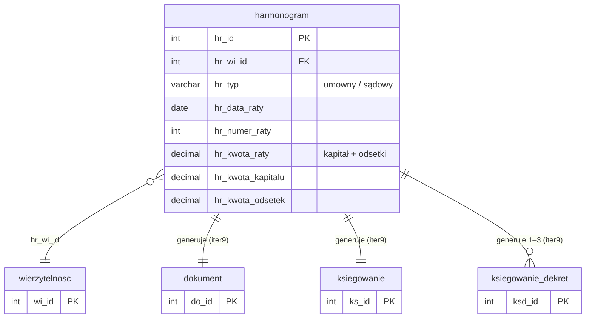

# Harmonogram

Iteracja 9 obejmuje harmonogramy spłat — raty powiązane z wierzytelnościami, z rozbiciem na część kapitałową i odsetkową. Dane z tej iteracji można załadować dopiero po Iteracji 6, ponieważ każda rata harmonogramu musi być powiązana z istniejącą wierzytelnością. Zobacz też: [walidacje](../przygotowanie-danych/walidacje.md), [kolejność ładowania](../przygotowanie-danych/kolejnosc-zasilania-tabel.md).

  Iteracja: 9
  Zależności: Iteracja 6
  Walidacje: <a href="../przygotowanie-danych/walidacje.md#str_07">STR_07</a>
  Zakres: harmonogramy spłat i przypomnienia

## Diagram ER

Diagram pokazuje źródłową tabelę staging `harmonogram` ze wszystkimi kolumnami oraz minimalne stuby `wierzytelnosc` (iteracja 6) jako punkt zaczepienia FK i tabel docelowych prod (`dokument`, `ksiegowanie`, `ksiegowanie_dekret`), które każda rata harmonogramu generuje w iteracji 9. Pełna struktura tabel docelowych — [Role wierzytelności i dokumenty § dbo.dokument](role-wierzytelnosci-i-dokumenty.md#dbodokument), [Dane finansowe § dbo.ksiegowanie](finanse.md#dboksiegowanie), [Dane finansowe § dbo.ksiegowanie_dekret](finanse.md#dboksiegowanie_dekret); wierzytelność — [Wierzytelności § dbo.wierzytelnosc](wierzytelnosci.md#dbowierzytelnosc).

## Tabele

### dbo.harmonogram

<code>dbo.harmonogram</code> — rozbicie raty harmonogramu spłat

  Tabele prod: <code>dm_data_web.dokument</code>, <code>dm_data_web.ksiegowanie</code>, <code>dm_data_web.ksiegowanie_dekret</code>
  Kształt mapowania: rozbicie
  Obowiązkowa: nie (harmonogram opcjonalny per wierzytelność)
  Multi-row: tak (1 rata → 1 dokument + 1 ksiegowanie + 1–3 dekrety)

Rata harmonogramu spłat powiązana z wierzytelnością — data płatności, numer kolejny raty, łączna kwota wraz z rozbiciem na część kapitałową i odsetkową. Każdy wiersz staging `harmonogram` generuje trójkę rekordów prod: nagłówek `dokument`, nagłówek `ksiegowanie` oraz od jednego do trzech dekretów `ksiegowanie_dekret` bilansujących kwotę raty.

<ul class="param-list">
  <li>
    hr_id
    INT
    Klucz główny raty harmonogramu.
  </li>
  <li>
    hr_wi_id
    INT
    FK do wierzytelności (iteracja 6).
  </li>
  <li>
    hr_typ
    VARCHAR(50)
    Typ harmonogramu (np. umowny, sądowy).
  </li>
  <li>
    hr_data_raty
    DATE
    Data płatności raty.
  </li>
  <li>
    hr_numer_raty
    INT
    Numer kolejny raty w harmonogramie.
  </li>
  <li>
    hr_kwota_raty
    DECIMAL(18,2)
    Łączna kwota raty (suma kapitału + odsetek).
  </li>
  <li>
    hr_kwota_kapitalu
    DECIMAL(18,2)
    Część kapitałowa raty.
  </li>
  <li>
    hr_kwota_odsetek
    DECIMAL(18,2)
    Część odsetkowa raty.
  </li>
  <li>
    mod_date
    DATETIME
    Kolumna techniczna — nie wypełniać.
  </li>
</ul>

## Powiązania {#powiazania}

- Poprzednia iteracja: [Dane finansowe](finanse.md)
- Źródłowe wierzytelności: [Wierzytelności](wierzytelnosci.md)
- Słowniki bazowe iteracja 1: [dokument_typ](slowniki.md#dbodokument_typ), [ksiegowanie_typ](slowniki.md#dboksiegowanie_typ), [ksiegowanie_konto](slowniki.md#dboksiegowanie_konto)
- Walidacje integralności strukturalnej: [STR_07 (harmonogram bez wierzytelności, OSTRZEŻENIE)](../przygotowanie-danych/walidacje.md#str_07)
- Koniec migracji etap 1 — [Kolejność ładowania](../przygotowanie-danych/kolejnosc-zasilania-tabel.md)
