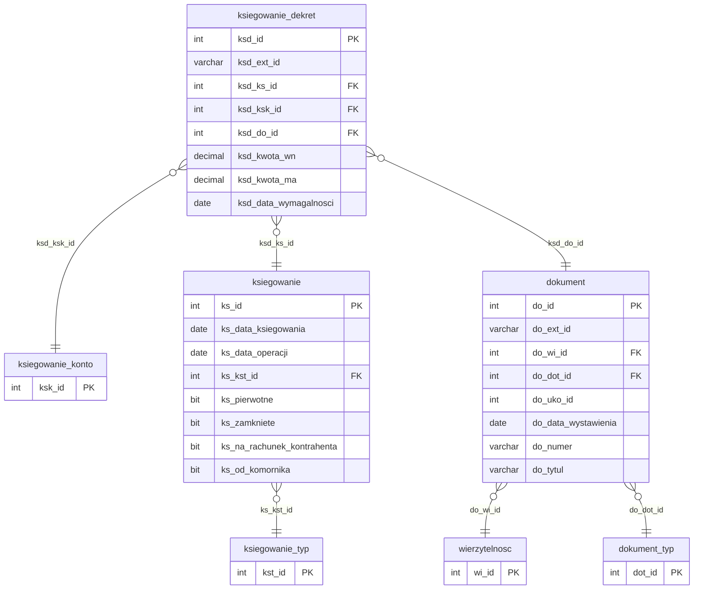

# Harmonogram

Iteracja 9 ładuje harmonogramy spłat — jedna tabela stagingowa `dbo.harmonogram` zasila trzy tabele produkcyjne (`dokument`, `ksiegowanie`, `ksiegowanie_dekret`) w układzie 1:3 syntetycznym. Dla każdej raty SQL generuje parę nagłówkową `dokument` + `ksiegowanie` oraz od jednego do trzech wierszy `ksiegowanie_dekret` (pozycje `KAP`, `ODU`, `MA`) — strony `WN` tylko dla niezerowych kwot kapitału i odsetek, strona `MA` zawsze bilansuje sumę `WN`. Przejście jest klasy **C**, zależne od słowników z iteracji 1 (`dokument_typ`, `ksiegowanie_typ`, `ksiegowanie_konto`) oraz mapowania wierzytelności z iteracji 6 (`mapowanie.dodane_wierzytelnosci`). Iteracja 9 domyka migrację stagingu etapu 1 — nie produkuje własnego `mapowania.*` dla kolejnych iteracji; pomocnicza tabela stagingowa `dbo.zabezpieczenie` pozostaje poza zakresem etapu 1 (przeniesiona do etapu 2 — patrz [Kolejność zasilania tabel § Iteracja 9](../przygotowanie-danych/kolejnosc-zasilania-tabel.md#iteracja-9-ostatnia)).

`Dokument` ładowany jest pojedynczym `MERGE ON 1=0` — idempotencja przez `LEFT JOIN` z pre-snapshotem `#existing_hr_do` (filtr `do_ext_id LIKE 'HR_%'`), ext_id w formacie `'HR_<hr_id>'`, FK `do_wi_id` rozwiązywany `JOIN`-em przez `mapowanie.dodane_wierzytelnosci`, a `do_uko_id` dziedziczony z prod `wierzytelnosc.wi_uko_id` (staging harmonogram nie posiada własnej kolumny umowy kontrahenta — analogicznie jak `dokument` w iteracji 7). Hardkody: `do_dot_id = 20` (`@DOT_KAPITAL`, wpis słownikowy *kapitał*), `do_data_wystawienia = hr_data_raty`, `do_numer = do_tytul = hr_typ` (pole oczekuje ostatecznego potwierdzenia biznesowego — patrz TODO **Q3** w nagłówku SQL). Mapping `hr_id → do_id` kapturowany przez `MERGE OUTPUT` do `#hr_do_mapping`. `Ksiegowanie` również `MERGE`-owane jest jednorazowo — idempotencja proxy przez istnienie wiersza `MA` w `#existing_hr_ksd` (prod `ksiegowanie` nie posiada własnego `ext_id`, stąd guard pośredni po dekrecie); hardkody: `ks_kst_id = 2` (wpłata), `ks_data_ksiegowania = ks_data_operacji = hr_data_raty`, `ks_zamkniete = 1`, `ks_pierwotne = 1`, `ks_na_rachunek_kontrahenta = 0`, `ks_od_komornika = 0`, `ks_uwagi = NULL`. Mapping `hr_id → ks_id` do `#hr_ks_mapping`. `Ksiegowanie_dekret` przechodzi w pętli range-based po `hr_id` batchy po 100 000, z `CROSS APPLY (VALUES ...)` rozbijającym każdą ratę na maksymalnie trzy pozycje — `KAP` (`ksd_ksk_id = 2`, strona `WN = hr_kwota_kapitalu`, filtr `> 0`), `ODU` (`ksd_ksk_id = 6`, strona `WN = hr_kwota_odsetek`, filtr `> 0`) oraz `MA` (`ksd_ksk_id = 1`, strona `MA = SUM(WN)`, zawsze); ext_id w formacie `'HR_<hr_id>_<typ>'`, FK `ksd_ks_id` / `ksd_do_id` z temp-mapów, idempotencja `LEFT JOIN` na `(hr_id, typ)` z `#existing_hr_ksd`. Dla ponownych uruchomień (`@stage > 1`) backfill temp-mapów z rekordów już zapisanych w poprzednich runach chroni przed utratą odwzorowania. Iteracja 9 **nie wykonuje** disable/rebuild NCI — wolumen harmonogramów jest znacząco mniejszy od iteracji 7/iteracja 8. Kolumny `aud_data` / `aud_login` wypełniane są explicite (bypass UDF). Szczegóły per prod-tabela w sekcjach `### dbo.<tabela>`; walidacja biznesowa `BIZ_15` (osierocony harmonogram bez wierzytelności, severity *OSTRZEŻENIE*) w sekcji [Powiązania](#powiazania) poniżej.

  Iteracja: 9
  Zależności: Iteracja 1 (dokument_typ, ksiegowanie_typ, ksiegowanie_konto) + Iteracja 6 (mapowanie.dodane_wierzytelnosci)

## Diagram ER

Diagram pokazuje trzy tabele prod iteracja 9 (`dokument`, `ksiegowanie`, `ksiegowanie_dekret`) — wszystkie generowane syntetycznie z jednego wiersza `dbo.harmonogram` — oraz minimalne stuby `dokument_typ`, `ksiegowanie_typ`, `ksiegowanie_konto` (iteracja 1) i `wierzytelnosc` (iteracja 6) jako punkty zaczepienia FK. Słownik typów dokumentów — [Słowniki § dbo.dokument_typ](slowniki.md#dbodokument_typ); słownik typów księgowań — [Słowniki § dbo.ksiegowanie_typ](slowniki.md#dboksiegowanie_typ); słownik kont księgowych — [Słowniki § dbo.ksiegowanie_konto](slowniki.md#dboksiegowanie_konto); wierzytelność — [Wierzytelności § dbo.wierzytelnosc](wierzytelnosci.md#dbowierzytelnosc). Staging `dbo.harmonogram` nie pojawia się jako osobna encja — jej wiersze generują syntetyczne zapisy w trzech tabelach prod (opisane w sekcjach `### dbo.<tabela>` poniżej). FK `ksd_do_id` wskazuje na iter-lokalny `dokument` (rekordy wygenerowane tą samą iteracją, prefiks `HR_`), nie na mapowanie z iteracji 7.

## Tabele

<code>dbo.harmonogram</code> — C harmonogram spłat rat — generuje nagłówek dokumentu, księgowania i do trzech dekretów per rata

  Tabele prod: <code>dm_data_web.dokument</code>, <code>dm_data_web.ksiegowanie</code>, <code>dm_data_web.ksiegowanie_dekret</code>
  Klasa: C — pełna transformacja (1:3 syntetyczny fan-out, MERGE OUTPUT, CROSS APPLY VALUES)
  Obowiązkowa: nie (harmonogram opcjonalny per wierzytelność)
  Multi-row: tak (1 rata → 1 dokument + 1 ksiegowanie + 1–3 dekrety)

Rata harmonogramu spłat powiązana z wierzytelnością — data płatności, numer kolejny raty, łączna kwota wraz z rozbiciem na część kapitałową i odsetkową. Każdy wiersz staging `harmonogram` generuje trójkę rekordów prod: nagłówek `dokument` (z ext_id `'HR_<hr_id>'` odróżniającym od dokumentów iteracja 7), nagłówek `ksiegowanie` (bez własnego ext_id — idempotencja proxy przez dekret `MA`) oraz od jednego do trzech dekretów `ksiegowanie_dekret` bilansujących kwotę raty. Staging PK `hr_id` nie trafia bezpośrednio do prod jako IDENTITY — wszystkie trzy tabele docelowe używają własnego auto-generated IDENTITY, a powiązanie staging↔prod utrzymywane jest przez prefiksowane ext_id (`HR_<hr_id>` dla dokumentu, `HR_<hr_id>_<typ>` dla dekretów). Mapowania `hr_id → do_id` i `hr_id → ks_id` są persistowane w temp-tables `#hr_do_mapping` / `#hr_ks_mapping` na czas trwania pojedynczego uruchomienia; dla re-runów oba maps są odtwarzane z pre-snapshotów prod.

<ul class="param-list">
  <li>
    hr_id
    INT
    Klucz główny raty harmonogramu - używany w schemacie ext_id 'HR_&lt;hr_id&gt;' dla dokumentu oraz 'HR_&lt;hr_id&gt;_&lt;typ&gt;' dla dekretów
  </li>
  <li>
    hr_wi_id
    INT
    FK do wierzytelności - rozwiązywany JOIN-em przez mapowanie.dodane_wierzytelnosci (staging wi_id → prod wi_id)
  </li>
  <li>
    hr_typ
    VARCHAR(50)
    Typ harmonogramu - kopiowany jednocześnie do prod do_numer i do_tytul (TODO Q3: potwierdzenie biznesowe mapowania vs. hardkodowany string)
  </li>
  <li>
    hr_data_raty
    DATE
    Data płatności raty - trafia do prod do_data_wystawienia, ks_data_ksiegowania, ks_data_operacji oraz ksd_data_wymagalnosci
  </li>
  <li>
    hr_numer_raty
    INT
    Numer kolejny raty - nie odwzorowywany w iteracji 9 (trzymany w stagingu dla kontekstu biznesowego; docelowe pole prod do uzgodnienia)
  </li>
  <li>
    hr_kwota_raty
    DECIMAL(18,2)
    Łączna kwota raty - nie odwzorowywana bezpośrednio (rozbijana na hr_kwota_kapitalu + hr_kwota_odsetek w dekretach; strona MA bilansuje sumę niezerowych WN)
  </li>
  <li>
    hr_kwota_kapitalu
    DECIMAL(18,2)
    Część kapitałowa raty - trafia do dekretu KAP (ksd_ksk_id=2, strona WN) gdy &gt; 0
  </li>
  <li>
    hr_kwota_odsetek
    DECIMAL(18,2)
    Część odsetkowa raty - trafia do dekretu ODU (ksd_ksk_id=6, strona WN) gdy &gt; 0
  </li>
  <li>
    mod_date
    DATETIME
    Kolumna techniczna - obsługiwana triggerami insert; nie wypełniać
  </li>
</ul>

### dbo.dokument
Sekcja 1 generuje syntetyczne nagłówki dokumentów — jeden per wiersz `harmonogram`. Prod `dokument` używa własnego IDENTITY `do_id`, a staging PK trafia do kolumny `do_ext_id` jako `'HR_' + CAST(stg.hr_id AS VARCHAR)`. Prefiks `HR_` odróżnia te wiersze od dokumentów migrowanych w iteracji 7 (iteracja 7 używa `CAST(do_id AS VARCHAR)` bez prefiksu), co pozwala na jednoznaczną idempotencję i separację ścieżek. Idempotencja: pre-snapshot istniejących prod dokumentów o ext_id `LIKE 'HR_%'` (z wykluczeniem ext_id dekretowego `'HR_%_%'`) jest zapisywany do indeksowanej `#existing_hr_do`, a MERGE USING filtruje `LEFT JOIN ... WHERE ex.hr_id IS NULL` przepuszczając tylko rekordy nieobecne w prod. Mechanizm `MERGE ON 1 = 0 WHEN NOT MATCHED THEN INSERT OUTPUT src.hr_id, inserted.do_id, src.hr_data_raty INTO #hr_do_mapping` kapturuje jednocześnie staging `hr_id`, auto-generated prod `do_id` oraz `hr_data_raty` (używaną w Sekcja 3 dla `ksd_data_wymagalnosci`) — standard `INSERT ... OUTPUT` nie może referować kolumn źródła, stąd idiom MERGE. FK `do_wi_id` rozwiązywany INNER JOIN-em przez `mapowanie.dodane_wierzytelnosci` (staging `wi_id` → prod `wi_id`). Kolumna `do_uko_id` nie ma odpowiednika w stagingu `harmonogram` — dziedziczona z prod `wierzytelnosc.wi_uko_id` przez INNER JOIN do `dm_data_web_pipeline.dbo.wierzytelnosc` po `mwi.prod_wi_id` (analogiczny pattern jak `dokument` iteracja 7). Hardkody: `do_dot_id = @DOT_KAPITAL = 20` (wpis słownikowy *kapitał*, Q1 potwierdzone), `do_data_wystawienia = hr_data_raty`, `do_numer = do_tytul = hr_typ` (Q3 oczekuje finalnego potwierdzenia biznesowego — obecnie hr_typ trafia do obu pól). INSERT używa hinta `WITH (TABLOCK)`. Dla re-runów (`@stage > 1`) backfill `#hr_do_mapping` z rekordów już obecnych w `#existing_hr_do` zapewnia, że Sekcja 2/3 znajdzie `prod_do_id` dla każdego `hr_id` — niezależnie od tego, czy rekord został wstawiony w bieżącym run-ie, czy wcześniejszym. Pominięte przy INSERT: IDENTITY `do_id`. Kolumny `aud_data` / `aud_login` wypełniane są explicite (`COALESCE(stg.mod_date, @aud_now)` i `@aud_login`), z pominięciem UDF-a.

### dbo.ksiegowanie
Sekcja 2 generuje syntetyczne nagłówki księgowań — jeden per wiersz `harmonogram`. Prod `ksiegowanie` nie posiada kolumny `ext_id`, więc idempotencja nie może być oparta bezpośrednio o ID staging. Guard jest pośredni — przez istnienie dekretu `MA` w pre-snapshocie `#existing_hr_ksd`: jeśli `ksd_ext_id = 'HR_<hr_id>_MA'` istnieje w prod, oznacza że Sekcja 2 wygenerowała już nagłówek dla tej raty w poprzednim run-ie (MA jest zawsze generowany, więc jego obecność jest pewnym wskaźnikiem). Idiom `MERGE ON 1 = 0 ... OUTPUT src.hr_id, inserted.ks_id INTO #hr_ks_mapping` ponownie kapturuje staging `hr_id` razem z auto-generated prod `ks_id`. Prod `ks_id` generowany przez IDENTITY (bez `IDENTITY_INSERT` — w odróżnieniu od staging `ksiegowanie` z iteracji 8). INSERT używa `WITH (TABLOCK)`. Kolumny mapowane: `ks_data_ksiegowania = hr_data_raty`, `ks_data_operacji = hr_data_raty` (ta sama data — rata harmonogramu jest zdarzeniem atomowym z datą wymagalności = datą operacji). Hardkody zgodne ze specyfikacją migracji dla harmonogramów: `ks_kst_id = 2` (*wpłata*, Q2 potwierdzone), `ks_zamkniete = 1` (raty harmonogramu traktowane jako zamknięte zapisy), `ks_pierwotne = 1` (raty są dokumentami pierwotnymi, nie korektami — odmiennie od ścieżki `operacja` w iteracji 8, gdzie `ks_pierwotne = 0`), `ks_na_rachunek_kontrahenta = 0`, `ks_od_komornika = 0`, `ks_uwagi = NULL`. Dla re-runów backfill `#hr_ks_mapping` z dekretów `MA` obecnych w `#existing_hr_ksd` (czyta `ex.ksd_ks_id`) odtwarza mapowanie dla Sekcja 3. Kolumny `aud_data` / `aud_login` wypełniane są explicite.

### dbo.ksiegowanie_dekret
Sekcja 3 generuje syntetyczne dekrety — od jednego do trzech per rata harmonogramu. `CROSS APPLY (VALUES (...))` rozbija każdą ratę na trzy potencjalne pozycje: `KAP` (`ksd_ksk_id = @KSK_KAPITAL = 2`, strona `WN = hr_kwota_kapitalu`, wstawiana tylko gdy `hr_kwota_kapitalu > 0`), `ODU` (`ksd_ksk_id = @KSK_ODSETKI_UMOWNE = 6`, strona `WN = hr_kwota_odsetek`, wstawiana tylko gdy `hr_kwota_odsetek > 0`) oraz `MA` (`ksd_ksk_id = 1`, strona `MA = (CASE WHEN hr_kwota_kapitalu > 0 THEN hr_kwota_kapitalu ELSE 0 END) + (CASE WHEN hr_kwota_odsetek > 0 THEN hr_kwota_odsetek ELSE 0 END)`, wstawiana zawsze). Strona `MA` bilansuje sumę niezerowych `WN` — pojedynczy dekret `MA` domyka księgowanie w prostych ratach (bez kapitału → `MA = hr_kwota_odsetek`; bez odsetek → `MA = hr_kwota_kapitalu`; obie niezerowe → `MA = kapital + odsetki`). Schemat ext_id: `'HR_' + CAST(stg.hr_id AS VARCHAR) + '_' + v.typ`, gdzie typ ∈ {KAP, ODU, MA}. Idempotencja: `LEFT JOIN #existing_hr_ksd ex ON ex.hr_id = stg.hr_id AND ex.typ = v.typ WHERE ex.hr_id IS NULL` — pre-snapshot istniejących dekretów `HR_%` jest rozbijany na `hr_id` (INT) i `typ` (VARCHAR) przez `SUBSTRING + CHARINDEX`. FK `ksd_ks_id` pobierany z `#hr_ks_mapping` (JOIN po `staging_hr_id`), FK `ksd_do_id` pobierany z `#hr_do_mapping` (wskazuje na iter-lokalny dokument z Sekcja 1, nie na dokumenty iteracja 7). `ksd_data_wymagalnosci = hr_data_raty` (przez `#hr_do_mapping.hr_data_raty` — stąd pre-populacja mapy datą raty w Sekcja 1). Kolumny multi-currency (`ksd_kwota_wn_bazowa`, `ksd_kwota_ma_bazowa`, `ksd_wa_id`, `ksd_kurs_bazowy`) są pomijane — nullowalne w prod, nie mają odpowiedników w stagingu `harmonogram` i nie są istotne dla raty PLN-owej. `ksd_data_naliczania_odsetek = NULL` (brak kolumny źródłowej). INSERT range-based batched po `hr_id` w pętli `WHILE` (`@KSD_BATCH_SIZE = 100000`) — pojedynczy batch wstawia do ~300 000 dekretów (3× fan-out na 100k rat). Iteracja 9 **nie wykonuje** disable/rebuild NCI na prod `ksiegowanie_dekret` (wolumen rat harmonogramowych ~350k jest o rząd wielkości mniejszy od dekretów z iteracji 8). INSERT używa `WITH (TABLOCK)`. Pominięte przy INSERT: IDENTITY `ksd_id`. Kolumny `aud_data` / `aud_login` wypełniane są explicite.

## Powiązania {#powiazania}

- Poprzednia iteracja: [Dane finansowe](finanse.md)
- Klasyfikacja mapowania: [Mapowanie staging → prod](mapowanie-tabel.md)
- Słowniki bazowe iteracja 1: [dokument_typ](slowniki.md#dbodokument_typ), [ksiegowanie_typ](slowniki.md#dboksiegowanie_typ), [ksiegowanie_konto](slowniki.md#dboksiegowanie_konto)
- Mapowania wejściowe: [Wierzytelności § mapowanie.dodane_wierzytelnosci](wierzytelnosci.md)
- Walidacje biznesowe: [BIZ_15 (harmonogram bez wierzytelności, OSTRZEŻENIE)](../przygotowanie-danych/walidacje.md)
