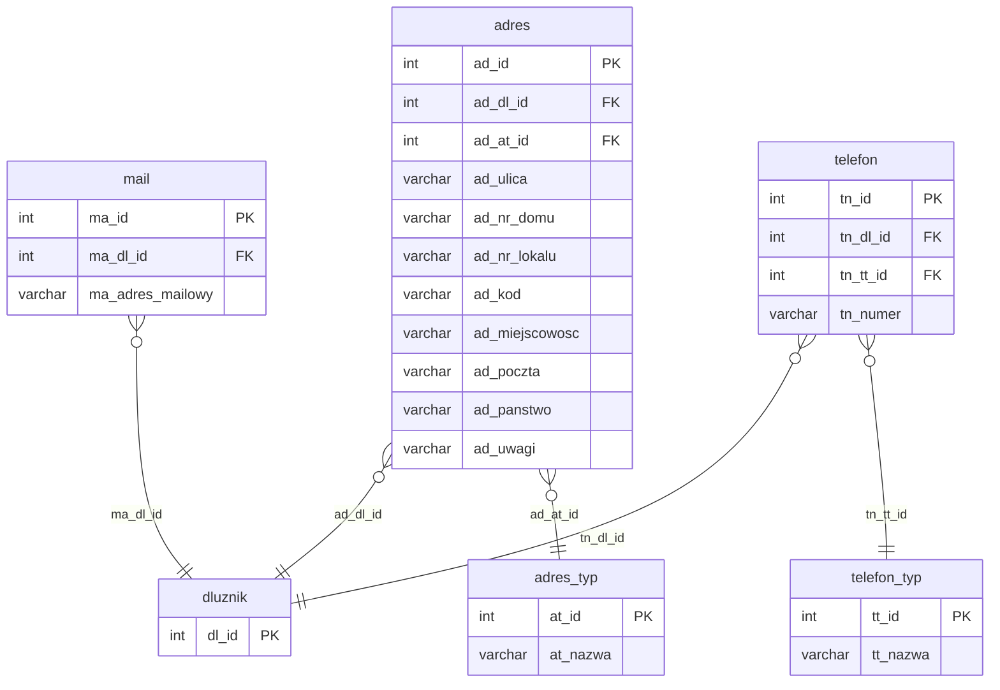

# Dane kontaktowe (adres, mail, telefon)

Iteracja 3 obejmuje dane kontaktowe dłużników — adresy pocztowe, adresy e-mail oraz numery telefonów. Dane z tej iteracji można załadować dopiero po Iteracji 2, ponieważ każdy kontakt musi być powiązany z istniejącym dłużnikiem. Zobacz też: [walidacje](../przygotowanie-danych/walidacje.md), [kolejność ładowania](../przygotowanie-danych/kolejnosc-zasilania-tabel.md).

!!! warning "Dane osobowe"
    Tabele w tej iteracji zawierają dane osobowe (PII) — adresy pocztowe, adresy e-mail oraz numery telefonów. Kolumny zawierające dane osobowe są oznaczone znacznikiem PII.

  Iteracja: 3
  Zależności: Iteracja 2
  Walidacje: <a href="../przygotowanie-danych/walidacje.md#str_08">STR_08</a>, <a href="../przygotowanie-danych/walidacje.md#str_09">STR_09</a>
  Zakres: dane kontaktowe dłużników

## Diagram ER

Diagram pokazuje tabele kontaktowe iteracja 3 oraz ich powiązanie z `dluznik` (iteracja 2). Pełna struktura dłużnika (`dluznik_typ`, `mapowanie_plec`, atrybuty) — [Dłużnicy § Diagram ER](dluznicy.md#diagram-er).

## Tabele

### dbo.adres

<code>dbo.adres</code> — przekształcenie adresy dłużnika (zameldowania, korespondencyjny, pobytu)

  Tabela prod: <code>dm_data_web.adres</code>
  Kształt mapowania: przekształcenie
  Obowiązkowa: nie
  Multi-row: tak

Adresy przypisane do dłużnika, z typem określonym przez `ad_at_id` (FK do słownika `adres_typ`). Okres obowiązywania adresu opisują kolumny `ad_data_od`/`ad_data_do` — `NULL` w `ad_data_do` oznacza adres aktywny.

<ul class="param-list">
  <li>
    ad_id
    INT
    Klucz główny adresu w stagingu
  </li>
  <li>
    ad_dl_id
    INT
    FK do dłużnika (dluznik.dl_id)
  </li>
  <li>
    ad_at_id
    INT
    FK do słownika typów adresów (adres_typ.at_id)
  </li>
  <li>
    ad_ulica
    VARCHAR
    Nazwa ulicy
  </li>
  <li>
    ad_nr_domu
    VARCHAR
    Numer domu
  </li>
  <li>
    ad_nr_lokalu
    VARCHAR
    Numer lokalu
  </li>
  <li>
    ad_kod
    VARCHAR
    Kod pocztowy w formacie XX-XXX
  </li>
  <li>
    ad_miejscowosc
    VARCHAR
    Miejscowość
  </li>
  <li>
    ad_poczta
    VARCHAR
    Poczta
  </li>
  <li>
    ad_panstwo
    VARCHAR
    Kraj
  </li>
  <li>
    ad_uwagi
    VARCHAR
    Uwagi dotyczące adresu
  </li>
  <li>
    ad_data_od
    DATETIME
    Data początku obowiązywania adresu
  </li>
  <li>
    ad_data_do
    DATETIME
    Data końca obowiązywania adresu - NULL oznacza adres aktywny
  </li>
  <li>
    mod_date
    DATETIME
    Kolumna techniczna - obsługiwana triggerami insert; nie wypełniać
  </li>
</ul>

- `wlasciwosc` + `wlasciwosc_adres` (`wdzi_id = 2`) — właściwości adresu. Definicja: [tabele-generyczne.md#dbowlasciwosc](tabele-generyczne.md#dbowlasciwosc).

### dbo.mail

<code>dbo.mail</code> — przekształcenie adresy e-mail dłużnika

  Tabela prod: <code>dm_data_web.mail</code>
  Kształt mapowania: przekształcenie
  Obowiązkowa: nie
  Multi-row: tak

Adresy e-mail przypisane do dłużnika. Okres obowiązywania opisują kolumny `ma_data_od`/`ma_data_do` — `NULL` w `ma_data_do` oznacza adres aktywny. Treść adresu e-mail znajduje się w kolumnie `ma_adres_mailowy`.

<ul class="param-list">
  <li>
    ma_id
    INT
    Klucz główny adresu e-mail w stagingu
  </li>
  <li>
    ma_dl_id
    INT
    FK do dłużnika (dluznik.dl_id)
  </li>
  <li>
    ma_adres_mailowy
    VARCHAR
    Adres e-mail dłużnika
  </li>
  <li>
    ma_data_od
    DATETIME
    Data początku obowiązywania adresu e-mail
  </li>
  <li>
    ma_data_do
    DATETIME
    Data końca obowiązywania adresu e-mail - NULL oznacza adres aktywny
  </li>
  <li>
    mod_date
    DATETIME
    Kolumna techniczna - obsługiwana triggerami insert; nie wypełniać
  </li>
</ul>

- `wlasciwosc` + `wlasciwosc_email` (`wdzi_id = 3`) — właściwości adresu e-mail. Definicja: [tabele-generyczne.md#dbowlasciwosc](tabele-generyczne.md#dbowlasciwosc).

### dbo.telefon

<code>dbo.telefon</code> — przekształcenie numery telefonów dłużnika

  Tabela prod: <code>dm_data_web.telefon</code>
  Kształt mapowania: przekształcenie
  Obowiązkowa: nie
  Multi-row: tak

Numery telefonów przypisane do dłużnika, z typem określonym przez `tn_tt_id` (FK do słownika `telefon_typ`). Okres obowiązywania opisują kolumny `tn_data_od`/`tn_data_do` — `NULL` w `tn_data_do` oznacza numer aktywny.

<ul class="param-list">
  <li>
    tn_id
    INT
    Klucz główny numeru telefonu w stagingu
  </li>
  <li>
    tn_dl_id
    INT
    FK do dłużnika (dluznik.dl_id)
  </li>
  <li>
    tn_numer
    VARCHAR
    Numer telefonu
  </li>
  <li>
    tn_tt_id
    INT
    FK do słownika typów telefonów (telefon_typ.tt_id)
  </li>
  <li>
    tn_data_od
    DATETIME
    Data początku obowiązywania numeru telefonu
  </li>
  <li>
    tn_data_do
    DATETIME
    Data końca obowiązywania numeru telefonu - NULL oznacza numer aktywny
  </li>
  <li>
    mod_date
    DATETIME
    Kolumna techniczna - obsługiwana triggerami insert; nie wypełniać
  </li>
</ul>

- `wlasciwosc` + `wlasciwosc_telefon` (`wdzi_id = 1`) — właściwości telefonu. Definicja: [tabele-generyczne.md#dbowlasciwosc](tabele-generyczne.md#dbowlasciwosc).

## Powiązania {#powiazania}

- Poprzednia iteracja: [Dłużnicy i atrybuty dłużników](dluznicy.md)
- Następna iteracja: [Sprawy i role](sprawy.md)
- Walidacje referencyjne (adres): [REF_09, REF_10](../przygotowanie-danych/walidacje.md)
- Walidacje referencyjne (mail): [REF_13](../przygotowanie-danych/walidacje.md)
- Walidacje referencyjne (telefon): [REF_11, REF_12](../przygotowanie-danych/walidacje.md)
- Walidacje formatu: [FMT_04 (kod pocztowy), FMT_05 (e-mail), FMT_06, FMT_07 (telefon)](../przygotowanie-danych/walidacje.md)
- Walidacje integralności strukturalnej: [STR_08 (limit telefonów)](../przygotowanie-danych/walidacje.md#str_08), [STR_09 (limit adresów)](../przygotowanie-danych/walidacje.md#str_09)
