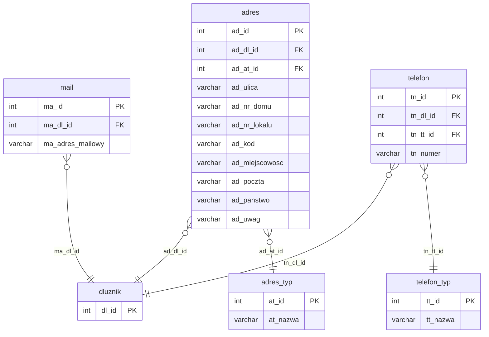

# Dane kontaktowe (adres, mail, telefon)

Iteracja 3 ładuje sześć tabel stagingowych danych kontaktowych — trzy nagłówkowe (`dbo.adres`, `dbo.mail`, `dbo.telefon`) oraz trzy łączące (`dbo.wlasciwosc_adres`, `dbo.wlasciwosc_email`, `dbo.wlasciwosc_telefon`) — wszystkie klasy **C**, zależne od słowników z iteracji 1 (`adres_typ`, `telefon_typ`) oraz od `mapowanie.dodani_dluznicy` zbudowanego w iteracji 2. Iteracja jest warunkiem koniecznym dla iteracji 4 (sprawy i role dłużników).

Trzy tabele nagłówkowe ładowane są range-based (`INSERT ... WHERE stg._id > @max_*_ext`, zamiast MERGE z iteracji 1/iteracja 2); trzy łączące — współdzieloną procedurą `usp_migrate_wlasciwosc_domain` w trybie `EXT_ID` (zamiast `MAPPING` z iteracji 2, bo prod `*_ext_id` jest dostępny od razu po INSERT encji kontaktowej w tym samym skrypcie). Pola PII (ulica, numery domu i lokalu, kod pocztowy, miejscowość, adres e-mail, numer telefonu) oznaczone są markerem. Szczegóły per tabela w sekcjach `### dbo.<tabela>`; walidacje referencyjne i biznesowe w sekcji [Powiązania](#powiazania) poniżej.

  Iteracja: 3
  Zależności: Iteracja 1 (adres_typ, telefon_typ) + Iteracja 2 (mapowanie.dodani_dluznicy)

## Diagram ER

Diagram pokazuje tabele kontaktowe iteracja 3 oraz ich powiązanie z `dluznik` (iteracja 2). Pełna struktura dłużnika (`dluznik_typ`, `mapowanie_plec`, atrybuty) — [Dłużnicy § Diagram ER](dluznicy.md#diagram-er).

## Tabele

<code>dbo.adres</code> — C adresy dłużnika (zameldowania, korespondencyjny, pobytu)

  Tabela prod: <code>dm_data_web.adres</code>
  Klasa: C — pełna transformacja
  Obowiązkowa: nie
  Multi-row: tak

Adresy przypisane do dłużnika, z typem określonym przez `ad_at_id` (FK do `adres_typ` z iteracji 1). Staging PK `ad_id` jest typu INT, prod używa IDENTITY i przechowuje pochodzenie w `ad_ext_id` (INT). Okres obowiązywania adresu opisują kolumny `ad_data_od`/`ad_data_do` — `NULL` w `ad_data_do` oznacza adres aktywny.

<ul class="param-list">
  <li>
    ad_id
    INT
    Klucz główny adresu w stagingu
  </li>
  <li>
    ad_dl_id
    INT
    FK do dłużnika - rozwiązywany przez mapowanie.dodani_dluznicy
  </li>
  <li>
    ad_at_id
    INT
    FK do słownika typów adresów
  </li>
  <li>
    ad_ulica
    VARCHAR
    Nazwa ulicy
  </li>
  <li>
    ad_nr_domu
    VARCHAR
    Numer domu
  </li>
  <li>
    ad_nr_lokalu
    VARCHAR
    Numer lokalu
  </li>
  <li>
    ad_kod
    VARCHAR
    Kod pocztowy w formacie XX-XXX
  </li>
  <li>
    ad_miejscowosc
    VARCHAR
    Miejscowość
  </li>
  <li>
    ad_poczta
    VARCHAR
    Poczta
  </li>
  <li>
    ad_panstwo
    VARCHAR
    Kraj
  </li>
  <li>
    ad_uwagi
    VARCHAR
    Uwagi dotyczące adresu
  </li>
  <li>
    ad_data_od
    DATETIME
    Data początku obowiązywania adresu
  </li>
  <li>
    ad_data_do
    DATETIME
    Data końca obowiązywania adresu - NULL oznacza adres aktywny
  </li>
  <li>
    mod_date
    DATETIME
    Kolumna techniczna - obsługiwana triggerami insert; nie wypełniać
  </li>
</ul>

### dbo.adres
Prod `adres` generuje własny IDENTITY `ad_id` — staging PK trafia do kolumny `ad_ext_id` (INT). Idempotencja realizowana jest range-based: `WHERE stg.ad_id > @max_ad_ext` (gdzie `@max_ad_ext = MAX(ad_ext_id)` w prod, domyślnie `-2147483648` dla stagingu pustego). Przed INSERT (przy `@stage > 1`) liczone są wiersze osierocone (brak rodzica w `mapowanie.dodani_dluznicy`) i raportowane jako `PRINT WARNING`; sam INSERT je niejawnie pomija przez INNER JOIN. FK `ad_dl_id` rozwiązywany przez INNER JOIN na `mapowanie.dodani_dluznicy` (staging `dl_id` → prod `dl_id`). FK `ad_at_id` rozwiązywany dwuetapowo: `staging.adres_typ.at_id = stg.ad_at_id`, następnie `prod.adres_typ.at_id = stg_at.at_ext_id` — staging `adres_typ.at_ext_id` przechowuje docelowy prod `at_id` po backfillu z iteracji 1. Kolumny hardkodowane: `ad_zpi_id = 2` (stała `@ZPI_IMPORT`, źródło: import) oraz `ad_tworzacy_us_id = @system_admin_user_id`. Kolumna `ad_data_od` wypełniana jest przez `COALESCE(stg.ad_data_od, stg.mod_date)`, `ad_data_do` kopiowana 1:1. Po zakończeniu INSERT-a prod `ad_id` jest zapisywany z powrotem do staging `ad_ext_id` przez UPDATE po `#ad_mapping` — to odwzorowanie wykorzystuje sekcja `wlasciwosc_adres` w tym samym kroku oraz pośrednio kolejne iteracje. Pominięte przy INSERT: IDENTITY `ad_id`. Kolumny `aud_data`/`aud_login` są wypełniane explicite (odpowiednio `COALESCE(stg.mod_date, @aud_now)` i `@aud_login`), z pominięciem UDF-a obliczającego defaulty.

<code>dbo.mail</code> — C adresy e-mail dłużnika

  Tabela prod: <code>dm_data_web.mail</code>
  Klasa: C — pełna transformacja
  Obowiązkowa: nie
  Multi-row: tak

Adresy e-mail przypisane do dłużnika. Staging PK `ma_id` jest typu INT, prod używa IDENTITY i przechowuje pochodzenie w `ma_ext_id`. Okres obowiązywania opisują kolumny `ma_data_od`/`ma_data_do` — `NULL` w `ma_data_do` oznacza adres aktywny. Blok zawiera jedną przemianowaną kolumnę na wejściu do prod (`ma_adres_mailowy → ma_nazwa`).

<ul class="param-list">
  <li>
    ma_id
    INT
    Klucz główny adresu e-mail w stagingu
  </li>
  <li>
    ma_dl_id
    INT
    FK do dłużnika - rozwiązywany przez mapowanie.dodani_dluznicy
  </li>
  <li>
    ma_adres_mailowy
    VARCHAR
    Adres e-mail dłużnika - w prod kolumna nosi nazwę ma_nazwa
  </li>
  <li>
    ma_data_od
    DATETIME
    Data początku obowiązywania adresu e-mail
  </li>
  <li>
    ma_data_do
    DATETIME
    Data końca obowiązywania adresu e-mail - NULL oznacza adres aktywny
  </li>
  <li>
    mod_date
    DATETIME
    Kolumna techniczna - obsługiwana triggerami insert; nie wypełniać
  </li>
</ul>

### dbo.mail
Prod `mail` generuje własny IDENTITY `ma_id` — staging PK trafia do kolumny `ma_ext_id` (INT). Idempotencja range-based: `WHERE stg.ma_id > @max_ma_ext`. Przed INSERT (przy `@stage > 1`) liczone są wiersze osierocone (brak rodzica w `mapowanie.dodani_dluznicy`) i raportowane jako `PRINT WARNING`; sam INSERT je niejawnie pomija przez INNER JOIN. FK `ma_dl_id` rozwiązywany przez INNER JOIN na `mapowanie.dodani_dluznicy`. Przy INSERT przemianowana jest jedna kolumna: `ma_adres_mailowy → ma_nazwa` (w prod kolumna mieści treść adresu e-mail). Kolumny hardkodowane: `ma_mat_id = 1` (stała `@MAT_DEFAULT`, domyślny typ poczty) oraz `ma_tworzacy_us_id = @system_admin_user_id`. Kolumna `ma_data_od` wypełniana przez `COALESCE(stg.ma_data_od, stg.mod_date)`, `ma_data_do` 1:1. Po INSERT prod `ma_id` zapisywane z powrotem do staging `ma_ext_id` (UPDATE po `#ma_mapping`) — używa tego sekcja `wlasciwosc_email` w tym samym kroku. Pominięte przy INSERT: IDENTITY `ma_id`. `aud_data`/`aud_login` wypełniane explicite z pominięciem UDF-a.

<code>dbo.telefon</code> — C numery telefonów dłużnika

  Tabela prod: <code>dm_data_web.telefon</code>
  Klasa: C — pełna transformacja
  Obowiązkowa: nie
  Multi-row: tak

Numery telefonów przypisane do dłużnika, z typem określonym przez `tn_tt_id` (FK do `telefon_typ` z iteracji 1). Staging PK `tn_id` jest typu INT, prod używa IDENTITY i przechowuje pochodzenie w `tn_ext_id`. Okres obowiązywania opisują `tn_data_od`/`tn_data_do` — `NULL` w `tn_data_do` oznacza numer aktywny. Blok zawiera przemianowaną kolumnę FK do słownika typów (`tn_tt_id → tn_tnt_id`).

<ul class="param-list">
  <li>
    tn_id
    INT
    Klucz główny numeru telefonu w stagingu
  </li>
  <li>
    tn_dl_id
    INT
    FK do dłużnika - rozwiązywany przez mapowanie.dodani_dluznicy
  </li>
  <li>
    tn_numer
    VARCHAR
    Numer telefonu
  </li>
  <li>
    tn_tt_id
    INT
    FK do słownika typów telefonów - w prod kolumna nosi nazwę tn_tnt_id
  </li>
  <li>
    tn_data_od
    DATETIME
    Data początku obowiązywania numeru telefonu
  </li>
  <li>
    tn_data_do
    DATETIME
    Data końca obowiązywania numeru telefonu - NULL oznacza numer aktywny
  </li>
  <li>
    mod_date
    DATETIME
    Kolumna techniczna - obsługiwana triggerami insert; nie wypełniać
  </li>
</ul>

### dbo.telefon
Prod `telefon` generuje własny IDENTITY `tn_id` — staging PK trafia do kolumny `tn_ext_id` (INT). Idempotencja range-based: `WHERE stg.tn_id > @max_tn_ext`. Przed INSERT (przy `@stage > 1`) liczone są wiersze osierocone (brak rodzica w `mapowanie.dodani_dluznicy`) i raportowane jako `PRINT WARNING`; sam INSERT je niejawnie pomija przez INNER JOIN. FK `tn_dl_id` rozwiązywany przez INNER JOIN na `mapowanie.dodani_dluznicy`. Przy INSERT przemianowana jest kolumna FK do słownika typów: staging `tn_tt_id` trafia do prod `tn_tnt_id` (nazwy różnią się między staging a prod). Rozwiązanie FK dwuetapowe: `staging.telefon_typ.tt_id = stg.tn_tt_id`, następnie `prod.telefon_typ.tnt_id = stg_tt.tt_ext_id` — staging `telefon_typ.tt_ext_id` przechowuje docelowy prod `tnt_id` po backfillu z iteracji 1. Kolumny hardkodowane: `tn_zpi_id = 2` (stała `@ZPI_IMPORT`, źródło: import) oraz `tn_tworzacy_us_id = @system_admin_user_id`. Kolumna `tn_data_od` wypełniana przez `COALESCE(stg.tn_data_od, stg.mod_date)`, `tn_data_do` 1:1. Po INSERT prod `tn_id` zapisywane z powrotem do staging `tn_ext_id` (UPDATE po `#tn_mapping`) — używa tego sekcja `wlasciwosc_telefon` w tym samym kroku. Pominięte przy INSERT: IDENTITY `tn_id`. `aud_data`/`aud_login` wypełniane explicite z pominięciem UDF-a.

Nagłówkowa tabela `wlasciwosc` jest ponownie ładowana w iteracji 3 (trzykrotnie, `wdzi_id ∈ {1, 2, 3}`) tą samą procedurą co iteracja 2 — pełny opis kolumn i mapowania patrz [iteracja 2 › wlasciwosc](dluznicy.md#wlasciwosc). Poniższe trzy bloki opisują wyłącznie tabele łączące per dziedzina.

<code>dbo.wlasciwosc_adres</code> (wdzi_id=2) — C tabela łącząca właściwość z adresem

  Tabela prod: <code>dm_data_web.wlasciwosc_adres</code>
  Klasa: C — tabela łącząca, shared proc
  Obowiązkowa: nie
  Multi-row: tak

Tabela łącząca (junction) — każdy wiersz wiąże rekord `wlasciwosc` (z dziedziny adres, `wdzi_id = 2`) z konkretnym adresem. Ładowana razem z rodzicem `wlasciwosc` w tym samym kroku iteracja 3 (SEKCJA 4 skryptu `03_iter3_adres_mail_telefon.sql`). Brak osobnego `ext_id` w stagingu — idempotencja zapewniona przez composite key na prod.

<ul class="param-list">
  <li>
    wa_id
    INT
    Klucz główny wiersza łączącego
  </li>
  <li>
    wa_wl_id
    INT
    FK do wlasciwosc (wl_id) - konkretna właściwość przypisana adresowi
  </li>
  <li>
    wa_ad_id
    INT
    FK do adres (ad_id) - adres, któremu przypisano właściwość
  </li>
  <li>
    mod_date
    DATETIME
    Kolumna techniczna - obsługiwana triggerami insert; nie wypełniać
  </li>
</ul>

### dbo.wlasciwosc_adres
MERGE po composite key (`wa_wl_id`, `wa_ad_id`); brak kolumn hardkodowanych. Dzieli wspólny shared proc `usp_migrate_wlasciwosc_domain` z rodzicem `wlasciwosc` (tryb `EXT_ID`, filtr `wdzi_id = 2`). FK `wa_ad_id` rozwiązywany w trybie `EXT_ID` przez `prod.adres.ad_ext_id = staging.wa_ad_id` (prod `adres` właśnie otrzymał `ad_ext_id` w SEKCJI 1 tego samego kroku). Pominięte: `aud_data`/`aud_login` wypełniane explicite z pominięciem UDF-a; prod PK (IDENTITY). Brak osobnego `ext_id` w stagingu — idempotencja po composite key (`wa_wl_id`, `wa_ad_id`).

<code>dbo.wlasciwosc_email</code> (wdzi_id=3) — C tabela łącząca właściwość z adresem e-mail

  Tabela prod: <code>dm_data_web.wlasciwosc_email</code>
  Klasa: C — tabela łącząca, shared proc
  Obowiązkowa: nie
  Multi-row: tak

Tabela łącząca — każdy wiersz wiąże rekord `wlasciwosc` (dziedzina e-mail, `wdzi_id = 3`) z konkretnym adresem e-mail. Ładowana razem z rodzicem `wlasciwosc` (SEKCJA 5 skryptu iteracja 3). Brak osobnego `ext_id` w stagingu — idempotencja zapewniona przez composite key na prod.

<ul class="param-list">
  <li>
    we_id
    INT
    Klucz główny wiersza łączącego
  </li>
  <li>
    we_wl_id
    INT
    FK do wlasciwosc (wl_id) - konkretna właściwość przypisana adresowi e-mail
  </li>
  <li>
    we_ma_id
    INT
    FK do mail (ma_id) - adres e-mail, któremu przypisano właściwość
  </li>
  <li>
    mod_date
    DATETIME
    Kolumna techniczna - obsługiwana triggerami insert; nie wypełniać
  </li>
</ul>

### dbo.wlasciwosc_email
MERGE po composite key (`we_wl_id`, `we_ma_id`); brak kolumn hardkodowanych. Dzieli wspólny shared proc `usp_migrate_wlasciwosc_domain` z rodzicem `wlasciwosc` (tryb `EXT_ID`, filtr `wdzi_id = 3`). FK `we_ma_id` rozwiązywany w trybie `EXT_ID` przez `prod.mail.ma_ext_id = staging.we_ma_id` (prod `mail` otrzymał `ma_ext_id` w SEKCJI 2 tego samego kroku). Pominięte: `aud_data`/`aud_login` wypełniane explicite z pominięciem UDF-a; prod PK (IDENTITY). Brak osobnego `ext_id` w stagingu — idempotencja po composite key (`we_wl_id`, `we_ma_id`).

<code>dbo.wlasciwosc_telefon</code> (wdzi_id=1) — C tabela łącząca właściwość z numerem telefonu

  Tabela prod: <code>dm_data_web.wlasciwosc_telefon</code>
  Klasa: C — tabela łącząca, shared proc
  Obowiązkowa: nie
  Multi-row: tak

Tabela łącząca — każdy wiersz wiąże rekord `wlasciwosc` (dziedzina telefon, `wdzi_id = 1`) z konkretnym numerem telefonu. Ładowana razem z rodzicem `wlasciwosc` (SEKCJA 6 skryptu iteracja 3). Brak osobnego `ext_id` w stagingu — idempotencja zapewniona przez composite key na prod.

<ul class="param-list">
  <li>
    wt_id
    INT
    Klucz główny wiersza łączącego
  </li>
  <li>
    wt_wl_id
    INT
    FK do wlasciwosc (wl_id) - konkretna właściwość przypisana numerowi telefonu
  </li>
  <li>
    wt_tn_id
    INT
    FK do telefon (tn_id) - numer telefonu, któremu przypisano właściwość
  </li>
  <li>
    mod_date
    DATETIME
    Kolumna techniczna - obsługiwana triggerami insert; nie wypełniać
  </li>
</ul>

### dbo.wlasciwosc_telefon
MERGE po composite key (`wt_wl_id`, `wt_tn_id`); brak kolumn hardkodowanych. Dzieli wspólny shared proc `usp_migrate_wlasciwosc_domain` z rodzicem `wlasciwosc` (tryb `EXT_ID`, filtr `wdzi_id = 1`). FK `wt_tn_id` rozwiązywany w trybie `EXT_ID` przez `prod.telefon.tn_ext_id = staging.wt_tn_id` (prod `telefon` otrzymał `tn_ext_id` w SEKCJI 3 tego samego kroku). Pominięte: `aud_data`/`aud_login` wypełniane explicite z pominięciem UDF-a; prod PK (IDENTITY). Brak osobnego `ext_id` w stagingu — idempotencja po composite key (`wt_wl_id`, `wt_tn_id`).

## Powiązania {#powiazania}

- Poprzednia iteracja: [Dłużnicy i atrybuty dłużników](dluznicy.md)
- Następna iteracja: [Sprawy i role](sprawy.md)
- Klasyfikacja mapowania: [Mapowanie staging → prod](mapowanie-tabel.md)
- Walidacje referencyjne (adres): [REF_09, REF_10](../przygotowanie-danych/walidacje.md)
- Walidacje referencyjne (mail): [REF_13](../przygotowanie-danych/walidacje.md)
- Walidacje referencyjne (telefon): [REF_11, REF_12](../przygotowanie-danych/walidacje.md)
- Walidacje formatu: [FMT_04 (kod pocztowy), FMT_05 (e-mail), FMT_06, FMT_07 (telefon)](../przygotowanie-danych/walidacje.md)
- Walidacje biznesowe: [BIZ_09 (limit telefonów), BIZ_10 (limit adresów)](../przygotowanie-danych/walidacje.md)
