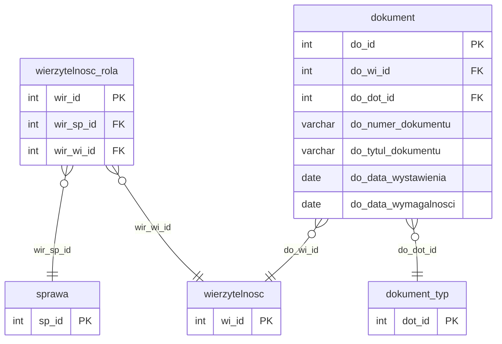

# Role wierzytelności i dokumenty

Iteracja 7 ładuje dodatkowe role wierzytelności oraz dokumenty finansowe powiązane z roszczeniami — dwie tabele stagingowe (`dbo.wierzytelnosc_rola`, `dbo.dokument`) oraz ponownie polimorficzna `dbo.atrybut` z filtrem `att_atd_id = 1` zasilają cztery tabele produkcyjne (`wierzytelnosc_rola`, `dokument`, `atrybut_wartosc`, `atrybut_dokument`). Wszystkie przejścia są klasy **C**, zależne od słowników z iteracji 1 (`dokument_typ`, `wierzytelnosc_rola_typ`, `atrybut_typ`), mapowania spraw z iteracji 4 (`mapowanie.dodane_sprawy`) oraz mapowania wierzytelności z iteracji 6 (`mapowanie.dodane_wierzytelnosci`). Iteracja zamyka domenę merytoryczną wierzytelności — po iteracji 7 pozostaje warstwa finansowa (iteracja 8 — księgowania i operacje) oraz harmonogram spłat (iteracja 9), oba zależne od `mapowanie.dodane_dokumenty` budowanego tutaj.

`wierzytelnosc_rola` ładowana jest composite-key NOT EXISTS po parze `(wir_wi_id, wir_sp_id)` — staging PK `wir_id` nie jest przechowywany w prod (brak kolumny `wir_ext_id`); hardkodowany `wir_wirt_id = 1` (stała `@WIR_DEFAULT_WIRT_ID` — domyślny typ roli wierzyciela, identyczny jak w iteracji 6 auto-gen), a staging `wir_rl_id` jest ignorowany. `Dokument` ładowany jest range-based w pętli batchy po 500 000 rekordów z wyłączeniem/odbudową NCI na tabeli docelowej; idempotencja po `do_ext_id = CAST(do_id AS VARCHAR)` z fallbackiem `-2147483648` dla stagingu pustego, FK `do_wi_id` rozwiązywany przez `mapowanie.dodane_wierzytelnosci`, a pochodna kolumna `do_uko_id` dziedziczona z prod `wierzytelnosc.wi_uko_id` (brak bezpośredniego źródła w stagingu dokumentu). Mapowanie staging→prod PK zapisywane jest do trwałej tabeli `mapowanie.dodane_dokumenty` — źródła FK dla iteracji 8 (`ksiegowanie_dekret.ksd_do_id`, `operacja.oper_do_id`). Atrybuty dziedziny `dokument` (`att_atd_id = 1`) współdzielą procedurę `usp_migrate_atrybut_wartosc` z iteracji 2/4/6 — zmiana tylko parametru `@att_atd_id` i docelowej junction na `atrybut_dokument`. Szczegóły per prod-tabela w sekcjach `### dbo.<tabela>`; walidacje referencyjne, formatu i techniczne w sekcji [Powiązania](#powiazania) poniżej.

  Iteracja: 7
  Zależności: Iteracja 1 (dokument_typ, wierzytelnosc_rola_typ, atrybut_typ) + Iteracja 4 (mapowanie.dodane_sprawy) + Iteracja 6 (mapowanie.dodane_wierzytelnosci)

## Diagram ER

Diagram pokazuje dwie tabele iteracji 7 (`wierzytelnosc_rola`, `dokument`) oraz minimalne stuby `sprawa` (iteracja 4), `wierzytelnosc` (iteracja 6) i `dokument_typ` (iteracja 1) jako punkty zaczepienia FK. Pełna struktura sprawy — [Sprawy § Diagram ER](sprawy.md#diagram-er); pełny słownik wierzytelności — [Wierzytelności § Diagram ER](wierzytelnosci.md#diagram-er); słownik typów dokumentów — [Słowniki § dbo.dokument_typ](slowniki.md#dbodokument_typ). Polimorficzny stos `atrybut` — [Dłużnicy § Diagram ER](dluznicy.md#diagram-er); w iteracji 7 wiersze `att_atd_id = 1` (opisane w sekcji `<code>dbo.atrybut</code>` poniżej) wiążą się z `dokument.do_id` przez polimorficzne `at_ob_id`. Staging `wir_rl_id` (FK do słownika ról wierzytelności) pominięty w diagramie — SQL go ignoruje i hardkoduje `wir_wirt_id = 1`. Prod-only encja `atrybut_dokument` opisana jest w sekcji `### dbo.atrybut_dokument` poniżej.

## Tabele

<code>dbo.wierzytelnosc_rola</code> — C dodatkowe role wierzytelności beyond auto-gen z iteracji 6

  Tabele prod: <code>dm_data_web.wierzytelnosc_rola</code>
  Klasa: C — pełna transformacja (composite NOT EXISTS, bez ext_id)
  Obowiązkowa: nie
  Multi-row: tak (1 wierzytelność → N ról — wierzyciel, wierzyciel pierwotny, cesjonariusz)

Staging `wierzytelnosc_rola` zawiera wiersze ról (wierzyciel, wierzyciel pierwotny, cesjonariusz, poręczyciel) przypisujących wierzytelność do sprawy — jedno (sprawa, wierzytelność) może mieć wiele wpisów roli w zależności od historii cesji. Iteracja 6 auto-generował już jeden domyślny wiersz `wierzytelnosc_rola` per (sprawa, wierzytelność) z `wir_wirt_id = 1` (rola wierzyciela); iteracja 7 dodaje pozostałe pary ze stagingu, których iteracja 6 nie pokrył (np. role wynikające z tabeli wierzytelnosc_rola niepowiązane 1:1 z nagłówkiem wierzytelności). Wszystkie wiersze iteracja 7 otrzymują ten sam hardkodowany typ roli — bogatsza semantyka staging `wir_rl_id` nie jest obecnie odwzorowana w prod.

<ul class="param-list">
  <li>
    wir_id
    INT
    Klucz główny powiązania wierzytelności ze sprawą w stagingu - nie trafia do prod (prod używa IDENTITY bez ext_id)
  </li>
  <li>
    wir_sp_id
    INT
    FK do sprawy - rozwiązywany przez mapowanie.dodane_sprawy
  </li>
  <li>
    wir_wi_id
    INT
    FK do wierzytelności - rozwiązywany przez mapowanie.dodane_wierzytelnosci
  </li>
  <li>
    wir_rl_id
    INT
    FK do słownika ról wierzytelności - ignorowany przez SQL; prod hardkoduje wir_wirt_id = 1
  </li>
  <li>
    mod_date
    DATETIME
    Kolumna techniczna - obsługiwana triggerami insert; nie wypełniać
  </li>
</ul>

### dbo.wierzytelnosc_rola
Prod `wierzytelnosc_rola` używa IDENTITY `wir_id` — staging PK `wir_id` nie jest przechowywany (brak kolumny `wir_ext_id` w prod, jedyna iteracja bez ext_id ze względu na composite-key idempotency). Idempotencja composite: snapshot istniejących par prod `(wir_wi_id, wir_sp_id)` trafia do indeksowanej `#existing_wir`, a INSERT pomija pary już obecne (LEFT JOIN z filtrem `WHERE ex.wir_wi_id IS NULL`) — gwarantuje bezpieczeństwo re-runów oraz nakładania się z wierszami wygenerowanymi przez iteracja 6. FK `wir_sp_id` rozwiązywany przez INNER JOIN na `mapowanie.dodane_sprawy` (staging `sp_id` → prod `sp_id`; tabela budowana przez iteracja 4); FK `wir_wi_id` przez `mapowanie.dodane_wierzytelnosci` (staging `wi_id` → prod `wi_id`; tabela budowana przez iteracja 6). Oba INNER JOIN-y filtrują wiersze, dla których sprawa lub wierzytelność nie zostały zmigrowane. Kolumny hardkodowane: `wir_wirt_id = 1` (stała `@WIR_DEFAULT_WIRT_ID` — domyślny typ roli wierzyciela, identyczny z iteracji 6 auto-gen), `wir_kwota_poreczenia_do = 0`, `wir_data_do = '9999-12-31'` (stała `@SENTINEL_DATE` — rola aktywna bezterminowo). `wir_data_od` kopiowany z `stg.mod_date`. Staging `wir_rl_id` nie jest odwzorowywany — bogatsza semantyka ról (wierzyciel pierwotny, cesjonariusz) zostanie dodana w przyszłej iteracji po uzgodnieniu słownika `wierzytelnosc_rola_typ`. Pominięte przy INSERT: IDENTITY prod `wir_id`. Kolumny `aud_data`/`aud_login` wypełniane są explicite (odpowiednio `COALESCE(stg.mod_date, @aud_now)` i `@aud_login`), z pominięciem UDF-a obliczającego defaulty.

<code>dbo.dokument</code> — C nagłówki dokumentów finansowych (faktury, noty, wezwania)

  Tabele prod: <code>dm_data_web.dokument</code>
  Klasa: C — pełna transformacja (range-based, batched, NCI cycle)
  Obowiązkowa: nie
  Multi-row: tak (1 wierzytelność → N dokumentów)

Nagłówek dokumentu finansowego powiązanego z wierzytelnością — faktury, noty księgowe, wezwania do zapłaty, potwierdzenia salda. Staging PK `do_id` jest typu INT (wartości ujemne per konwencja staging); prod używa IDENTITY i przechowuje pochodzenie staging PK w kolumnie `do_ext_id` (VARCHAR — CAST wymuszony przy każdym range check). Kolumny staging `do_numer_dokumentu` i `do_tytul_dokumentu` są przy INSERT renamowane odpowiednio na prod `do_numer` i `do_tytul`. Mapowanie staging→prod PK zapisywane jest do `mapowanie.dodane_dokumenty` — źródła FK dla iteracji 8 (ksiegowanie_dekret, operacja) oraz dla junction `atrybut_dokument` w sekcji 3 iteracja 7.

<ul class="param-list">
  <li>
    do_id
    INT
    Klucz główny dokumentu w stagingu
  </li>
  <li>
    do_wi_id
    INT
    FK do wierzytelności - rozwiązywany przez mapowanie.dodane_wierzytelnosci
  </li>
  <li>
    do_numer_dokumentu
    VARCHAR
    Numer dokumentu nadany w systemie źródłowym - renamowany przy INSERT na prod do_numer
  </li>
  <li>
    do_data_wystawienia
    DATE
    Data wystawienia dokumentu
  </li>
  <li>
    do_dot_id
    INT
    FK do słownika typów dokumentów - bezpośrednio (dokument_typ IDs zachowują tożsamość po iteracji 1)
  </li>
  <li>
    do_data_wymagalnosci
    DATE
    Data wymagalności dokumentu
  </li>
  <li>
    do_tytul_dokumentu
    VARCHAR
    Tytuł dokumentu - renamowany przy INSERT na prod do_tytul
  </li>
  <li>
    mod_date
    DATETIME
    Kolumna techniczna - obsługiwana triggerami insert; nie wypełniać
  </li>
</ul>

### dbo.dokument
Prod `dokument` generuje własny IDENTITY `do_id` — staging PK trafia do kolumny `do_ext_id` (VARCHAR, `CAST(stg.do_id AS VARCHAR)`). Idempotencja range-based z filtrem regex: `@max_do_ext = ISNULL((SELECT MAX(TRY_CAST(do_ext_id AS INT)) FROM prod.dokument WHERE do_ext_id IS NOT NULL AND do_ext_id NOT LIKE '%[^0-9-]%'), -2147483648)`, następnie INSERT filtruje `stg.do_id > @max_do_ext`. Ujemne staging PK są obsługiwane (regex dopuszcza znak minus). INSERT jest batched — `@do_batch_size = 500000`, pętla `WHILE` po `do_id BETWEEN @do_batch_start AND @do_batch_end` aż do `@do_max_id` — minimalizuje rozmiar pojedynczej transakcji i blokady przy dużej liczbie dokumentów. Przed Sekcja 2 non-clustered indexy na prod `dokument` są disablowane (`EXEC usp_manage_prod_ncis 'dokument', 'DISABLE'`) i odbudowywane po zakończeniu Sekcja 2 (`'REBUILD'`) — klasyczny wzorzec bulk insert dla dużych tabel. Wszystkie INSERT-y używają hinta `WITH (TABLOCK)`. FK `do_wi_id` rozwiązywany przez INNER JOIN na `mapowanie.dodane_wierzytelnosci` (staging `wi_id` → prod `wi_id`). FK `do_dot_id` kopiowany bezpośrednio ze stagingu (identity iteracja 1 słownika `dokument_typ` zachowana po MERGE z iteracji 1). Kolumny renamowane przy SELECT: `stg.do_numer_dokumentu` → `do_numer`, `stg.do_tytul_dokumentu` → `do_tytul`. Pochodna kolumna `do_uko_id` derivowana z prod `wierzytelnosc.wi_uko_id` (JOIN do `dm_data_web_pipeline.dbo.wierzytelnosc prod_wi ON prod_wi.wi_id = mwi.prod_wi_id`) — staging dokument nie posiada własnej kolumny umowy kontrahenta, dziedziczy ją z rodzica. Mapowanie staging→prod PK kaptowane przez `OUTPUT CAST(inserted.do_ext_id AS INT), inserted.do_id` i zapisywane do trwałej tabeli `mapowanie.dodane_dokumenty` — wykorzystywane przez iteracja 8 (`ksd_do_id`, `oper_do_id`) oraz przez Sekcja 3 iteracja 7 (`atdo_do_id`). Dla `@stage > 1` wykonywany jest backfill `mapowanie.dodane_dokumenty` z wierszy już obecnych w prod z poprzednich runów (zabezpieczenie przed utratą mappingu przy błędach OUTPUT). Pominięte przy INSERT: IDENTITY `do_id`. Kolumny `aud_data`/`aud_login` wypełniane są explicite, z pominięciem UDF-a.

<code>dbo.atrybut</code> (att_atd_id=1) — C atrybuty dodatkowe dziedziny dokument, rozbicie na dwie tabele prod

  Tabele prod: <code>dm_data_web.atrybut_wartosc</code>, <code>dm_data_web.atrybut_dokument</code>
  Klasa: C — pełna transformacja
  Obowiązkowa: nie
  Multi-row: tak

Staging `dbo.atrybut` jest polimorficzną tabelą wartości — struktura, klasy i kolumny opisane są w [Dłużnicy i atrybuty § atrybut](dluznicy.md). W iteracji 7 ładowane są wiersze z `att_atd_id = 1` (atrybuty dokumentu — dziedzina `dokument`) do dwóch tabel prod: `atrybut_wartosc` (wartości) i `atrybut_dokument` (junction — odpowiednik `atrybut_dluznik` z iteracji 2, `atrybut_sprawa` z iteracji 4, `atrybut_wierzytelnosc` z iteracji 6). Mechanika procedury współdzielonej jest identyczna jak w poprzednich iteracjach — różni tylko parametr `@att_atd_id = 1` i docelowa tabela junction.

### dbo.atrybut_wartosc
Faza 1 — INSERT do prod `atrybut_wartosc` (IDENTITY `atw_id`) przez shared proc `usp_migrate_atrybut_wartosc` z parametrem `@att_atd_id = 1`. Staging `at_id` trafia do `atw_ext_id` (VARCHAR(100)), wartość `at_wartosc` kopiowana jest do `atw_wartosc`, FK `atw_att_id` rozwiązywany przez JOIN na `staging.atrybut_typ.att_ext_id → prod.atrybut_typ.att_id`. Mapping staging `at_id` → prod `atw_id` trafia do tabeli tymczasowej `#atw_mapping` — wykorzystywanej w fazie 2. Filtr iteracja 7 wymusza `att_atd_id = 1` na etapie JOIN-a z `atrybut_typ`. Idempotencja po `atw_ext_id`. Pominięte przy INSERT: `aud_data`/`aud_login` (wypełniane explicite w procu), IDENTITY w prod.

### dbo.atrybut_dokument
Faza 2 — INSERT do prod `atrybut_dokument` (tabela łącząca, PK composite `atdo_do_id + atdo_atw_id`, odpowiednik `atrybut_dluznik`/`atrybut_sprawa`/`atrybut_wierzytelnosc` z poprzednich iteracji). FK `atdo_atw_id` pobierany z `#atw_mapping`, FK `atdo_do_id` rozwiązywany przez `mapowanie.dodane_dokumenty` (staging `at_ob_id` traktowany jako staging `do_id` — semantyka polimorficznej kolumny dla `att_atd_id = 1`; mapping dostępny z Sekcja 2 iteracja 7 oraz backfill dla `@stage > 1`). Idempotencja composite: snapshot `(atdo_do_id, atdo_atw_id)` trafia do `#existing_atdo`, INSERT pomija pary już obecne (WHERE NOT EXISTS). Filtr na `atrybut_typ.att_atd_id = 1` zapewnia, że tylko wiersze dziedziny dokumentu trafiają do junction. Pominięte przy INSERT: IDENTITY w prod; `aud_data`/`aud_login` wypełniane explicite.

## Powiązania {#powiazania}

- Poprzednia iteracja: [Wierzytelności](wierzytelnosci.md)
- Następna iteracja: [Dane finansowe](finanse.md)
- Klasyfikacja mapowania: [Mapowanie staging → prod](mapowanie-tabel.md)
- Słowniki bazowe iteracja 1: [dokument_typ](slowniki.md#dbodokument_typ), [atrybut (struktura polimorficzna)](dluznicy.md)
- Walidacje referencyjne (wierzytelnosc_rola): [REF_04 (wierzytelność istnieje)](../przygotowanie-danych/walidacje.md), [REF_05 (sprawa istnieje)](../przygotowanie-danych/walidacje.md)
- Walidacje referencyjne (dokument): [REF_07 (wierzytelność istnieje)](../przygotowanie-danych/walidacje.md), [REF_08 (dokument_typ istnieje)](../przygotowanie-danych/walidacje.md)
- Walidacje referencyjne (atrybut polimorficzny): [REF_15 (atrybut_typ istnieje)](../przygotowanie-danych/walidacje.md), [REF_16 (att_atd_id=1 → dokument)](../przygotowanie-danych/walidacje.md)
- Walidacje formatu: [FMT_08 (data wymagalności ≥ data wystawienia)](../przygotowanie-danych/walidacje.md)
- Walidacje techniczne: [TECH_05 (do_wi_id wymagane)](../przygotowanie-danych/walidacje.md), [TECH_07 (at_ob_id wymagane)](../przygotowanie-danych/walidacje.md)
