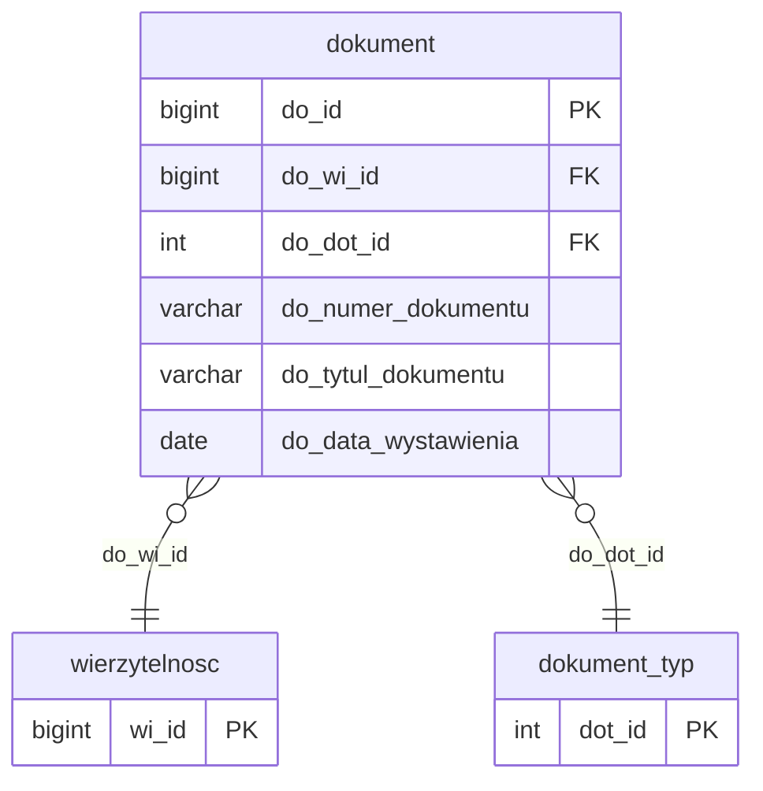

# Dokumenty

Iteracja 7 obejmuje dokumenty powiązane z wierzytelnościami (faktury, noty, wezwania) oraz ich atrybuty. Dane z tej iteracji można załadować dopiero po Iteracji 6, ponieważ każdy dokument odnosi się do konkretnej wierzytelności. Role wierzytelności (powiązania wierzytelność ↔ sprawa) są migrowane wcześniej, w [Iteracji 6](wierzytelnosci.md#dbowierzytelnosc_rola). Zobacz też: [walidacje](../przygotowanie-danych/walidacje.md), [kolejność ładowania](../przygotowanie-danych/kolejnosc-zasilania-tabel.md).

  Iteracja: 7
  Zależności: Iteracja 6
  Walidacje: <a href="../../przygotowanie-danych/walidacje/#str_11">STR_11</a>, <a href="../../przygotowanie-danych/walidacje/#biz_16">BIZ_16</a>
  Zakres: dokumenty i ich atrybuty

## Diagram ER

Diagram pokazuje tabelę iteracji 7 (`dokument`) oraz minimalne stuby `wierzytelnosc` (iteracja 6) i `dokument_typ` (iteracja 1) jako punkty zaczepienia FK. Pełny słownik wierzytelności — [Wierzytelności § Diagram ER](wierzytelnosci.md#diagram-er); słownik typów dokumentów — [Słowniki § dbo.dokument_typ](slowniki.md#dbodokument_typ). Polimorficzny stos `atrybut` opisany jest w [Tabele generyczne](tabele-generyczne.md#dboatrybut); w iteracji 7 wiersze `att_atd_id = 1` dotyczą atrybutów dokumentu.

## Tabele

### dbo.dokument

- `atrybut` (`att_atd_id = 1`) — atrybuty dokumentu ładuj do wspólnej tabeli `dbo.atrybut`. Definicja: [tabele-generyczne.md#atrybut](tabele-generyczne.md#dboatrybut).

<code>dbo.dokument</code> — przekształcenie nagłówki dokumentów finansowych (faktury, noty, wezwania)

  Tabela prod: <code>dm_data_web.dokument</code>
  Kształt mapowania: przekształcenie
  Obowiązkowa: nie
  Multi-row: tak (1 wierzytelność → N dokumentów)

Nagłówek dokumentu finansowego powiązanego z wierzytelnością — faktury, noty księgowe, wezwania do zapłaty, potwierdzenia salda. Każdy dokument wiąże się z dokładnie jedną wierzytelnością z iteracji 6 i jednym typem dokumentu ze słowników iteracji 1.

<ul class="param-list">
  <li>
    do_id
    BIGINT
    Klucz główny dokumentu w stagingu
  </li>
  <li>
    do_wi_id
    BIGINT
    FK do wierzytelności
  </li>
  <li>
    do_numer_dokumentu
    VARCHAR
    Numer dokumentu nadany w systemie źródłowym
  </li>
  <li>
    do_data_wystawienia
    DATE
    Data wystawienia dokumentu
  </li>
  <li>
    do_dot_id
    INT
    FK do słownika typów dokumentów
  </li>
  <li>
    do_tytul_dokumentu
    VARCHAR
    Tytuł dokumentu
  </li>
  <li>
    mod_date
    DATETIME
    Kolumna techniczna - obsługiwana triggerami insert; nie wypełniać
  </li>
</ul>

## Powiązania {#powiazania}

- Poprzednia iteracja: [Wierzytelności](wierzytelnosci.md)
- Następna iteracja: [Dane finansowe](finanse.md)
- Słowniki bazowe iteracja 1: [dokument_typ](slowniki.md#dbodokument_typ), [atrybut (struktura polimorficzna)](tabele-generyczne.md#dboatrybut)
- Walidacje referencyjne (dokument): [REF_07 (wierzytelność istnieje)](../przygotowanie-danych/walidacje.md), [REF_08 (dokument_typ istnieje)](../przygotowanie-danych/walidacje.md)
- Walidacje referencyjne (atrybut polimorficzny): [REF_15 (atrybut_typ istnieje)](../przygotowanie-danych/walidacje.md), [REF_16 (att_atd_id=1 → dokument)](../przygotowanie-danych/walidacje.md)
- Walidacje techniczne: [TECH_05 (do_wi_id wymagane)](../przygotowanie-danych/walidacje.md), [TECH_07 (at_ob_id wymagane)](../przygotowanie-danych/walidacje.md)
- Walidacje integralności strukturalnej: [STR_11 (nadmierna liczba dokumentów per wierzytelność)](../przygotowanie-danych/walidacje.md#str_11)
- Walidacje biznesowe: [BIZ_16 (dokument bez daty wymagalności — BLOKUJĄCE)](../przygotowanie-danych/walidacje.md#biz_16)
