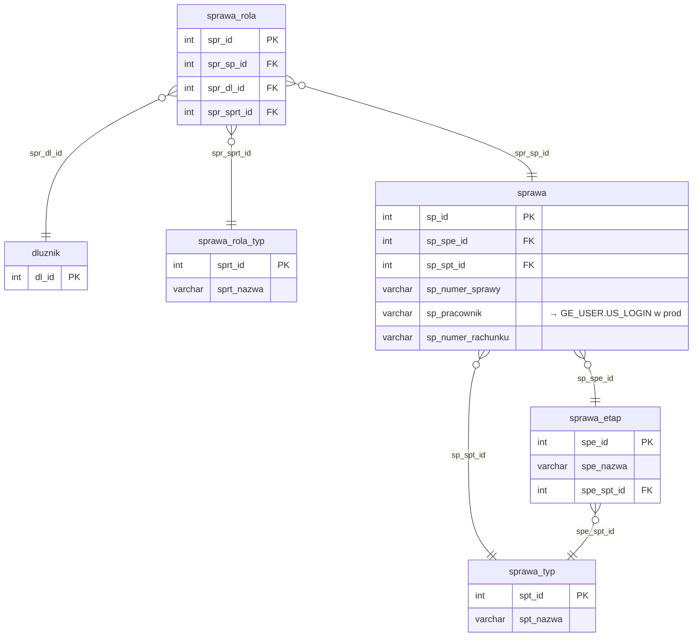

# Sprawy i role

Iteracja 4 obejmuje sprawy — kontekst zadłużenia klienta, wraz z rolami sprawy (kto bierze udział w sprawie — dłużnik główny, poręczyciel, pełnomocnik) oraz atrybutami sprawy. Dane z tej iteracji można załadować dopiero po Iteracji 2, ponieważ każda rola sprawy wskazuje na istniejącego dłużnika. Zobacz też: [walidacje](../przygotowanie-danych/walidacje.md), [kolejność ładowania](../przygotowanie-danych/kolejnosc-zasilania-tabel.md).

  Iteracja: 4
  Zależności: Iteracja 2
  Walidacje: <a href="../przygotowanie-danych/walidacje.md#str_01">STR_01</a>, <a href="../przygotowanie-danych/walidacje.md#str_02">STR_02</a>, <a href="../przygotowanie-danych/walidacje.md#str_03">STR_03</a>, <a href="../przygotowanie-danych/walidacje.md#biz_07">BIZ_07</a>, <a href="../przygotowanie-danych/walidacje.md#str_10">STR_10</a>
  Zakres: sprawy, role spraw i atrybuty

## Diagram ER

Diagram pokazuje tabele iteracji 4 (sprawa + sprawa_rola wraz z ich słownikami) oraz powiązanie z `dluznik` (iteracja 2). Polimorficzny stos `atrybut` opisany jest w [Tabele generyczne](tabele-generyczne.md#dboatrybut).

## Tabele

### dbo.sprawa

<code>dbo.sprawa</code> — rozbicie rekord sprawy (rozgałęzienie: `rachunek_bankowy` + `sprawa` + `operator`)

  Tabele prod: <code>dm_data_web.rachunek_bankowy</code>, <code>dm_data_web.sprawa</code>, <code>dm_data_web.operator</code>
  Kształt mapowania: rozbicie
  Obowiązkowa: tak
  Multi-row: tak (1 dłużnik → N spraw)

Rekord sprawy — jednostka pracy systemu DEBT Manager, powiązana z dłużnikiem przez `sprawa_rola`. Jeden wiersz staging rozchodzi się do trzech tabel prod: `rachunek_bankowy` (distinct po numerze rachunku), `sprawa` (rekord główny) oraz `operator` (gdy `sp_pracownik` jest wypełniony). Kolumna `sp_numer_rachunku` jest wymagana. Opcjonalne okno obsługi: `sp_data_obslugi_od`/`sp_data_obslugi_do`.

<ul class="param-list">
  <li>
    sp_id
    INT
    Klucz główny sprawy w stagingu
  </li>
  <li>
    sp_numer_sprawy
    VARCHAR
    Numer sprawy nadany w systemie źródłowym
  </li>
  <li>
    sp_numer_rachunku
    VARCHAR
    Numer rachunku bankowego sprawy - migrowany do tabeli rachunek_bankowy
  </li>
  <li>
    sp_pracownik
    VARCHAR
    Login pracownika przypisanego do sprawy, opcjonalny
  </li>
  <li>
    sp_spe_id
    INT
    FK do etapu sprawy
  </li>
  <li>
    sp_spt_id
    INT
    FK do słownika typów spraw
  </li>
  <li>
    sp_import_info
    VARCHAR
    Identyfikator paczki importu, z której pochodzi rekord
  </li>
  <li>
    sp_data_obslugi_od
    DATETIME
    Data obsługi od (start date)
  </li>
  <li>
    sp_data_obslugi_do
    DATETIME
    Data obsługi do (end date)
  </li>
  <li>
    mod_date
    DATETIME
    Kolumna techniczna - obsługiwana triggerami insert; nie wypełniać
  </li>
</ul>

- `atrybut` (`att_atd_id = 4`) — atrybuty sprawy ładuj do wspólnej tabeli `dbo.atrybut`. Definicja: [tabele-generyczne.md#atrybut](tabele-generyczne.md#dboatrybut).

### dbo.sprawa_rola

<code>dbo.sprawa_rola</code> — przekształcenie tabela łącząca sprawę z dłużnikiem (rola dłużnika na sprawie)

  Tabela prod: <code>dm_data_web.sprawa_rola</code>
  Kształt mapowania: przekształcenie
  Obowiązkowa: tak (STR_01: każda sprawa musi mieć ≥1 dłużnika)
  Multi-row: tak (1 sprawa → N dłużników w różnych rolach)

Tabela łącząca (junction) — każdy wiersz wiąże sprawę z dłużnikiem wraz z rolami w jakiej dłużnik (lub powiązana ze sprawą osoba) występuje w sprawie (np. dłużnik główny, poręczyciel, pełnomocnik). Jedna sprawa może mieć wielu dłużników w różnych rolach. Tabela jest materializacją wymogu STR_01 (sprawa bez dłużnika jest nieprawidłowa). Opcjonalne okno obowiązywania roli: `spr_data_od`/`spr_data_do` (puste = rola otwarta bezterminowo).

<ul class="param-list">
  <li>
    spr_id
    INT
    Klucz główny powiązania sprawy z dłużnikiem
  </li>
  <li>
    spr_sp_id
    INT
    FK do sprawy
  </li>
  <li>
    spr_dl_id
    INT
    FK do dłużnika
  </li>
  <li>
    spr_sprt_id
    INT
    FK do słownika ról w sprawie
  </li>
  <li>
    spr_data_od
    DATE
    Data początku obowiązywania roli dłużnika w sprawie. Pole opcjonalne - jeśli puste, podstawiana jest data wczytania wiersza do staging
  </li>
  <li>
    spr_data_do
    DATE
    Data zakończenia obowiązywania roli dłużnika w sprawie. Pole opcjonalne - jeśli puste, podstawiana jest data sentinel 9999-12-31 (rola otwarta bezterminowo)
  </li>
  <li>
    mod_date
    DATETIME
    Kolumna techniczna - obsługiwana triggerami insert; nie wypełniać
  </li>
</ul>

## Powiązania {#powiazania}

- Poprzednia iteracja: [Dane kontaktowe (adres, mail, telefon)](kontakty.md)
- Następna iteracja: [Akcje i rezultaty](akcje.md)
- Walidacje referencyjne (sprawa): [REF_24 (typ sprawy), REF_31 (etap sprawy), REF_25 (etap-typ)](../przygotowanie-danych/walidacje.md)
- Walidacje referencyjne (sprawa_rola): [REF_01 (dłużnik), REF_02 (sprawa), REF_03 (typ roli)](../przygotowanie-danych/walidacje.md)
- Walidacje techniczne: [TECH_03 (sp_numer_rachunku wymagane)](../przygotowanie-danych/walidacje.md)
- Walidacje integralności strukturalnej: [STR_01 (sprawa musi mieć ≥1 dłużnika)](../przygotowanie-danych/walidacje.md#str_01)
