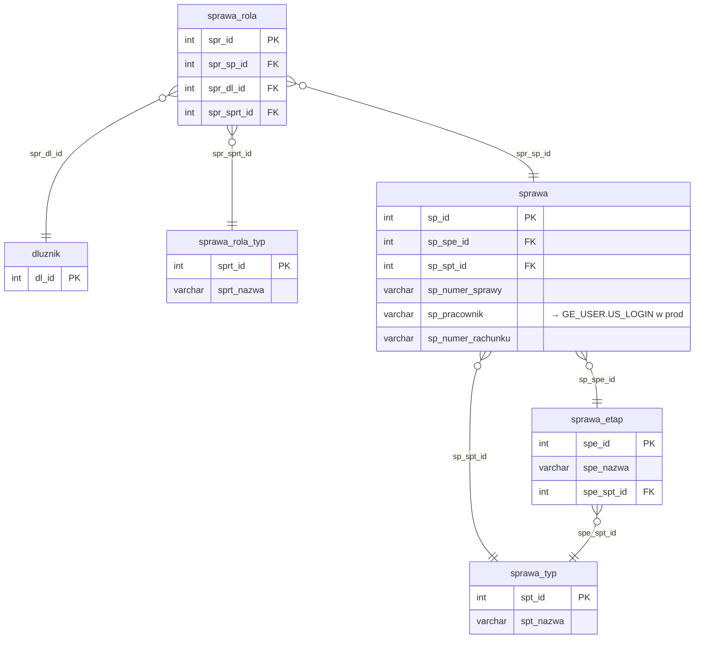

# Sprawy i role

Iteracja 4 ładuje sprawy wraz z ich rolami dłużników — trzy tabele stagingowe (`dbo.sprawa`, `dbo.sprawa_rola` oraz ponownie polimorficzna `dbo.atrybut` z filtrem `att_atd_id = 4`) zasilają sześć tabel produkcyjnych (`rachunek_bankowy`, `sprawa`, `operator`, `sprawa_rola`, `atrybut_wartosc`, `atrybut_sprawa`). Wszystkie przejścia są klasy **C**, zależne od słowników z iter1 (`sprawa_typ`, `sprawa_rola_typ`, `atrybut_typ`) oraz od `mapowanie.dodani_dluznicy` zbudowanego w iter2. Iteracja jest warunkiem koniecznym dla iter5 (akcje i rezultaty) oraz iter6-7 (wierzytelności i dokumenty).

Iter4 jest iteracją o największym rozgałęzieniu — jeden wiersz staging `sprawa` może wygenerować do trzech wierszy w prod: distinct rekord w `rachunek_bankowy` (po `sp_numer_rachunku`, idempotencja po `rb_nr` bez `ext_id`), główny rekord w `sprawa` (IDENTITY prod PK, staging `sp_id → sp_ext_id`, range-based idempotencja) oraz warunkowy rekord w `operator` gdy `sp_pracownik IS NOT NULL` (FK `op_us_id` rozwiązywany przez prod `GE_USER.US_LOGIN` — tabela systemowa poza schematem migracji). Mapowanie staging→prod PK zapisywane jest do `mapowanie.dodane_sprawy` — źródła FK dla iter5/6/7. `sprawa_rola` używa MERGE po composite key (`spr_sp_id`, `spr_dl_id`), a atrybuty spraw współdzielą procedurę `usp_migrate_atrybut_wartosc` z iter2 (zmiana tylko parametru `@att_atd_id = 4` i docelowej junction na `atrybut_sprawa`). Szczegóły per prod-tabela w sekcjach `### dbo.<tabela>`; walidacje referencyjne, formatu i biznesowe w sekcji [Powiązania](#powiazania) poniżej.

  Iteracja: 4
  Zależności: Iter 1 (sprawa_typ, sprawa_rola_typ, atrybut_typ) + Iter 2 (mapowanie.dodani_dluznicy)

## Diagram ER

Diagram pokazuje tabele iter4 (sprawa + sprawa_rola wraz z ich słownikami) oraz powiązanie z `dluznik` (iter2). Polimorficzny stos `atrybut` — [Dłużnicy § Diagram ER](dluznicy.md#diagram-er); w iter4 wiersze `att_atd_id = 4` (opisane w sekcji `<code>dbo.atrybut</code>` poniżej) wiążą się ze `sprawa.sp_id` przez polimorficzne `at_ob_id`. Prod-only encje `rachunek_bankowy`, `operator`, `atrybut_sprawa` opisane są w sekcjach `### dbo.<tabela>` poniżej.

## Tabele

<code>dbo.sprawa</code> — C rekord sprawy (rozgałęzienie: `rachunek_bankowy` + `sprawa` + `operator`)

  Tabele prod: <code>dm_data_web.rachunek_bankowy</code>, <code>dm_data_web.sprawa</code>, <code>dm_data_web.operator</code>
  Klasa: C — pełna transformacja (3-way rozgałęzienie)
  Obowiązkowa: tak
  Multi-row: tak (1 dłużnik → N spraw)

Rekord sprawy — jednostka pracy systemu DEBT Manager. Staging PK `sp_id` jest typu INT, prod używa IDENTITY i przechowuje pochodzenie w `sp_ext_id` (VARCHAR). Okres obsługi sprawy opisują `sp_data_obslugi_od`/`sp_data_obslugi_do`. Kolumna `sp_numer_rachunku` jest krytyczna - jej brak blokuje migrację (walidacja TECH_03), a distinct values tej kolumny zasilają prod `rachunek_bankowy` przed właściwym INSERT-em do `sprawa`. Kolumna `sp_pracownik` jest opcjonalnym loginem — gdy wypełniona, dodatkowo generowany jest rekord w prod `operator`.

<ul class="param-list">
  <li>
    sp_id
    INT
    Klucz główny sprawy w stagingu
  </li>
  <li>
    sp_numer_sprawy
    VARCHAR
    Numer sprawy nadany w systemie źródłowym
  </li>
  <li>
    sp_numer_rachunku
    VARCHAR
    Numer rachunku bankowego sprawy - migrowany do tabeli rachunek_bankowy
  </li>
  <li>
    sp_pracownik
    VARCHAR
    Login pracownika przypisanego do sprawy, opcjonalny
  </li>
  <li>
    sp_spe_id
    INT
    FK do etapu sprawy
  </li>
  <li>
    sp_spt_id
    INT
    FK do słownika typów spraw
  </li>
  <li>
    sp_import_info
    VARCHAR
    Identyfikator paczki importu, z której pochodzi rekord
  </li>
  <li>
    sp_data_obslugi_od
    DATETIME
    Data obsługi od (start date)
  </li>
  <li>
    sp_data_obslugi_do
    DATETIME
    Data obsługi do (end date)
  </li>
  <li>
    mod_date
    DATETIME
    Kolumna techniczna - obsługiwana triggerami insert; nie wypełniać
  </li>
</ul>

### dbo.rachunek_bankowy
Pierwszy krok iter4 — INSERT distinct `sp_numer_rachunku` do prod `rachunek_bankowy`. Idempotencja po kolumnie `rb_nr` (brak `ext_id` w tej tabeli): snapshot istniejących prod `rb_nr` trafia do indeksowanej `#existing_rb`, a INSERT obejmuje wyłącznie wartości, których nie ma w snapshot. Prod generuje IDENTITY `rb_id` — mapowanie `rb_nr → rb_id` kaptowane jest przez `OUTPUT inserted.rb_id, inserted.rb_nr INTO #rb_mapping`, a dodatkowo backfillowane o wiersze już obecne w prod z poprzednich runów (sekcja `Backfill mapping` w SQL) — `#rb_mapping` jest następnie wykorzystywany jako źródło FK przy INSERT do `sprawa`. Kolumna `rb_bank` wstawiana jest jako pusty string `''` — staging nie zawiera danych o banku. Pominięte przy INSERT: IDENTITY `rb_id`. Kolumny `aud_data`/`aud_login` wypełniane są explicite (`COALESCE(stg.mod_date, @aud_now)` i `@aud_login`), z pominięciem UDF-a obliczającego defaulty.

### dbo.sprawa
Główny INSERT iter4 — prod `sprawa` generuje własny IDENTITY `sp_id`, staging PK trafia do `sp_ext_id` (VARCHAR). Idempotencja realizowana jest range-based: `WHERE stg.sp_id > @max_sp_ext` (gdzie `@max_sp_ext = MAX(CAST(sp_ext_id AS INT))` w prod, domyślnie `-2147483648` dla stagingu pustego). Przy INSERT stosowane są cztery przemianowania wejściowe: `sp_numer_sprawy → sp_numer` (prod), `sp_data_obslugi_od/do` (1:1), oraz mapowanie staging `sp_id → sp_ext_id` (VARCHAR). FK `sp_rb_id` rozwiązywany jest przez **INNER JOIN** na `#rb_mapping` po `rb_nr = stg.sp_numer_rachunku` — prod `sp_rb_id` jest NOT NULL, więc wiersze bez numeru rachunku nie są wstawiane (wcześniej odrzucane przez TECH_03). FK `sp_pr_id` (pracownik) rozwiązywany jest przez **LEFT JOIN** na prod `GE_USER.US_LOGIN = stg.sp_pracownik` — `NULL` gdy pracownik jest pusty albo login nie istnieje w `GE_USER` (tabela systemowa poza schematem migracji). Direct: `sp_spt_id` (iter1 lookup pasuje po backfillu). Po INSERT wynik `OUTPUT CAST(inserted.sp_ext_id AS INT), inserted.sp_id` trafia do `#sp_output`, a następnie do trwałej tabeli `mapowanie.dodane_sprawy` — odwzorowanie staging→prod wykorzystywane przez sekcje `operator`, `sprawa_rola`, `atrybut_sprawa` oraz przez iter5/6/7. Dla `@stage > 1` dodatkowo wykonywany jest backfill `mapowanie.dodane_sprawy` z wierszy już obecnych w prod z poprzednich runów. Pominięte przy INSERT: IDENTITY `sp_id`, staging `sp_spe_id` (etap nie ładowany w iter4). Kolumny `aud_data`/`aud_login` wypełniane są explicite, z pominięciem UDF-a.

### dbo.operator
Trzeci krok iter4 — INSERT do prod `operator` wykonywany tylko dla spraw z niepustym `sp_pracownik`. FK `op_sp_id` rozwiązywany przez `mapowanie.dodane_sprawy` (staging `sp_id` → prod `sp_id`), FK `op_us_id` przez prod `GE_USER.US_LOGIN = stg.sp_pracownik` (ten sam lookup co przy `sp_pr_id` w sekcji `sprawa`). Idempotencja: snapshot DISTINCT `op_sp_id` z prod trafia do `#existing_op`, a INSERT dotyczy tylko spraw, dla których nie ma jeszcze żadnego operatora w prod — kolumna `op_sp_id` jest unikalna per sprawa (`DISTINCT` w snapshot). Kolumny hardkodowane: `op_opt_id = 1` (stała `@OPT_PRACOWNIK`, typ operatora: pracownik), `op_zastepstwo = 0` (nie zastępstwo). `op_data_od` kopiowany z `stg.mod_date`. Pominięte przy INSERT: IDENTITY `op_id`, `op_data_do` (pozostaje NULL = operator aktywny). Kolumny `aud_data`/`aud_login` wypełniane są explicite, z pominięciem UDF-a.

<code>dbo.sprawa_rola</code> — C tabela łącząca sprawę z dłużnikiem (rola dłużnika na sprawie)

  Tabela prod: <code>dm_data_web.sprawa_rola</code>
  Klasa: C — pełna transformacja (composite FK)
  Obowiązkowa: tak (BIZ_01: każda sprawa musi mieć ≥1 dłużnika)
  Multi-row: tak (1 sprawa → N dłużników w różnych rolach)

Tabela łącząca (junction) — każdy wiersz wiąże sprawę z dłużnikiem, przypisując mu rolę (dłużnik główny, poręczyciel itp.). Staging PK `spr_id` istnieje, ale nie migruje do prod — prod używa IDENTITY i identyfikuje wiersze po composite key (`spr_sp_id`, `spr_dl_id`). Tabela jest materializacją wymogu BIZ_01 (sprawa bez dłużnika jest nieprawidłowa) i jest walidowana przez REF_01/02/03.

<ul class="param-list">
  <li>
    spr_id
    INT
    Klucz główny powiązania sprawy z dłużnikiem
  </li>
  <li>
    spr_sp_id
    INT
    FK do sprawy
  </li>
  <li>
    spr_dl_id
    INT
    FK do dłużnika
  </li>
  <li>
    spr_sprt_id
    INT
    FK do słownika ról w sprawie
  </li>
  <li>
    mod_date
    DATETIME
    Kolumna techniczna - obsługiwana triggerami insert; nie wypełniać
  </li>
</ul>

### dbo.sprawa_rola
INSERT do prod `sprawa_rola` z idempotencją composite (`spr_sp_id`, `spr_dl_id`): snapshot istniejących par trafia do indeksowanej `#existing_spr`, a INSERT pomija pary już obecne. FK `spr_sp_id` rozwiązywany przez `mapowanie.dodane_sprawy` (staging `sp_id` → prod `sp_id`), FK `spr_dl_id` przez `mapowanie.dodani_dluznicy` (iter2). Direct: `spr_sprt_id` (iter1 lookup). Kolumny hardkodowane: `spr_kwota_poreczenia_do = 0` (brak danych o kwocie poręczenia w stagingu), `spr_data_do = '9999-12-31'` (stała `@SENTINEL_DATE` — rola aktywna). `spr_data_od` kopiowany z `stg.mod_date`. Pominięte przy INSERT: staging `spr_id` (nie używany), IDENTITY w prod. Kolumny `aud_data`/`aud_login` wypełniane są explicite, z pominięciem UDF-a.

<code>dbo.atrybut</code> (att_atd_id=4) — C atrybuty dodatkowe dziedziny sprawa, rozbicie na dwie tabele prod

  Tabele prod: <code>dm_data_web.atrybut_wartosc</code>, <code>dm_data_web.atrybut_sprawa</code>
  Klasa: C — pełna transformacja
  Obowiązkowa: nie
  Multi-row: tak

Staging `dbo.atrybut` jest polimorficzną tabelą wartości — struktura, klasy i kolumny opisane są w [Dłużnicy i atrybuty § atrybut](dluznicy.md). W iter4 ładowane są wiersze z `att_atd_id = 4` (atrybuty spraw — dziedzina `sprawa`) do dwóch tabel prod: `atrybut_wartosc` (wartości) i `atrybut_sprawa` (junction — odpowiednik `atrybut_dluznik` z iter2). Mechanika procedury współdzielonej jest identyczna jak w iter2 — różni tylko parametr `@att_atd_id` i docelowa tabela junction.

### dbo.atrybut_wartosc
Faza 1 — INSERT do prod `atrybut_wartosc` (IDENTITY `atw_id`) przez shared proc `usp_migrate_atrybut_wartosc` z parametrem `@att_atd_id = 4`. Staging `at_id` trafia do `atw_ext_id` (VARCHAR(100)), wartość `at_wartosc` kopiowana jest do `atw_wartosc`, FK `atw_att_id` rozwiązywany przez JOIN na `staging.atrybut_typ.att_ext_id → prod.atrybut_typ.att_id`. Mapping staging `at_id` → prod `atw_id` trafia do tabeli tymczasowej `#atw_mapping` — wykorzystywanej w fazie 2. Filtr iter4 wymusza `att_atd_id = 4` na etapie JOIN-a z `atrybut_typ`. Idempotencja po `atw_ext_id`. Pominięte przy INSERT: `aud_data`/`aud_login` (wypełniane explicite w procu), IDENTITY w prod.

### dbo.atrybut_sprawa
Faza 2 — INSERT do prod `atrybut_sprawa` (tabela łącząca, PK composite `atsp_sp_id + atsp_atw_id`, odpowiednik `atrybut_dluznik` z iter2). FK `atsp_atw_id` pobierany z `#atw_mapping`, FK `atsp_sp_id` rozwiązywany przez `mapowanie.dodane_sprawy` (staging `at_ob_id` traktowany jako staging `sp_id` — semantyka polimorficznej kolumny dla `att_atd_id = 4`). Idempotencja composite: snapshot `(atsp_sp_id, atsp_atw_id)` trafia do `#existing_atsp`, INSERT pomija pary już obecne. Pominięte przy INSERT: `aud_data`/`aud_login` (wypełniane explicite), IDENTITY w prod.

## Powiązania {#powiazania}

- Poprzednia iteracja: [Dane kontaktowe (adres, mail, telefon)](kontakty.md)
- Następna iteracja: [Akcje i rezultaty](akcje.md)
- Klasyfikacja mapowania: [Mapowanie staging → prod](mapowanie-tabel.md)
- Walidacje referencyjne (sprawa): [REF_24 (typ sprawy), REF_31 (etap sprawy), REF_25 (etap-typ)](../przygotowanie-danych/walidacje.md)
- Walidacje referencyjne (sprawa_rola): [REF_01 (dłużnik), REF_02 (sprawa), REF_03 (typ roli)](../przygotowanie-danych/walidacje.md)
- Walidacje techniczne: [TECH_03 (sp_numer_rachunku wymagane)](../przygotowanie-danych/walidacje.md)
- Walidacje biznesowe: [BIZ_01 (sprawa musi mieć ≥1 dłużnika)](../przygotowanie-danych/walidacje.md)
