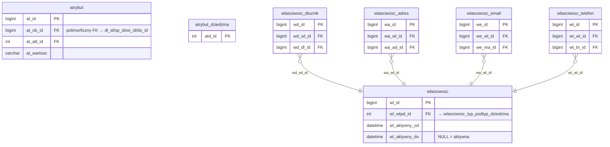

# Tabele generyczne

Tabele generyczne to staging-owe tabele, do których ładuje się dane dotyczące różnych obiektów (dłużnik, sprawa, wierzytelność, dokument itp.). Rozróżnienie obiektów następuje przez kolumnę-dyskryminator (`obiekt_typ`, `att_atd_id`, `wdzi_id`). Aby załadować atrybut/właściwość dla konkretnej domeny, ustaw wartość dyskryminatora zgodnie z tabelą poniżej w opisie tabeli.

  Używane w: Iteracja 2, 3, 4, 6, 7
  Walidacje: — (walidacje per-iteracja obejmują też generyczne)
  Zakres: tabele współdzielone między iteracjami

## Diagram ER

## Tabele

### dbo.atrybut

<code>dbo.atrybut</code> — rozbicie atrybuty dla dłużnika / sprawy / wierzytelności / dokumentu

  Tabele prod: (wiele, per dziedzina)
  Kształt mapowania: rozbicie
  Obowiązkowa: nie
  Multi-row: tak

Atrybut jest wiersza-na-obiekt — jedna tabela `dbo.atrybut` ładuje dane atrybutowe dla wielu domen. Rozróżnienie domeny następuje pośrednio: `at_att_id` → `atrybut_typ.att_atd_id` → `atrybut_dziedzina`. Poniższa tabela pokazuje, jak dobierać `at_att_id` zależnie od obiektu, który opisujesz:

<table class="report-table compact">
  <thead>
    <tr>
      <th><code>att_atd_id</code></th>
      <th>Dziedzina</th>
      <th>Iteracja ładowania</th>
    </tr>
  </thead>
  <tbody>
    <tr><td><code>1</code></td><td>dokument</td><td>Iter 7 — <a href="role-wierzytelnosci-i-dokumenty.md">role-wierzytelnosci-i-dokumenty</a></td></tr>
    <tr><td><code>2</code></td><td>wierzytelność</td><td>Iter 6 — <a href="wierzytelnosci.md">wierzytelnosci</a></td></tr>
    <tr><td><code>3</code></td><td>dłużnik</td><td>Iter 2 — <a href="dluznicy.md">dluznicy</a></td></tr>
    <tr><td><code>4</code></td><td>sprawa</td><td>Iter 4 — <a href="sprawy.md">sprawy</a></td></tr>
  </tbody>
</table>

<ul class="param-list">
  <li>
    at_id
    BIGINT
    Klucz główny atrybutu
  </li>
  <li>
    at_ob_id
    BIGINT
    FK polimorficzny do encji docelowej - identyfikator obiektu określonego przez atrybut_typ.att_atd_id (referuje dl_id / sp_id / wi_id / do_id, dlatego BIGINT)
  </li>
  <li>
    at_att_id
    INT
    Typ atrybutu - FK do atrybut_typ (rodzaj informacji, np. PESEL, adres email, numer sprawy w sądzie)
  </li>
  <li>
    at_wartosc
    VARCHAR(500)
    Wartość atrybutu - tekst, liczba lub data w formacie zgodnym z at_att_id.typ_wartosci
  </li>
</ul>

### dbo.wlasciwosc

<code>dbo.wlasciwosc</code> + <code>dbo.wlasciwosc_{dluznik,adres,email,telefon}</code> — rozbicie właściwości dla dłużnika i kanałów kontaktowych

  Tabele prod: (wiele, per kanał)
  Kształt mapowania: rozbicie
  Obowiązkowa: nie
  Multi-row: tak

Właściwość działa w układzie par `wlasciwosc` + tabela łącznikowa specyficzna dla domeny (`wlasciwosc_dluznik`, `wlasciwosc_adres`, `wlasciwosc_email`, `wlasciwosc_telefon`). Każda para korzysta z własnego `wdzi_id` z tabeli `wlasciwosc_dziedzina`:

<table class="report-table compact">
  <thead>
    <tr>
      <th><code>wdzi_id</code></th>
      <th>Dziedzina</th>
      <th>Tabela łącznikowa</th>
      <th>Iteracja ładowania</th>
    </tr>
  </thead>
  <tbody>
    <tr><td><code>1</code></td><td>telefon</td><td><code>wlasciwosc_telefon</code></td><td>Iter 3 — <a href="kontakty.md">kontakty</a></td></tr>
    <tr><td><code>2</code></td><td>adres</td><td><code>wlasciwosc_adres</code></td><td>Iter 3 — <a href="kontakty.md">kontakty</a></td></tr>
    <tr><td><code>3</code></td><td>email</td><td><code>wlasciwosc_email</code></td><td>Iter 3 — <a href="kontakty.md">kontakty</a></td></tr>
    <tr><td><code>4</code></td><td>dłużnik</td><td><code>wlasciwosc_dluznik</code></td><td>Iter 2 — <a href="dluznicy.md">dluznicy</a></td></tr>
  </tbody>
</table>

<ul class="param-list">
  <li>
    wl_id
    BIGINT
    Klucz główny właściwości
  </li>
  <li>
    w_wartosc
    VARCHAR(500)
    Wartość właściwości - format zgodny z wlasciwosc_typ.typ_walidacji
  </li>
</ul>

Szczegóły tabel łącznikowych (`wlasciwosc_dluznik`, `wlasciwosc_adres`, `wlasciwosc_email`, `wlasciwosc_telefon`) — patrz odpowiadające im iteracje [2 — dłużnicy](dluznicy.md) / [3 — kontakty](kontakty.md).

## Powiązania

- Słownik dziedzin atrybutów: [Słowniki § dbo.atrybut_dziedzina](slowniki.md#dboatrybut_dziedzina)
- Słownik typów atrybutów: [Słowniki § dbo.atrybut_typ](slowniki.md#dboatrybut_typ)
- Słownik dziedzin właściwości: [Słowniki § dbo.wlasciwosc_dziedzina](slowniki.md#dbowlasciwosc_dziedzina)
- Słownik typów właściwości: [Słowniki § dbo.wlasciwosc_typ](slowniki.md#dbowlasciwosc_typ)

