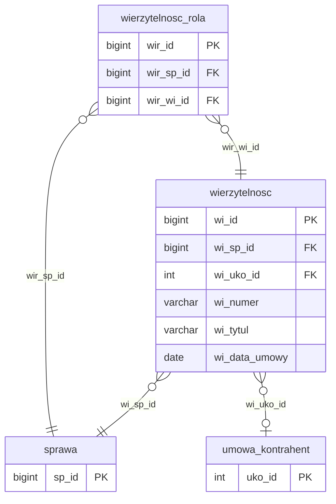

# Wierzytelności

Iteracja 6 obejmuje wierzytelności — umowy/zobowiązania dłużników — oraz role wierzytelności (powiązania wierzytelność ↔ sprawa) wraz z atrybutami wierzytelności. Dane z tej iteracji można załadować dopiero po Iteracji 4, ponieważ każda wierzytelność i każda rola jest powiązana ze sprawą. Zobacz też: [walidacje](../przygotowanie-danych/walidacje.md), [kolejność ładowania](../przygotowanie-danych/kolejnosc-zasilania-tabel.md).

  Iteracja: 6
  Zależności: Iteracja 4
  Walidacje: <a href="../../przygotowanie-danych/walidacje/#biz_04">BIZ_04</a>, <a href="../../przygotowanie-danych/walidacje/#biz_14">BIZ_14</a>, <a href="../../przygotowanie-danych/walidacje/#biz_19">BIZ_19</a>
  Zakres: wierzytelności, role wierzytelności i ich atrybuty

## Diagram ER

Diagram pokazuje tabele iteracji 6 (`wierzytelnosc`, `wierzytelnosc_rola`) oraz powiązanie ze `sprawa` (iteracja 4) i `umowa_kontrahent` (iteracja 1). Polimorficzny stos `atrybut` opisany jest w [Tabele generyczne](tabele-generyczne.md#dboatrybut).

## Tabele

### dbo.wierzytelnosc

<code>dbo.wierzytelnosc</code> — rozbicie nagłówek wierzytelności

  Tabela prod: <code>dm_data_web.wierzytelnosc</code>
  Kształt mapowania: rozbicie
  Obowiązkowa: nie
  Multi-row: tak (1 sprawa → N wierzytelności)

Nagłówek wierzytelności — roszczenie finansowe przypisane do sprawy. Jeden wiersz staging odpowiada jednej wierzytelności przypisanej do sprawy z iteracji 4. Powiązania wierzytelności ze sprawą (role: wierzyciel, wierzyciel pierwotny, cesjonariusz, poręczyciel) opisuje osobna tabela [`dbo.wierzytelnosc_rola`](#dbowierzytelnosc_rola) — również migrowana w tej iteracji.

<ul class="param-list">
  <li>
    wi_id
    BIGINT
    Klucz główny wierzytelności w stagingu (BIGINT — 8-bajtowy, dopuszcza identyfikatory źródłowe spoza zakresu INT)
  </li>
  <li>
    wi_sp_id
    BIGINT
    FK do sprawy (BIGINT — kaskada typu z <code>sprawa.sp_id</code>)
  </li>
  <li>
    wi_uko_id
    INT
    FK do <code>dbo.umowa_kontrahent</code> — nullable w stagingu, ale wymagane do migracji. Rekordy z <code>wi_uko_id IS NULL</code> są blokowane przez walidację <a href="../../przygotowanie-danych/walidacje/">TECH_04</a> (BLOCKING) i nie przejdą INNER JOIN w skrypcie iteracji 6.
  </li>
  <li>
    wi_numer
    VARCHAR
    Numer wierzytelności nadany w systemie źródłowym
  </li>
  <li>
    wi_tytul
    VARCHAR
    Tytuł wierzytelności
  </li>
  <li>
    wi_data_umowy
    DATE
    Data zawarcia umowy źródłowej wierzytelności
  </li>
  <li>
    mod_date
    DATETIME
    Kolumna techniczna - obsługiwana triggerami insert; nie wypełniać
  </li>
</ul>

### dbo.wierzytelnosc_rola

<code>dbo.wierzytelnosc_rola</code> — przekształcenie powiązanie wierzytelności ze sprawą

  Tabela prod: <code>dm_data_web.wierzytelnosc_rola</code>
  Kształt mapowania: przekształcenie
  Obowiązkowa: nie
  Multi-row: tak (1 wierzytelność → N ról — wierzyciel, wierzyciel pierwotny, cesjonariusz)

Staging `wierzytelnosc_rola` zawiera wiersze ról (wierzyciel, wierzyciel pierwotny, cesjonariusz, poręczyciel) przypisujących wierzytelność do sprawy — jedna para (sprawa, wierzytelność) może mieć wiele wpisów roli w zależności od historii cesji. Każdy wiersz stagingu jest migrowany do produkcji; klucze obce są rozwiązywane przez tabele mapowania (`mapowanie.dodane_wierzytelnosci`, `mapowanie.dodane_sprawy`).

<ul class="param-list">
  <li>
    wir_id
    BIGINT
    Klucz główny powiązania wierzytelności ze sprawą w stagingu (IDENTITY)
  </li>
  <li>
    wir_sp_id
    BIGINT
    FK do sprawy
  </li>
  <li>
    wir_wi_id
    BIGINT
    FK do wierzytelności
  </li>
  <li>
    mod_date
    DATETIME
    Kolumna techniczna - obsługiwana triggerami insert; nie wypełniać
  </li>
</ul>

- `atrybut` (`att_atd_id = 2`) — atrybuty wierzytelności ładuj do wspólnej tabeli `dbo.atrybut`. Definicja: [tabele-generyczne.md#atrybut](tabele-generyczne.md#dboatrybut).

## Powiązania {#powiazania}

- Poprzednia iteracja: [Akcje i rezultaty](akcje.md)
- Następna iteracja: [Dokumenty](role-wierzytelnosci-i-dokumenty.md)
- Słowniki bazowe iteracja 1: [umowa_kontrahent](slowniki.md#dboumowa_kontrahent), [atrybut (struktura polimorficzna)](tabele-generyczne.md#dboatrybut)
- Walidacje referencyjne (wierzytelnosc): [REF_06 (umowa kontrahenta opcjonalna)](../przygotowanie-danych/walidacje.md)
- Walidacje referencyjne (wierzytelnosc_rola): [REF_04 (wierzytelność istnieje)](../przygotowanie-danych/walidacje.md), [REF_05 (sprawa istnieje)](../przygotowanie-danych/walidacje.md)
- Walidacje referencyjne (atrybut polimorficzny): [REF_17 (att_atd_id=2 → wierzytelnosc)](../przygotowanie-danych/walidacje.md)
- Walidacje formatu: [FMT_12 (data umowy nie może być w przyszłości)](../przygotowanie-danych/walidacje.md)
- Walidacje biznesowe: [BIZ_04 (wierzytelność bez dokumentu), BIZ_14 (bez księgowań), BIZ_19 (data umowy z przyszłości)](../przygotowanie-danych/walidacje.md)
