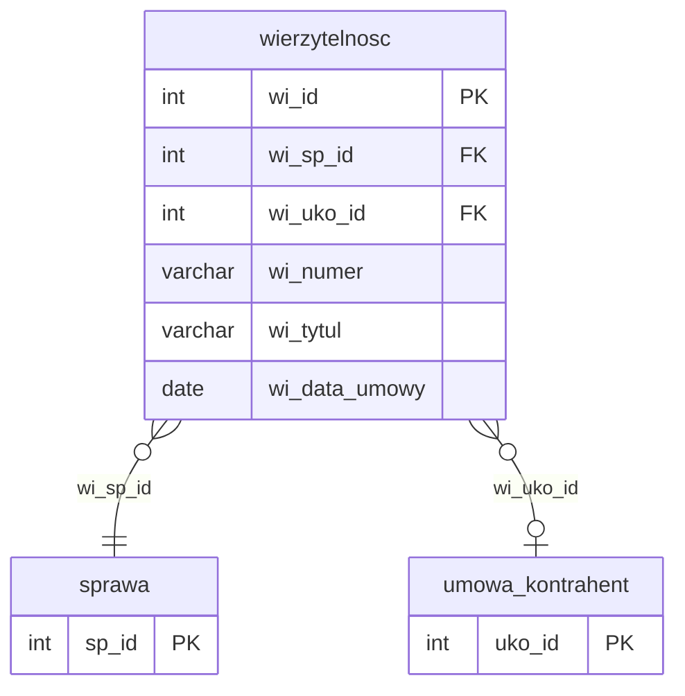

# Wierzytelności

Iteracja 6 ładuje nagłówki wierzytelności (roszczeń finansowych) — jedna tabela stagingowa (`dbo.wierzytelnosc`) oraz ponownie polimorficzna `dbo.atrybut` z filtrem `att_atd_id = 2` zasilają cztery tabele produkcyjne (`wierzytelnosc`, `wierzytelnosc_rola`, `atrybut_wartosc`, `atrybut_wierzytelnosc`). Wszystkie przejścia są klasy **C**, zależne od słowników z iter1 (`umowa_kontrahent`, `atrybut_typ`, `wierzytelnosc_rola_typ`) oraz od `mapowanie.dodane_sprawy` zbudowanego w iter4. Iteracja ładuje wyłącznie nagłówki roszczeń — szczegółowe role wierzytelności (wierzyciel pierwotny, cesjonariusz) oraz dokumenty są tematem iter7. Iter6 jest warunkiem koniecznym dla iter7 (dokumenty i dodatkowe role) oraz iter8-9 (operacje finansowe i harmonogram).

Nagłówek wierzytelności ładowany jest range-based (`WHERE stg.wi_id > @max_wi_ext` po prod `wi_ext_id` — VARCHAR, CAST wymuszony przy range check), z automatyczną materializacją pojedynczego rekordu `wierzytelnosc_rola` per (sprawa, wierzytelność) przy użyciu hardkodowanego `wir_wirt_id = 1` (domyślny typ roli — wierzyciel). FK `wi_uko_id` rozwiązywany jest dwuetapowo przez staging `umowa_kontrahent.uko_id_migracja` do prod `umowa_kontrahent.uko_id` (z fallbackiem do `uko_id` gdy migracja nie nastąpiła). Mapowanie staging→prod PK zapisywane jest do `mapowanie.dodane_wierzytelnosci` — źródła FK dla iter7/8/9 (wierzytelnosc_rola, dokument, ksiegowanie). Atrybuty dziedziny `wierzytelność` (`att_atd_id = 2`) współdzielą procedurę `usp_migrate_atrybut_wartosc` z iter2/4 — zmiana tylko parametru i docelowej junction na `atrybut_wierzytelnosc`. Szczegóły per prod-tabela w sekcjach `### dbo.<tabela>`; walidacje referencyjne i formatu w sekcji [Powiązania](#powiazania) poniżej.

  Iteracja: 6
  Zależności: Iter 1 (umowa_kontrahent, atrybut_typ, wierzytelnosc_rola_typ) + Iter 4 (mapowanie.dodane_sprawy)

## Diagram ER

Diagram pokazuje tabelę iter6 (`wierzytelnosc`) oraz minimalne stuby `sprawa` (iter4) i `umowa_kontrahent` (iter1) jako punkty zaczepienia FK. Pełna struktura sprawy — [Sprawy § Diagram ER](sprawy.md#diagram-er); pełny słownik `umowa_kontrahent` — [Słowniki § dbo.umowa_kontrahent](slowniki.md#dboumowa_kontrahent). Polimorficzny stos `atrybut` — [Dłużnicy § Diagram ER](dluznicy.md#diagram-er); w iter6 wiersze `att_atd_id = 2` (opisane w sekcji `<code>dbo.atrybut</code>` poniżej) wiążą się z `wierzytelnosc.wi_id` przez polimorficzne `at_ob_id`. Prod-only encje `wierzytelnosc_rola` i `atrybut_wierzytelnosc` opisane są w sekcjach `### dbo.<tabela>` poniżej.

## Tabele

<code>dbo.wierzytelnosc</code> — C nagłówek wierzytelności (rozgałęzienie: `wierzytelnosc` + `wierzytelnosc_rola`)

  Tabele prod: <code>dm_data_web.wierzytelnosc</code>, <code>dm_data_web.wierzytelnosc_rola</code>
  Klasa: C — pełna transformacja (auto-generowana rola)
  Obowiązkowa: nie
  Multi-row: tak (1 sprawa → N wierzytelności)

Nagłówek wierzytelności — roszczenie finansowe przypisane do sprawy. Staging PK `wi_id` jest typu INT; prod używa IDENTITY i przechowuje pochodzenie staging PK w kolumnie `wi_ext_id` (VARCHAR — CAST wymuszony przy każdym range check). Każdy wiersz stagingowej wierzytelności skutkuje INSERT-em do prod `wierzytelnosc` oraz jednego rekordu `wierzytelnosc_rola` z hardkodowanym typem roli (`wir_wirt_id = 1` — wierzyciel). Dodatkowe role (wierzyciel pierwotny, cesjonariusz) są tematem iter7 (staging `wierzytelnosc_rola`).

<ul class="param-list">
  <li>
    wi_id
    INT
    Klucz główny wierzytelności w stagingu
  </li>
  <li>
    wi_sp_id
    INT
    FK do sprawy - rozwiązywany przez mapowanie.dodane_sprawy
  </li>
  <li>
    wi_uko_id
    INT
    FK do umowy kontrahenta - opcjonalny
  </li>
  <li>
    wi_numer
    VARCHAR
    Numer wierzytelności nadany w systemie źródłowym
  </li>
  <li>
    wi_tytul
    VARCHAR
    Tytuł wierzytelności
  </li>
  <li>
    wi_data_umowy
    DATE
    Data zawarcia umowy źródłowej wierzytelności
  </li>
  <li>
    mod_date
    DATETIME
    Kolumna techniczna - obsługiwana triggerami insert; nie wypełniać
  </li>
</ul>

### dbo.wierzytelnosc
Prod `wierzytelnosc` generuje własny IDENTITY `wi_id` — staging PK trafia do kolumny `wi_ext_id` (VARCHAR, `CAST(stg.wi_id AS VARCHAR(100))`). Idempotencja range-based: `WHERE stg.wi_id > @max_wi_ext` (gdzie `@max_wi_ext = MAX(CAST(wi_ext_id AS INT))` w prod, domyślnie `-2147483648` dla stagingu pustego). FK `wi_sp_id` rozwiązywany przez INNER JOIN na `mapowanie.dodane_sprawy` (staging `sp_id` → prod `sp_id`; tabela budowana przez iter4). FK `wi_uko_id` rozwiązywany dwuetapowo: staging `umowa_kontrahent.uko_id = stg.wi_uko_id`, następnie `uko_id_migracja` (docelowy prod `uko_id`) z fallbackiem do staging `uko_id` gdy migracja nie nastąpiła — LEFT JOIN z COALESCE dopuszcza NULL (FK opcjonalny). Kolumny hardkodowane: `wi_wt_id = 1` (stała `@WI_DEFAULT_WT_ID`, domyślny typ wierzytelności). Mapowanie staging→prod PK kaptowane przez `OUTPUT CAST(inserted.wi_ext_id AS INT), inserted.wi_id` i zapisywane do trwałej tabeli `mapowanie.dodane_wierzytelnosci` — odwzorowanie wykorzystywane przez iter7 (wierzytelnosc_rola, dokument), iter8 (ksiegowanie) i iter9. Dla `@stage > 1` dodatkowo wykonywany jest backfill `mapowanie.dodane_wierzytelnosci` z wierszy już obecnych w prod z poprzednich runów. Pominięte przy INSERT: IDENTITY `wi_id`. Kolumny `aud_data`/`aud_login` wypełniane są explicite (odpowiednio `COALESCE(stg.mod_date, @aud_now)` i `@aud_login`), z pominięciem UDF-a obliczającego defaulty.

### dbo.wierzytelnosc_rola
Drugi krok sekcji wierzytelności — auto-generowany INSERT jednego rekordu `wierzytelnosc_rola` per (sprawa, wierzytelność) z hardkodowanym typem roli `wir_wirt_id = 1` (stała `@WIR_DEFAULT_WIRT_ID` — wierzyciel). Idempotencja composite: snapshot istniejących par prod `(wir_sp_id, wir_wi_id)` trafia do indeksowanej `#existing_wir_auto`, a INSERT pomija pary już obecne (WHERE NOT EXISTS). FK `wir_sp_id` rozwiązywany przez `mapowanie.dodane_sprawy`, FK `wir_wi_id` przez świeżo zbudowane `mapowanie.dodane_wierzytelnosci` (staging `wi_id` → prod `wi_id`). Kolumny hardkodowane: `wir_wirt_id = 1`, `wir_kwota_poreczenia_do = 0` (brak danych o kwocie poręczenia w stagingu dla roli default), `wir_data_do = '9999-12-31'` (stała `@SENTINEL_DATE` — rola aktywna). `wir_data_od` kopiowany z `stg.mod_date`. Pominięte przy INSERT: IDENTITY prod `wir_id`; staging nie dostarcza własnego wiersza roli — wartości wyliczane z nagłówka wierzytelności. Dodatkowe role (poręczyciel, cesjonariusz) tematem iter7. Kolumny `aud_data`/`aud_login` wypełniane są explicite, z pominięciem UDF-a.

<code>dbo.atrybut</code> (att_atd_id=2) — C atrybuty dodatkowe dziedziny wierzytelność, rozbicie na dwie tabele prod

  Tabele prod: <code>dm_data_web.atrybut_wartosc</code>, <code>dm_data_web.atrybut_wierzytelnosc</code>
  Klasa: C — pełna transformacja
  Obowiązkowa: nie
  Multi-row: tak

Staging `dbo.atrybut` jest polimorficzną tabelą wartości — struktura, klasy i kolumny opisane są w [Dłużnicy i atrybuty § atrybut](dluznicy.md). W iter6 ładowane są wiersze z `att_atd_id = 2` (atrybuty wierzytelności — dziedzina `wierzytelność`) do dwóch tabel prod: `atrybut_wartosc` (wartości) i `atrybut_wierzytelnosc` (junction — odpowiednik `atrybut_dluznik` z iter2 oraz `atrybut_sprawa` z iter4). Mechanika procedury współdzielonej jest identyczna jak w iter2/4 — różni tylko parametr `@att_atd_id` i docelowa tabela junction.

### dbo.atrybut_wartosc
Faza 1 — INSERT do prod `atrybut_wartosc` (IDENTITY `atw_id`) przez shared proc `usp_migrate_atrybut_wartosc` z parametrem `@att_atd_id = 2`. Staging `at_id` trafia do `atw_ext_id` (VARCHAR(100)), wartość `at_wartosc` kopiowana jest do `atw_wartosc`, FK `atw_att_id` rozwiązywany przez JOIN na `staging.atrybut_typ.att_ext_id → prod.atrybut_typ.att_id`. Mapping staging `at_id` → prod `atw_id` trafia do tabeli tymczasowej `#atw_mapping` — wykorzystywanej w fazie 2. Filtr iter6 wymusza `att_atd_id = 2` na etapie JOIN-a z `atrybut_typ`. Idempotencja po `atw_ext_id`. Pominięte przy INSERT: `aud_data`/`aud_login` (wypełniane explicite w procu), IDENTITY w prod.

### dbo.atrybut_wierzytelnosc
Faza 2 — INSERT do prod `atrybut_wierzytelnosc` (tabela łącząca, PK composite `atwi_wi_id + atwi_atw_id`, odpowiednik `atrybut_dluznik` z iter2 i `atrybut_sprawa` z iter4). FK `atwi_atw_id` pobierany z `#atw_mapping`, FK `atwi_wi_id` rozwiązywany przez `mapowanie.dodane_wierzytelnosci` (staging `at_ob_id` traktowany jako staging `wi_id` — semantyka polimorficznej kolumny dla `att_atd_id = 2`). Idempotencja composite: snapshot `(atwi_wi_id, atwi_atw_id)` trafia do `#existing_atwi`, INSERT pomija pary już obecne (WHERE NOT EXISTS). Pominięte przy INSERT: `aud_data`/`aud_login` (wypełniane explicite), IDENTITY w prod.

## Powiązania {#powiazania}

- Poprzednia iteracja: [Akcje i rezultaty](akcje.md)
- Następna iteracja: [Role wierzytelności i dokumenty](role-wierzytelnosci-i-dokumenty.md)
- Klasyfikacja mapowania: [Mapowanie staging → prod](mapowanie-tabel.md)
- Słowniki bazowe iter1: [umowa_kontrahent](slowniki.md#dboumowa_kontrahent), [atrybut (struktura polimorficzna)](dluznicy.md)
- Walidacje referencyjne (wierzytelnosc): [REF_06 (umowa kontrahenta opcjonalna)](../przygotowanie-danych/walidacje.md)
- Walidacje referencyjne (atrybut polimorficzny): [REF_17 (att_atd_id=2 → wierzytelnosc)](../przygotowanie-danych/walidacje.md)
- Walidacje formatu: [FMT_12 (data umowy nie może być w przyszłości)](../przygotowanie-danych/walidacje.md)
